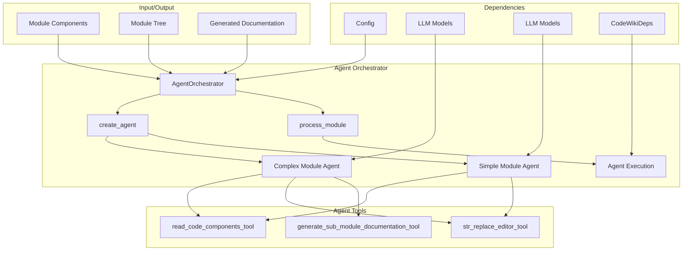
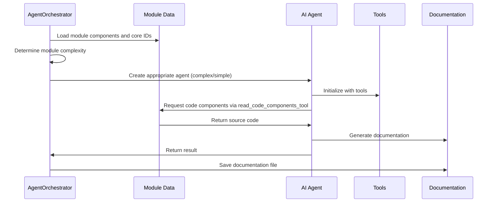
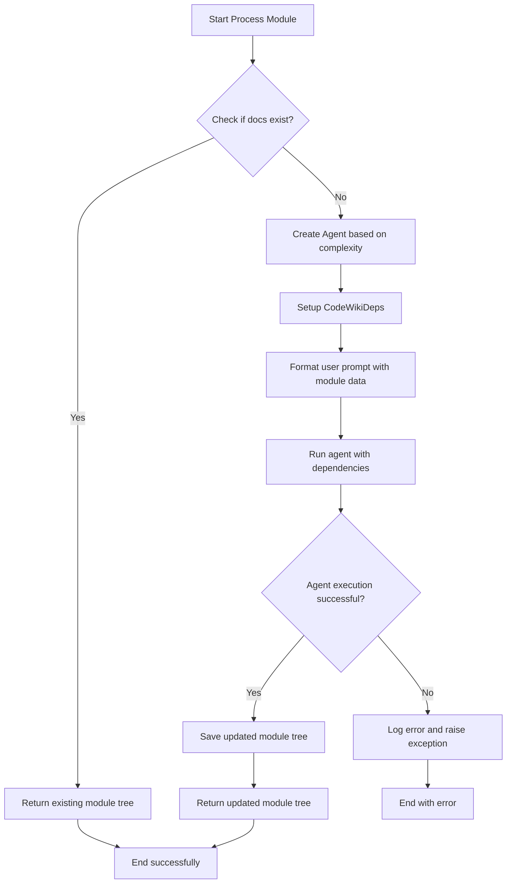

# Agent Orchestrator Module

## Overview

The `agent_orchestrator` module is a core component of the CodeWiki system responsible for managing and coordinating AI agents that generate documentation for software modules. It dynamically creates appropriate agents based on module complexity and orchestrates the documentation generation process.

## Core Components

### AgentOrchestrator Class

The main class that orchestrates the AI agents for documentation generation:

- **Purpose**: Manages the creation and execution of AI agents for module documentation
- **Key Responsibilities**:
  - Creates appropriate agents based on module complexity
  - Processes individual modules to generate documentation
  - Manages agent dependencies and execution context
  - Handles error logging and recovery

## Architecture

## Component Relationships

The agent_orchestrator module has the following key relationships:

- **Config Module**: [config.md] - Receives configuration settings for LLM models and processing parameters
- **Agent Tools**: [agent_tools.md] - Uses various tools for code reading, file editing, and sub-module documentation generation
- **LLM Services**: [llm_services.md] - Creates fallback models for agent execution
- **Dependency Analyzer**: [dependency_analyzer.md] - Works with Node models to understand module structure
- **Prompt Templates**: [prompt_template.md] - Uses system and user prompts for agent instructions
- **Utils**: [utils.md] - Leverages file management and utility functions

## Data Flow

## Key Functions

### create_agent(module_name, components, core_component_ids)
Creates an appropriate agent based on module complexity:
- **Complex modules**: Uses all three tools (read_code_components, str_replace_editor, generate_sub_module_documentation)
- **Simple modules**: Uses only read_code_components and str_replace_editor tools
- Determines complexity using the `is_complex_module` utility function

### process_module(module_name, components, core_component_ids, module_path, working_dir)
Main processing function that:
1. Loads or creates module tree
2. Creates appropriate agent based on complexity
3. Sets up dependencies with CodeWikiDeps
4. Checks if documentation already exists
5. Runs the agent with formatted user prompt
6. Saves updated module tree
7. Handles errors and logging

## Process Flow

## Dependencies and Tools

The orchestrator provides agents with the following tools:

1. **read_code_components_tool**: Reads source code of specified components
2. **str_replace_editor_tool**: Allows viewing, creating, and editing files in both repo and docs directories
3. **generate_sub_module_documentation_tool**: Generates documentation for sub-modules recursively

## Error Handling

The module implements comprehensive error handling:
- Catches exceptions during agent execution
- Logs detailed error messages with tracebacks
- Preserves existing documentation if processing fails
- Continues processing other modules despite individual failures

## Integration Points

The agent_orchestrator integrates with:
- **CLI Layer**: [cli.md] - Receives configuration and module data from CLI
- **Frontend**: [frontend.md] - Can be used in background processing for web interface
- **Documentation Generator**: [documentation_generator.md] - Works as part of the overall documentation pipeline

## Configuration

The orchestrator uses the [Config](config.md) object to:
- Access LLM model settings
- Determine maximum processing depth
- Set repository and output paths
- Configure fallback model chains

## Performance Considerations

- Checks for existing documentation to avoid redundant processing
- Uses complexity analysis to optimize agent tool selection
- Implements proper error handling to maintain processing flow
- Supports asynchronous processing for better performance