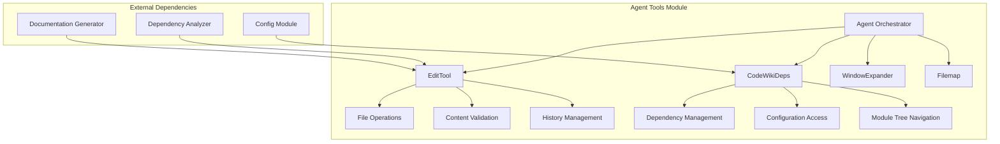

# Agent Tools Module Documentation

## Overview

The `agent_tools` module provides essential tools for the CodeWiki system that enable agents to interact with the file system, perform code analysis, and manage documentation generation. This module serves as a bridge between the AI agents and the underlying codebase, allowing for sophisticated operations like viewing, editing, and analyzing source code and documentation files.

## Architecture Overview

## Core Components

### CodeWikiDeps
The `CodeWikiDeps` dataclass serves as a dependency container that provides essential information to the agent tools. It contains paths, configuration data, module trees, and other contextual information needed for the tools to operate effectively.

**Key Properties:**
- `absolute_docs_path`: Path to the documentation directory
- `absolute_repo_path`: Path to the source code repository
- `registry`: Dictionary for storing persistent state
- `components`: Mapping of components to their AST nodes
- `module_tree`: Hierarchical representation of the codebase structure
- `config`: Configuration object with LLM settings

### EditTool
The `EditTool` is a comprehensive file system editor that allows agents to perform various file operations including viewing, creating, and editing files. It provides a safe interface for agents to interact with the file system while maintaining history and validation capabilities.

**Key Features:**
- File viewing with line numbers and range selection
- File creation and content replacement
- String replacement with validation
- Line insertion capabilities
- Edit history and undo functionality
- Content validation and linting support

### Filemap
The `Filemap` class provides intelligent code visualization by creating abbreviated views of Python files that highlight function and class definitions while eliding their implementations. This helps agents understand the structure of large files without being overwhelmed by implementation details.

### WindowExpander
The `WindowExpander` class intelligently expands file viewports to include complete functions, classes, or other logical code blocks rather than arbitrary line ranges. This ensures that agents see meaningful code sections when viewing specific parts of files.

## Sub-Modules

For detailed information about specific sub-components, see:
- [str_replace_editor.md](str_replace_editor.md) - Detailed documentation for the file editing capabilities
- [deps.md](deps.md) - Detailed documentation for the dependency management system

## Integration with Other Modules

The agent_tools module integrates closely with several other modules in the CodeWiki system:

- **Dependency Analyzer**: Uses AST analysis to understand code structure and relationships
- **Config Module**: Accesses configuration settings for LLM parameters and system behavior
- **Documentation Generator**: Works in conjunction with documentation generation processes
- **CLI Module**: Provides the underlying functionality for command-line operations

## Usage Patterns

The agent_tools module is primarily used by the [agent_orchestrator](agent_orchestrator.md) to enable AI agents to perform complex file operations during documentation generation and code analysis tasks. The tools provide a safe and controlled environment for agents to interact with the codebase while maintaining system integrity.

## Security and Validation

The module includes several safety mechanisms:
- Path validation to prevent unauthorized file access
- Content validation with linting for code files
- Edit history tracking for rollback capabilities
- Range validation for file operations