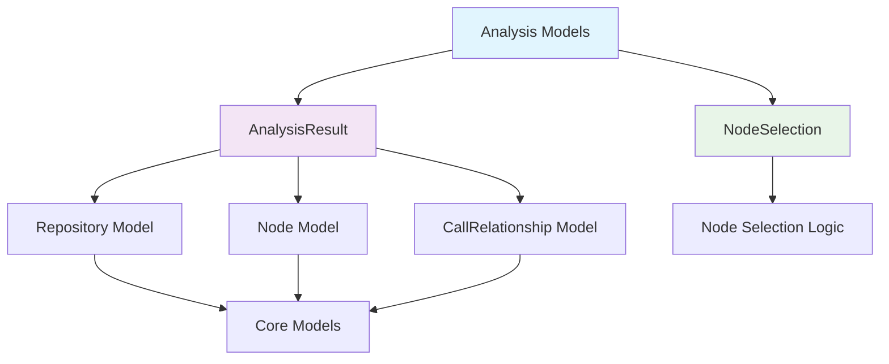
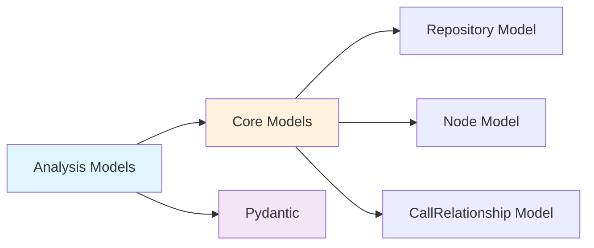
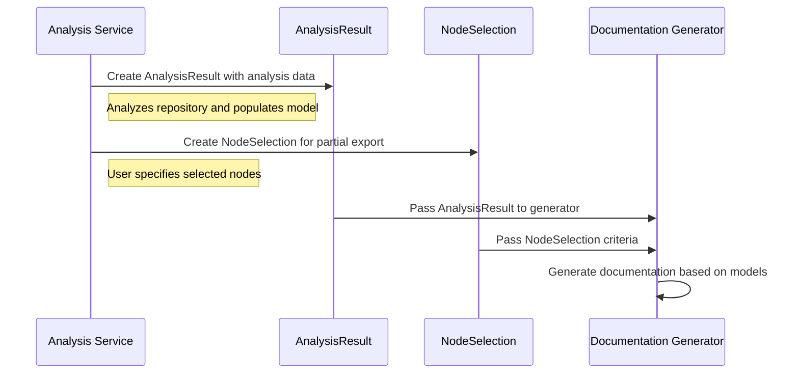

# Analysis Models Module Documentation

## Introduction

The `analysis_models` module is part of the dependency analyzer component in the CodeWiki system. This module provides Pydantic data models that represent the results of code analysis and node selection for partial exports. These models serve as the structured data format for storing and transferring analysis results between different components of the system.

The module contains two primary models:
- `AnalysisResult`: Represents the complete result of analyzing a repository
- `NodeSelection`: Represents selected nodes for partial export operations

## Architecture Overview



## Component Details

### AnalysisResult Model

The `AnalysisResult` model represents the complete result of analyzing a repository. It contains all the essential information gathered during the analysis process.

#### Fields:
- `repository`: A `Repository` object containing information about the analyzed repository
- `functions`: A list of `Node` objects representing functions found in the repository
- `relationships`: A list of `CallRelationship` objects representing relationships between functions
- `file_tree`: A dictionary containing the repository's file structure
- `summary`: A dictionary containing summary statistics and metadata about the analysis
- `visualization`: A dictionary containing visualization data (default: empty dict)
- `readme_content`: Optional string containing the repository's README content

#### Usage Context:
This model is typically used by the [AnalysisService](analysis_service.md) to store and return the results of repository analysis. It serves as the primary data structure for transferring analysis results to other components like the documentation generator.

### NodeSelection Model

The `NodeSelection` model represents selected nodes for partial export operations. It allows users to specify which nodes should be included in a partial analysis or export.

#### Fields:
- `selected_nodes`: A list of strings representing the IDs or names of selected nodes (default: empty list)
- `include_relationships`: A boolean indicating whether to include relationships in the export (default: True)
- `custom_names`: A dictionary mapping node IDs to custom names for the export (default: empty dict)

#### Usage Context:
This model is used when users want to perform partial analysis or export specific components of a repository rather than the entire codebase. It's particularly useful for large repositories where full analysis might be resource-intensive.

## Dependencies

The analysis_models module depends on the following components:



### Core Dependencies:
- `codewiki.src.be.dependency_analyzer.models.core`: Provides the `Repository`, `Node`, and `CallRelationship` models that are referenced in the analysis models
- `pydantic`: Used for data validation and serialization
- `typing`: Provides type hints for better code documentation and IDE support

## Data Flow



## Integration with Other Modules

### Dependency Analyzer
The analysis models are primarily used by the [dependency_analyzer](dependency_analyzer.md) module, specifically by the [AnalysisService](analysis_service.md) which creates and populates these models during repository analysis.

### Documentation Generator
The [documentation_generator](documentation_generator.md) module uses the `AnalysisResult` model to generate documentation based on the analysis data.

### CLI Module
The [CLI](cli.md) module may use these models when performing command-line analysis operations and when handling user requests for partial exports.

## Usage Examples

### Creating an AnalysisResult
```python
from codewiki.src.be.dependency_analyzer.models.analysis import AnalysisResult
from codewiki.src.be.dependency_analyzer.models.core import Repository, Node, CallRelationship

# Create a repository object
repo = Repository(path="/path/to/repo", name="example-repo")

# Create analysis result
result = AnalysisResult(
    repository=repo,
    functions=[Node(name="function1", file_path="file1.py")],
    relationships=[CallRelationship(caller="func1", callee="func2")],
    file_tree={"src": {"main.py": "..."}},
    summary={"total_functions": 1, "total_files": 1}
)
```

### Creating a NodeSelection
```python
from codewiki.src.be.dependency_analyzer.models.analysis import NodeSelection

# Select specific nodes for export
selection = NodeSelection(
    selected_nodes=["function1", "function2"],
    include_relationships=True,
    custom_names={"function1": "My Custom Function 1"}
)
```

## Best Practices

1. **Validation**: Always validate the AnalysisResult model before using it to ensure all required fields are properly populated
2. **Serialization**: Use Pydantic's built-in serialization methods when storing or transmitting analysis results
3. **Memory Management**: For large repositories, consider using NodeSelection to limit the amount of data processed
4. **Consistency**: Maintain consistency between the selected nodes in NodeSelection and the actual nodes in AnalysisResult

## Error Handling

The models use Pydantic for validation, which will raise validation errors if required fields are missing or if data types don't match the expected types. Always handle these exceptions when creating or parsing these models.

## Future Considerations

- Consider adding more detailed metadata fields to AnalysisResult for better analysis tracking
- Potentially add validation constraints to ensure consistency between selected nodes and actual analysis results
- Consider adding methods to filter AnalysisResult based on NodeSelection criteria

## References

- [Core Models](core_models.md) - Contains the Repository, Node, and CallRelationship models referenced by AnalysisResult
- [Analysis Service](analysis_service.md) - Uses these models to store and transfer analysis results
- [Documentation Generator](documentation_generator.md) - Uses AnalysisResult to generate documentation
- [CLI Module](cli.md) - May use these models for command-line analysis operations