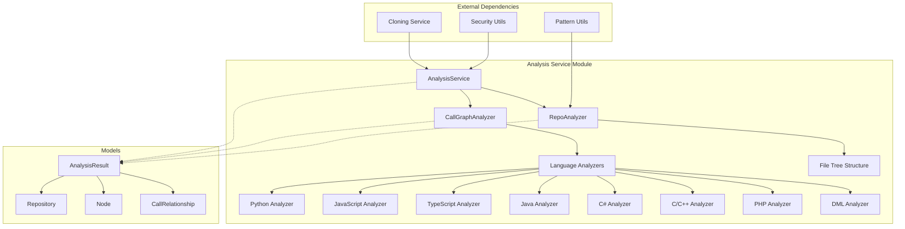

# Analysis Service Module Documentation

## Overview

The Analysis Service module is a centralized component of the CodeWiki system responsible for repository analysis with support for multiple programming languages. It orchestrates the complete analysis workflow including repository cloning, structure analysis, and multi-language AST parsing for call graph generation.

This module serves as the core backend service that enables the system to understand code repositories by extracting function definitions, call relationships, and structural information across various programming languages.

## Architecture Overview

## Core Components

### AnalysisService
The main orchestrator that manages the complete analysis workflow:
- Repository cloning and validation
- File structure analysis with filtering
- Multi-language AST parsing and call graph generation
- Result consolidation and cleanup

### CallGraphAnalyzer
Central orchestrator for multi-language call graph analysis that coordinates language-specific analyzers to build comprehensive call graphs across different programming languages in a repository.

### RepoAnalyzer
Provides functionality to analyze repository structures and generate detailed file tree representations with filtering capabilities.

## Sub-modules

For detailed information about specific sub-components, see:
- [analysis_service_current.md](analysis_service_current.md) - Documentation for the core analysis service components (AnalysisService, CallGraphAnalyzer, RepoAnalyzer)
- [language_analyzers.md](language_analyzers.md) - Overview of all language-specific analyzers
- [c_analyzer.md](c_analyzer.md) - Documentation for C language analyzer
- [cpp_analyzer.md](cpp_analyzer.md) - Documentation for C++ language analyzer
- [csharp_analyzer.md](csharp_analyzer.md) - Documentation for C# language analyzer
- [dml_analyzer.md](dml_analyzer.md) - Documentation for DML language analyzer
- [java_analyzer.md](java_analyzer.md) - Documentation for Java language analyzer
- [javascript_analyzer.md](javascript_analyzer.md) - Documentation for JavaScript language analyzer
- [php_analyzer.md](php_analyzer.md) - Documentation for PHP language analyzer
- [python_analyzer.md](python_analyzer.md) - Documentation for Python language analyzer
- [typescript_analyzer.md](typescript_analyzer.md) - Documentation for TypeScript language analyzer
- [ast_parser.md](ast_parser.md) - Documentation for AST parsing components
- [dependency_graph_builder.md](dependency_graph_builder.md) - Documentation for dependency graph construction
- [analysis_models.md](analysis_models.md) - Documentation for analysis data models
- [core_models.md](core_models.md) - Documentation for core data models

## Integration with Other Modules

The Analysis Service module integrates with several other modules in the CodeWiki system:

- **CLI Module**: Provides command-line interface for analysis operations
- **Documentation Generator**: Uses analysis results to generate documentation
- **Agent Orchestrator**: Supplies code understanding capabilities to AI agents
- **Frontend**: Provides analysis results for visualization and user interaction

For more details about these integrations, see the respective module documentation:
- [cli.md](cli.md)
- [documentation_generator.md](documentation_generator.md)
- [agent_orchestrator.md](agent_orchestrator.md)
- [frontend.md](frontend.md)

## Key Features

1. **Multi-language Support**: Analyzes Python, JavaScript, TypeScript, Java, C#, C, C++, PHP, DML and other languages
2. **Repository Cloning**: Automatically clones GitHub repositories for analysis
3. **Call Graph Generation**: Builds comprehensive call graphs showing function relationships
4. **File Structure Analysis**: Provides detailed repository structure information
5. **Security**: Implements path validation and safe file operations
6. **Visualization**: Generates data for graph visualization tools

## Usage Patterns

The Analysis Service can be used in different modes:
- Full repository analysis with call graph generation
- Structure-only analysis for quick repository overview
- Local repository analysis for offline codebases
- Language-filtered analysis to focus on specific technologies