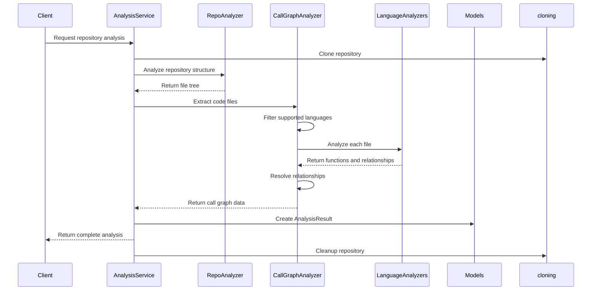
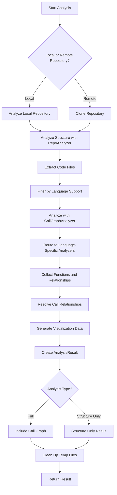

# Analysis Service Current Module Documentation

## Overview

The Analysis Service Current module is a comprehensive repository analysis system that provides multi-language dependency analysis, call graph generation, and repository structure analysis. This module serves as the central orchestrator for analyzing code repositories, supporting multiple programming languages and generating detailed dependency graphs.

The module consists of three main components:
- **AnalysisService**: The primary orchestration service that manages the complete analysis workflow
- **CallGraphAnalyzer**: Handles multi-language call graph analysis and relationship mapping
- **RepoAnalyzer**: Analyzes repository structure and file organization

## Architecture

```mermaid
graph TB
    subgraph "Analysis Service Module"
        AnalysisService[AnalysisService]
        CallGraphAnalyzer[CallGraphAnalyzer]
        RepoAnalyzer[RepoAnalyzer]
    end

    subgraph "Language Analyzers"
        PythonAnalyzer[Python AST Analyzer]
        JSAnalyzer[JavaScript TreeSitter Analyzer]
        TSAnalyzer[TypeScript TreeSitter Analyzer]
        JavaAnalyzer[Java TreeSitter Analyzer]
        CSharpAnalyzer[C# TreeSitter Analyzer]
        CAnalyzer[C TreeSitter Analyzer]
        CPPAnalyzer[C++ TreeSitter Analyzer]
        PHPAnalyzer[PHP TreeSitter Analyzer]
        DMLAnalyzer[DML Analyzer]
    end

    subgraph "Core Models"
        AnalysisResult[AnalysisResult]
        Repository[Repository]
        Node[Node]
        CallRelationship[CallRelationship]
    end

    AnalysisService --> CallGraphAnalyzer
    AnalysisService --> RepoAnalyzer
    CallGraphAnalyzer --> PythonAnalyzer
    CallGraphAnalyzer --> JSAnalyzer
    CallGraphAnalyzer --> TSAnalyzer
    CallGraphAnalyzer --> JavaAnalyzer
    CallGraphAnalyzer --> CSharpAnalyzer
    CallGraphAnalyzer --> CAnalyzer
    CallGraphAnalyzer --> CPPAnalyzer
    CallGraphAnalyzer --> PHPAnalyzer
    CallGraphAnalyzer --> DMLAnalyzer
    AnalysisService --> AnalysisResult
    AnalysisResult --> Repository
    CallGraphAnalyzer --> Node
    CallGraphAnalyzer --> CallRelationship
```



## Component Details

### AnalysisService

The AnalysisService is the main orchestration component that manages the complete analysis workflow. It handles repository cloning, structure analysis, call graph generation, and result consolidation.

#### Key Features:
- Repository cloning and validation from GitHub URLs
- Local repository analysis support
- Multi-language AST parsing for call graph generation
- Automatic cleanup of temporary directories
- Support for include/exclude patterns

#### Methods:
- `analyze_local_repository()`: Analyze a local repository folder
- `analyze_repository_full()`: Perform complete repository analysis including call graph generation
- `analyze_repository_structure_only()`: Perform lightweight structure-only analysis
- `cleanup_all()`: Clean up all tracked temporary directories

### CallGraphAnalyzer

The CallGraphAnalyzer is responsible for multi-language call graph analysis. It coordinates language-specific analyzers to build comprehensive call graphs across different programming languages in a repository.

#### Key Features:
- Multi-language support (Python, JavaScript, TypeScript, Java, C#, C, C++, PHP, DML)
- Call relationship resolution across languages
- Visualization data generation for graph rendering
- Function and relationship deduplication

#### Methods:
- `analyze_code_files()`: Complete analysis of all code files to build call graphs
- `extract_code_files()`: Extract code files from file tree structure
- `_analyze_*_file()`: Language-specific file analysis methods
- `_resolve_call_relationships()`: Resolve function call relationships
- `_generate_visualization_data()`: Generate Cytoscape.js compatible graph data

### RepoAnalyzer

The RepoAnalyzer provides functionality to analyze repository structures and generate detailed file tree representations with filtering capabilities.

#### Key Features:
- Repository structure analysis with filtering
- Support for include/exclude patterns
- File size and count calculations
- Path security validation (prevents directory traversal)

#### Methods:
- `analyze_repository_structure()`: Analyze repository structure and return file tree
- `_build_file_tree()`: Build hierarchical file tree representation
- `_should_exclude_path()`: Check if a path should be excluded based on patterns
- `_should_include_file()`: Check if a file should be included based on patterns

## Dependencies

The Analysis Service module depends on several other modules in the system:

- **[language_analyzers](language_analyzers.md)**: Provides language-specific AST analysis capabilities
- **[analysis_models](analysis_models.md)**: Contains AnalysisResult model for analysis output
- **[core_models](core_models.md)**: Provides Repository, Node, and CallRelationship models
- **[ast_parser](ast_parser.md)**: AST parsing utilities used by language analyzers
- **[dependency_graph_builder](dependency_graph_builder.md)**: Builds dependency graphs from analysis results
- **[cloning](cloning.md)**: Repository cloning and cleanup utilities

## Data Flow



## Process Flow



## Security Considerations

The Analysis Service module implements several security measures:

- **Path Validation**: Uses `assert_safe_path` and `safe_open_text` to prevent directory traversal attacks
- **Repository Cloning**: Validates GitHub URLs and manages temporary directories securely
- **File Access**: Restricts file access to the repository directory only
- **Pattern Matching**: Validates include/exclude patterns to prevent malicious path traversal

## Error Handling

The module implements comprehensive error handling:

- **Exception Propagation**: Errors are logged and propagated as RuntimeErrors
- **Cleanup on Failure**: Temporary directories are cleaned up even when analysis fails
- **Language-Specific Error Handling**: Each language analyzer has its own error handling
- **Graceful Degradation**: Unsupported languages are skipped rather than causing failures

## Integration Points

The Analysis Service module integrates with the broader system through:

- **[frontend](frontend.md)**: Provides analysis results for the web interface
- **[documentation_generator](documentation_generator.md)**: Supplies dependency information for documentation
- **[agent_orchestrator](agent_orchestrator.md)**: Provides code structure information for agent operations
- **[config](config.md)**: Uses system configuration for analysis parameters

## Performance Considerations

- **File Limiting**: Supports maximum file limits to prevent excessive analysis
- **Language Filtering**: Allows analysis of specific languages only
- **Pattern Matching**: Efficient file filtering using pattern matching
- **Memory Management**: Proper cleanup of temporary directories and resources

## Usage Examples

The module provides both high-level and low-level interfaces:

```python
# High-level analysis
service = AnalysisService()
result = service.analyze_repository_full("https://github.com/user/repo")

# Local repository analysis
local_result = service.analyze_local_repository("/path/to/local/repo", max_files=50)

# Structure-only analysis
structure_result = service.analyze_repository_structure_only("https://github.com/user/repo")
```

## Backward Compatibility

The module maintains backward compatibility through wrapper functions:
- `analyze_repository()`: Wrapper for full analysis
- `analyze_repository_structure_only()`: Wrapper for structure-only analysis

These functions maintain the same interface as previous versions while using the new AnalysisService internally.