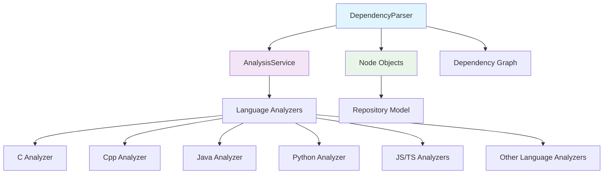
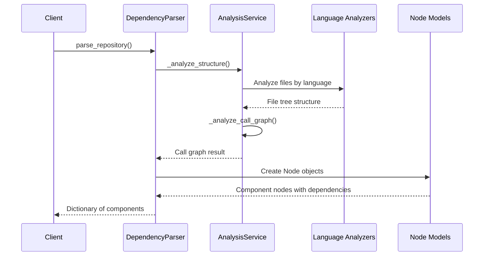
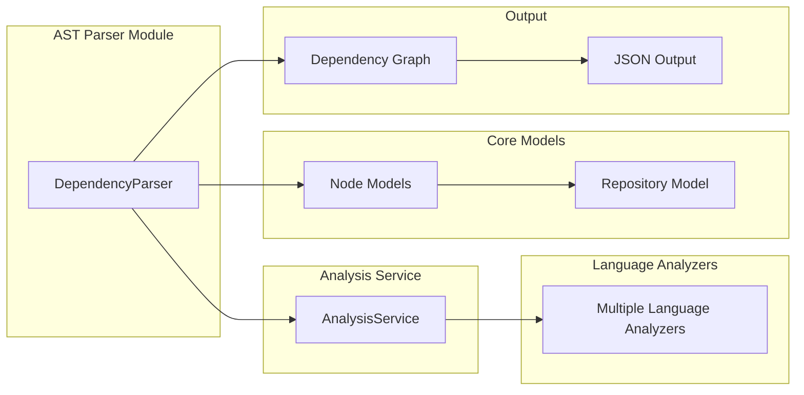
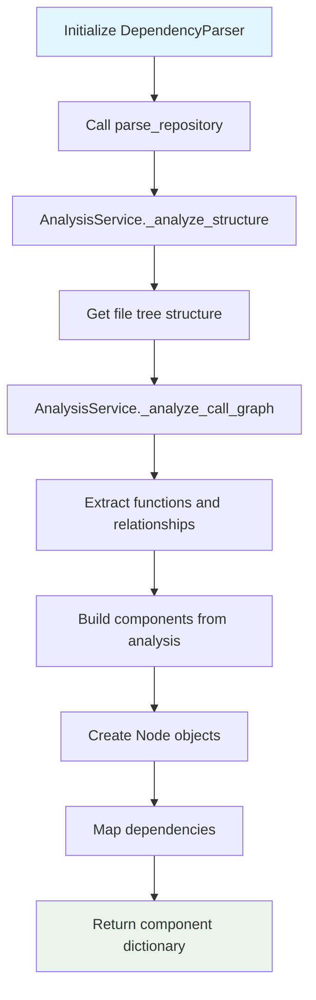

# AST Parser Module Documentation

## Overview

The AST Parser module is a core component of the dependency analyzer system that provides functionality for parsing multi-language repositories and extracting code components. The module leverages the [analysis_service](analysis_service.md) to perform structural and call graph analysis, then builds a comprehensive dependency graph of code components.

The primary class `DependencyParser` serves as the main entry point for repository parsing, creating a mapping of components with their dependencies and metadata. This module is essential for understanding code structure and relationships across different programming languages.

## Architecture



## Core Components

### DependencyParser

The `DependencyParser` class is the main component of this module, responsible for:

- Parsing repositories and extracting code components
- Building dependency relationships between components
- Managing component metadata and documentation
- Saving dependency graphs to JSON format

#### Key Methods

- `parse_repository()`: Main entry point that analyzes repository structure and call graphs
- `_build_components_from_analysis()`: Processes analysis results into Node objects
- `save_dependency_graph()`: Exports the dependency graph to JSON format
- `_determine_component_type()`: Identifies the type of code component
- `_file_to_module_path()`: Converts file paths to module paths

## Data Flow



## Component Relationships



## Dependencies

The AST Parser module depends on several other modules:

- **[analysis_service](analysis_service.md)**: Provides structural and call graph analysis capabilities
- **[core_models](core_models.md)**: Defines the Node data structure used to represent code components
- **[language_analyzers](language_analyzers.md)**: Language-specific parsing capabilities through the AnalysisService

## Process Flow



## Usage Example

The DependencyParser is typically used as follows:

```python
parser = DependencyParser(repo_path="/path/to/repository")
components = parser.parse_repository()
parser.save_dependency_graph("dependency_graph.json")
```

## Integration Points

The AST Parser module integrates with the broader system through:

1. **[analysis_service](analysis_service.md)**: For performing the actual parsing and analysis
2. **[dependency_graph_builder](dependency_graph_builder.md)**: For constructing the final dependency graph
3. **[cli](cli.md)**: Through the documentation generation workflow
4. **[documentation_generator](documentation_generator.md)**: Providing component information for documentation

## File Extensions Supported

The module supports parsing of multiple programming languages through the underlying language analyzers, including:
- Python (.py)
- JavaScript/TypeScript (.js, .ts, .tsx, .jsx)
- Java (.java)
- C# (.cs)
- C/C++ (.c, .cpp, .h, .hpp)
- PHP (.php)
- And other languages supported by the language analyzers

## Error Handling

The module includes logging capabilities for debugging and error tracking. All operations are logged at the DEBUG level, providing visibility into the parsing process and any issues that may occur during analysis.

## Performance Considerations

The parser processes repositories by:
1. Analyzing repository structure first
2. Performing call graph analysis
3. Building component relationships
4. Creating Node objects with metadata

For large repositories, this process can be time-intensive, but provides comprehensive dependency information.