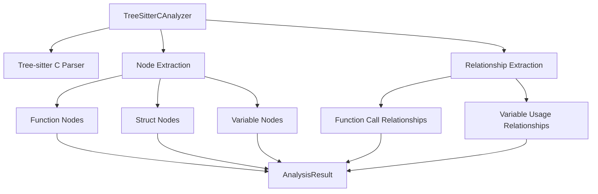
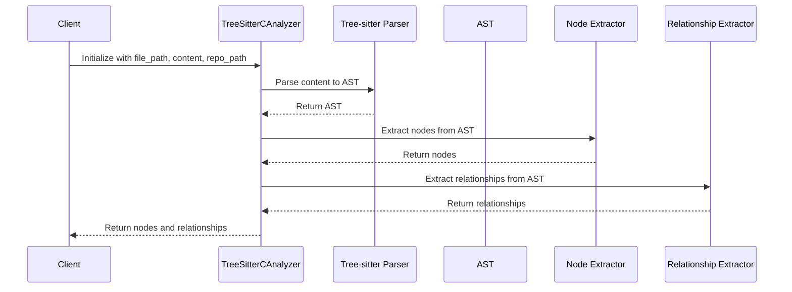
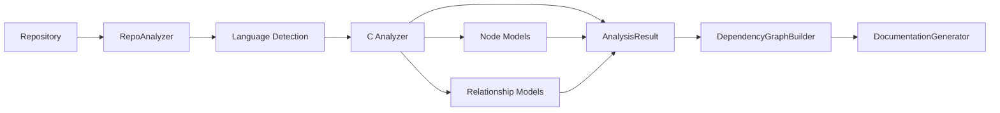

# C Analyzer Module Documentation

## Overview

The C Analyzer module (`codewiki.src.be.dependency_analyzer.analyzers.c.TreeSitterCAnalyzer`) is a specialized component within the dependency analysis system that handles parsing and analysis of C language source code files. It uses Tree-sitter, a parser generator tool, to build abstract syntax trees (ASTs) and extract structural information from C code.

This module is part of the larger [dependency_analyzer](dependency_analyzer.md) system and specifically handles the extraction of nodes (functions, structs, variables) and relationships (function calls, variable usage) from C source files.

## Architecture



## Core Components

### TreeSitterCAnalyzer Class

The main class responsible for analyzing C files and extracting structural information.

#### Constructor
```python
def __init__(self, file_path: str, content: str, repo_path: str = None)
```

**Parameters:**
- `file_path`: Path to the C source file being analyzed
- `content`: The actual content of the C file
- `repo_path`: Optional repository root path for relative path calculations

#### Key Methods

**`_analyze()`**: Internal method that orchestrates the analysis process:
- Initializes the Tree-sitter C parser
- Parses the file content into an AST
- Extracts nodes and relationships from the AST

**`_extract_nodes(node, top_level_nodes, lines)`**: Recursively extracts top-level nodes from the AST:
- **Functions**: Identified by `function_definition` nodes
- **Structs**: Identified by `struct_specifier` and `type_definition` nodes
- **Variables**: Identified by `declaration` nodes that are not within functions

**`_extract_relationships(node, top_level_nodes)`**: Extracts relationships between nodes:
- Function calls to other functions
- Function usage of global variables

**`_get_component_id(name: str)`**: Generates unique component IDs by combining module path with node name.

### Helper Functions

**`analyze_c_file(file_path: str, content: str, repo_path: str = None)`**: Convenience function that creates an analyzer instance and returns extracted nodes and relationships.

## Data Flow



## Component Interactions

The C Analyzer interacts with several other components in the system:

1. **[DependencyParser](ast_parser.md)**: Uses Tree-sitter for parsing C code
2. **[Node](core_models.md)**: Creates Node objects representing functions, structs, and variables
3. **[CallRelationship](core_models.md)**: Creates CallRelationship objects representing function calls and variable usage
4. **[AnalysisService](analysis_service.md)**: Provides analysis results to the main analysis service
5. **[CallGraphAnalyzer](analysis_service.md)**: Supplies relationship data for call graph construction

## Language-Specific Features

The C Analyzer handles several C-specific language constructs:

### Function Analysis
- Identifies function definitions using `function_definition` AST nodes
- Extracts function names from `function_declarator` nodes
- Captures function source code and line numbers

### Struct Analysis
- Handles both regular struct definitions (`struct Name { ... }`)
- Handles typedef struct definitions (`typedef struct { ... } Name;`)
- Extracts struct names from `type_identifier` nodes

### Variable Analysis
- Identifies global variables (not within function scope)
- Distinguishes between local and global variable declarations
- Handles both regular and pointer variable declarations

### Relationship Analysis
- Function-to-function calls
- Function-to-variable usage
- System function filtering (excludes common C library functions)

## Dependencies

The C Analyzer module depends on:
- `tree_sitter` - AST parsing library
- `tree_sitter_c` - C language grammar for Tree-sitter
- [core_models](core_models.md) - Node and CallRelationship models
- Standard Python libraries (logging, pathlib, os, etc.)

## Integration with System

The C Analyzer fits into the overall system as follows:



## Usage Example

```python
from codewiki.src.be.dependency_analyzer.analyzers.c import analyze_c_file

# Analyze a C file
nodes, relationships = analyze_c_file(
    file_path="/path/to/file.c",
    content="/* C source code */",
    repo_path="/path/to/repo"
)

# Process extracted information
for node in nodes:
    print(f"Found {node.component_type}: {node.name}")

for rel in relationships:
    print(f"Call from {rel.caller} to {rel.callee}")
```

## Related Modules

- [cpp_analyzer](cpp_analyzer.md) - C++ language analyzer (similar functionality for C++)
- [analysis_service](analysis_service.md) - Main analysis orchestration service
- [ast_parser](ast_parser.md) - AST parsing utilities
- [core_models](core_models.md) - Core data models for nodes and relationships
- [dependency_graph_builder](dependency_graph_builder.md) - Builds dependency graphs from analysis results