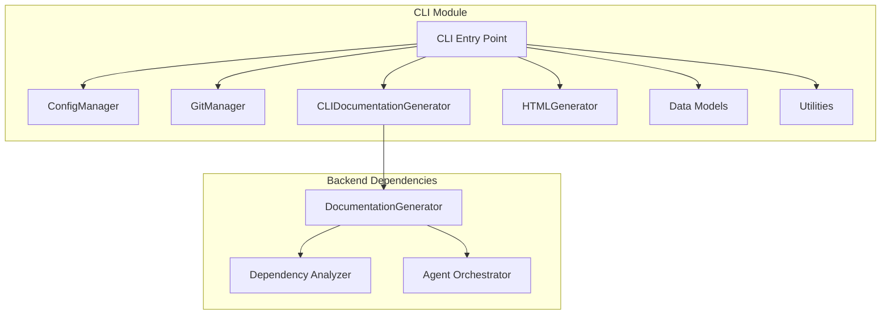

# CLI Module Documentation

The CLI module provides a command-line interface for the CodeWiki documentation generation system. It serves as the primary user interaction point, handling configuration management, repository operations, documentation generation, and output formatting.

## Architecture Overview

## Core Components

### Configuration Management
The [ConfigManager](config_manager.md) handles user configuration and secure credential storage using system keyring services. It manages API keys, LLM settings, and default output directories.

### Git Operations
The [GitManager](git_manager.md) provides repository operations including branch creation, status checking, and commit handling for documentation workflows.

### Documentation Generation
The [CLIDocumentationGenerator](doc_generator.md) serves as an adapter between the CLI and backend documentation generation services, providing progress tracking and CLI-specific functionality.

### HTML Generation
The [HTMLGenerator](html_generator.md) creates static HTML documentation viewers suitable for GitHub Pages deployment.

### Data Models
The CLI module includes several data models:
- [Configuration](config.md): Persistent user settings
- [Job Models](job_models.md): Documentation job tracking and statistics

### Utilities
Utility components include:
- [Logging](logging.md): Colored output and verbose logging
- [Progress Tracking](progress.md): Progress indicators and ETA estimation

## Integration with Backend Systems

The CLI module integrates with various backend systems:

- **Dependency Analyzer**: Analyzes codebases to build dependency graphs
- **Documentation Generator**: Generates module documentation using LLMs
- **Agent Orchestrator**: Manages AI agent workflows for documentation
- **Configuration System**: Bridges CLI and backend configuration models

## Key Features

1. **Secure Credential Management**: Uses system keyring for API key storage
2. **Progress Tracking**: Provides detailed progress indicators during generation
3. **Git Integration**: Manages documentation branches and commits
4. **HTML Output**: Generates GitHub Pages-compatible documentation viewers
5. **Flexible Configuration**: Supports multiple LLM models and providers