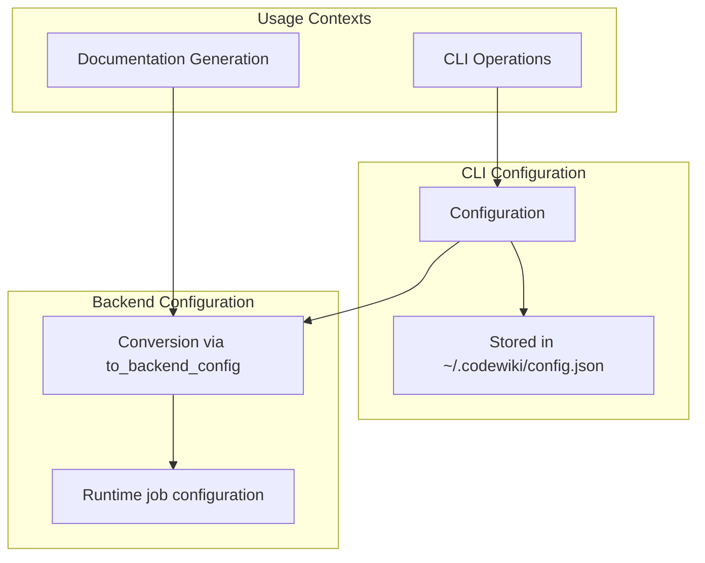
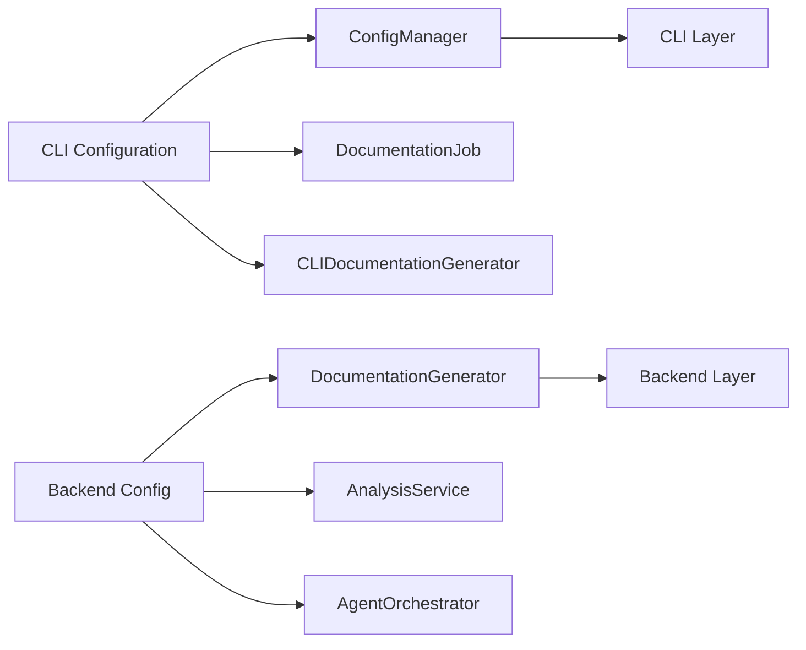
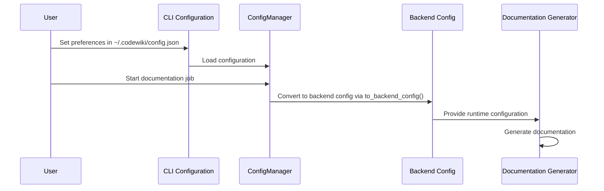

# Config Module Documentation

## Introduction

The config module in CodeWiki provides configuration management for both the CLI and backend components. It consists of two main configuration classes that serve different purposes: the CLI `Configuration` class for persistent user settings and the backend `Config` class for runtime job configuration.

## Architecture Overview

The config module serves as a bridge between persistent user preferences and runtime job configurations. The CLI configuration stores user preferences in `~/.codewiki/config.json`, while the backend configuration handles specific documentation generation jobs.

## Core Components

### CLI Configuration (`codewiki.cli.models.config.Configuration`)

The CLI `Configuration` class represents persistent user settings stored in `~/.codewiki/config.json`. This configuration is designed to store user preferences that persist across sessions.

#### Attributes
- `base_url`: LLM API base URL
- `main_model`: Primary model for documentation generation
- `cluster_model`: Model for module clustering
- `fallback_model`: Fallback model for documentation generation (default: "glm-4p5")
- `default_output`: Default output directory (default: "docs")

#### Methods

**`validate()`**
Validates all configuration fields using the validation utilities. Raises `ConfigurationError` if validation fails.

**`to_dict()`**
Converts the configuration instance to a dictionary representation.

**`from_dict(data: dict)`**
Creates a Configuration instance from a dictionary.

**`is_complete()`**
Checks if all required fields are set and returns a boolean value.

**`to_backend_config(repo_path: str, output_dir: str, api_key: str)`**
Converts CLI Configuration to Backend Config, bridging persistent user settings with runtime job configuration.

### Backend Config (`codewiki.src.config.Config`)

The backend `Config` class handles runtime job configurations for documentation generation. It's created from CLI configuration when starting documentation jobs.

#### Attributes
- `repo_path`: Path to the repository being documented
- `output_dir`: Base output directory for generated files
- `dependency_graph_dir`: Directory for dependency graph files
- `docs_dir`: Directory for generated documentation
- `max_depth`: Maximum depth for analysis
- `llm_base_url`: LLM API base URL
- `llm_api_key`: LLM API key
- `main_model`: Primary model for documentation generation
- `cluster_model`: Model for module clustering
- `fallback_model`: Fallback model (default: FALLBACK_MODEL_1)

#### Methods

**`from_args(args: argparse.Namespace)`**
Creates configuration from parsed command-line arguments.

**`from_cli(...)`**
Creates configuration specifically for CLI context with the required parameters.

## Component Relationships

The config module integrates with several other modules in the CodeWiki system:

## Data Flow

The configuration data flows through the system as follows:

## Usage in the System

### CLI Layer Integration
The CLI configuration is managed by the [ConfigManager](config_manager.md) and used by the [CLIDocumentationGenerator](doc_generator.md) to create backend configurations for documentation jobs.

### Backend Integration
The backend configuration is consumed by:
- [DocumentationGenerator](documentation_generator.md) for documentation generation
- [AnalysisService](dependency_analyzer/analysis_service.md) for repository analysis
- [AgentOrchestrator](agent_orchestrator.md) for AI agent coordination

## Validation and Error Handling

The configuration system includes comprehensive validation:

- URL validation for API endpoints
- Model name validation for LLM models
- Required field validation to ensure complete configuration
- Type checking for all configuration values

## File Locations

- **CLI Configuration File**: `~/.codewiki/config.json`
- **Backend Configuration**: Runtime-only, created per job

## Dependencies

The config module depends on:
- [Validation utilities](cli/utils/validation.md) for input validation
- [Backend configuration](config.md) for runtime job configuration
- [Job models](job_models.md) for documentation job integration

## Integration Points

The configuration module integrates with:
- [CLI Layer](cli.md) for user preferences
- [Backend Services](dependency_analyzer.md) for runtime configuration
- [Documentation Generation](documentation_generator.md) for job-specific settings