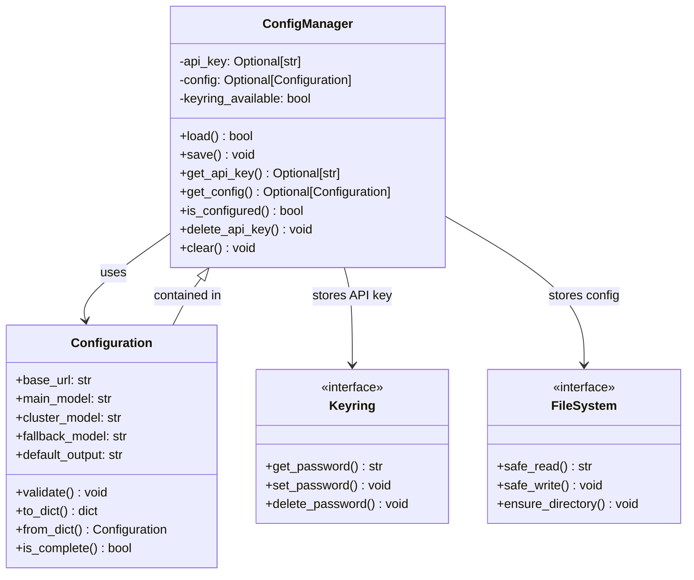
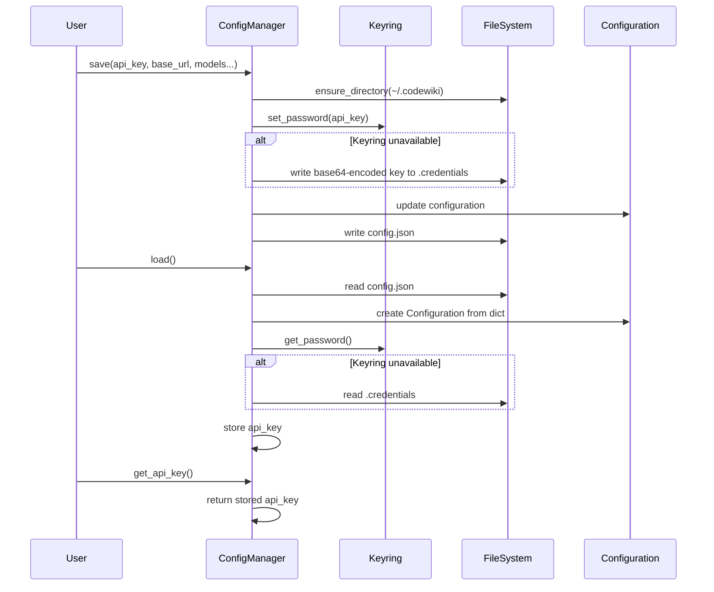

# ConfigManager Module Documentation

## Overview

The `ConfigManager` module provides secure configuration management for CodeWiki, handling both sensitive credentials (API keys) and general settings. It implements a dual-storage approach using system keyring for sensitive data and JSON files for non-sensitive configuration.

## Architecture

The ConfigManager follows a layered architecture that separates credential storage from configuration management:



## Components

### ConfigManager

The main class that orchestrates configuration management:

- **Secure API Key Storage**: Uses system keyring (macOS Keychain, Windows Credential Manager, Linux Secret Service) with fallback to base64-encoded file storage
- **Configuration Persistence**: Stores non-sensitive settings in `~/.codewiki/config.json`
- **Validation**: Ensures configuration integrity and completeness
- **Fallback Mechanisms**: Provides alternative storage when keyring is unavailable

### Configuration Model

The data model that represents user preferences:

- **LLM Configuration**: Base URL, main model, cluster model, and fallback model settings
- **Output Settings**: Default output directory for generated documentation
- **Validation**: Ensures all required fields are properly set
- **Conversion**: Bridges CLI configuration to backend runtime configuration

## Data Flow



## Storage Strategy

The module implements a secure storage strategy with multiple fallbacks:

1. **Primary**: System keyring for API keys (secure, OS-specific)
2. **Secondary**: Base64-encoded file storage in `~/.codewiki/.credentials` (with restrictive permissions)
3. **Configuration**: JSON file at `~/.codewiki/config.json` for non-sensitive settings

## Dependencies

- [Configuration](configuration.md): Data model for user settings
- [Error Handling](error_handling.md): ConfigurationError and FileSystemError
- [File System Utilities](fs_utils.md): Safe read/write operations
- [Backend Config](config.md): Runtime configuration bridge

## Integration Points

The ConfigManager serves as a bridge between CLI user preferences and backend runtime configuration:

- **CLI Layer**: Stores persistent user settings
- **Backend Layer**: Provides runtime configuration through `to_backend_config()` method
- **Security Layer**: Ensures API keys are never stored in plain text

## Security Considerations

- API keys are stored in system keyring when available
- Fallback file storage uses base64 encoding with restrictive file permissions (600)
- Keyring availability is checked at initialization
- Credentials are never logged or exposed in plain text

## Usage Patterns

### Initialization and Loading
```python
config_manager = ConfigManager()
if config_manager.load():
    # Configuration exists and is loaded
    api_key = config_manager.get_api_key()
    config = config_manager.get_config()
```

### Saving Configuration
```python
config_manager.save(
    api_key="sk-...",
    base_url="https://api.example.com",
    main_model="gpt-4",
    cluster_model="gpt-3.5",
    fallback_model="glm-4p5",
    default_output="docs"
)
```

### Validation
```python
if config_manager.is_configured():
    # All required settings are present and valid
    backend_config = config_manager.get_config().to_backend_config(
        repo_path="/path/to/repo",
        output_dir="docs",
        api_key=config_manager.get_api_key()
    )
```