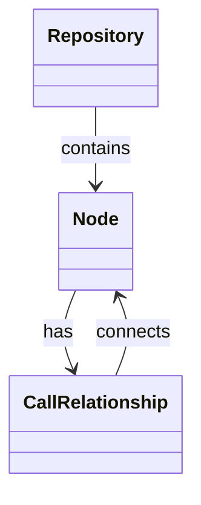
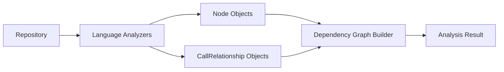

# Core Models Module Documentation

## Introduction

The `core_models` module provides the fundamental data structures used throughout the dependency analyzer component of CodeWiki. This module defines the essential Pydantic models that represent the core entities in the system: `Node`, `CallRelationship`, and `Repository`. These models serve as the foundation for representing code repositories, their components, and the relationships between them during dependency analysis.

## Module Overview

The core_models module contains three primary Pydantic models that form the backbone of the dependency analysis system:

- **Node**: Represents individual code components (functions, classes, modules, etc.)
- **CallRelationship**: Represents relationships between code components (function calls, method invocations, etc.)
- **Repository**: Represents a code repository being analyzed

These models are used by various components throughout the dependency analyzer, including language analyzers, the dependency graph builder, and the analysis service.

## Architecture



## Component Details

### Node Model

The `Node` model represents individual code components within a repository. It captures both structural information and semantic details about code elements.

#### Fields

| Field | Type | Description |
|-------|------|-------------|
| `id` | `str` | Unique identifier for the node |
| `name` | `str` | Name of the code component |
| `component_type` | `str` | Type of component (function, class, module, etc.) |
| `file_path` | `str` | Absolute path to the file containing the component |
| `relative_path` | `str` | Path relative to the repository root |
| `depends_on` | `Set[str]` | Set of node IDs this component depends on |
| `source_code` | `Optional[str]` | The actual source code of the component |
| `start_line` | `int` | Starting line number in the file |
| `end_line` | `int` | Ending line number in the file |
| `has_docstring` | `bool` | Whether the component has a docstring |
| `docstring` | `str` | The docstring content |
| `parameters` | `Optional[List[str]]` | List of parameter names (for functions/methods) |
| `node_type` | `Optional[str]` | Specific type of node (function, class, etc.) |
| `base_classes` | `Optional[List[str]]` | List of base classes (for classes) |
| `class_name` | `Optional[str]` | Name of the containing class (for methods) |
| `display_name` | `Optional[str]` | Name to display in UI |
| `component_id` | `Optional[str]` | Additional identifier for the component |

#### Methods

- `get_display_name() -> str`: Returns the display name if available, otherwise returns the regular name

### CallRelationship Model

The `CallRelationship` model represents relationships between code components, specifically when one component calls or references another.

#### Fields

| Field | Type | Description |
|-------|------|-------------|
| `caller` | `str` | ID of the calling node |
| `callee` | `str` | ID of the called node |
| `call_line` | `Optional[int]` | Line number where the call occurs |
| `is_resolved` | `bool` | Whether the relationship has been resolved |

### Repository Model

The `Repository` model represents a code repository being analyzed by the system.

#### Fields

| Field | Type | Description |
|-------|------|-------------|
| `url` | `str` | URL of the repository |
| `name` | `str` | Name of the repository |
| `clone_path` | `str` | Local path where the repository is cloned |
| `analysis_id` | `str` | Unique identifier for the analysis session |

## Data Flow



## Dependencies

The core_models module is used by several other modules in the system:

- [dependency_analyzer](dependency_analyzer.md) - The main dependency analysis system
- [analysis_models](analysis_models.md) - Analysis result models that reference these core models
- [language_analyzers](language_analyzers.md) - Individual language analyzers that create Node and CallRelationship instances
- [dependency_graph_builder](dependency_graph_builder.md) - Builds dependency graphs using these models

## Integration Points

### With Language Analyzers
Language-specific analyzers (Python, Java, JavaScript, etc.) use the `Node` model to represent code components they discover during analysis. Each analyzer creates `Node` instances with appropriate metadata based on the language being analyzed.

### With Dependency Graph Builder
The dependency graph builder uses both `Node` and `CallRelationship` models to construct a complete representation of dependencies within a repository.

### With Analysis Service
The analysis service orchestrates the entire process and uses these models to represent the state of the analysis.

## Usage Examples

```python
# Creating a Node for a function
node = Node(
    id="func_123",
    name="calculate_sum",
    component_type="function",
    file_path="/path/to/file.py",
    relative_path="src/file.py",
    source_code="def calculate_sum(a, b):\n    return a + b",
    start_line=5,
    end_line=6,
    parameters=["a", "b"]
)

# Creating a CallRelationship
relationship = CallRelationship(
    caller="func_123",
    callee="func_456",
    call_line=10,
    is_resolved=True
)

# Creating a Repository
repo = Repository(
    url="https://github.com/example/repo",
    name="example-repo",
    clone_path="/tmp/example-repo",
    analysis_id="analysis_789"
)
```

## Best Practices

1. **Node Identification**: Ensure that node IDs are unique within a repository context
2. **Relationship Integrity**: Maintain consistency between caller/callee references and actual node IDs
3. **Source Code Handling**: Store only necessary source code to optimize memory usage
4. **Path Management**: Use relative paths for better portability across different environments

## Related Modules

- [analysis_models](analysis_models.md) - Contains models for analysis results
- [dependency_graph_builder](dependency_graph_builder.md) - Builds dependency graphs from these models
- [language_analyzers](language_analyzers.md) - Creates instances of these models
- [analysis_service](analysis_service.md) - Orchestrates the analysis process using these models