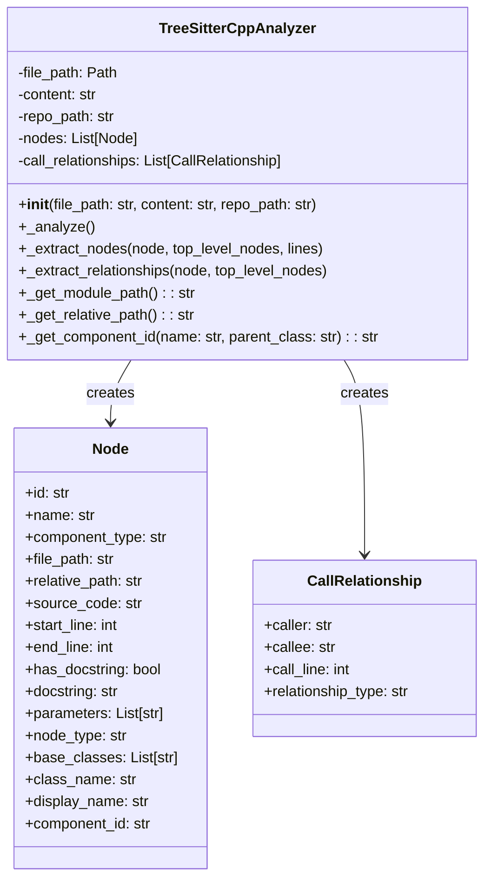
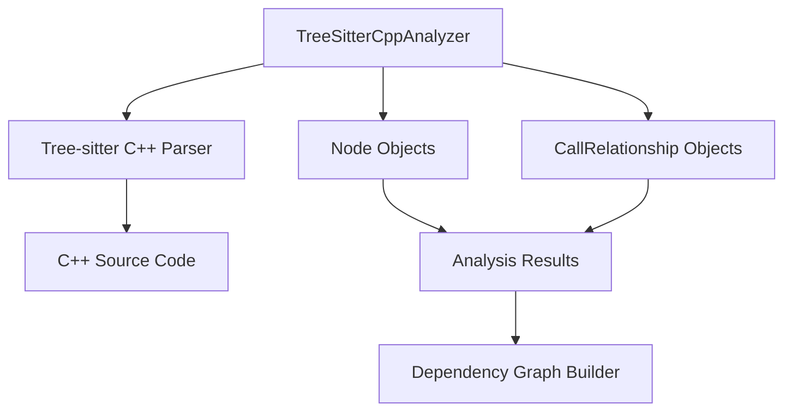
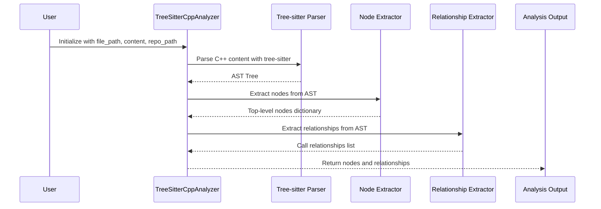

# C++ Analyzer Module Documentation

## Overview

The C++ Analyzer module (`TreeSitterCppAnalyzer`) is a specialized component within the dependency analyzer system that provides static analysis capabilities for C++ source code. It leverages the Tree-sitter parsing library with the C++ grammar to extract structural information, identify code elements, and map relationships between them.

This module is part of the broader [dependency_analyzer](dependency_analyzer.md) system and works in conjunction with other language analyzers to provide comprehensive multi-language code analysis capabilities.

## Purpose and Core Functionality

The C++ Analyzer module serves the following primary functions:

1. **Code Structure Extraction**: Parses C++ source files to identify and extract top-level code elements including classes, functions, methods, structs, variables, and namespaces.

2. **Dependency Analysis**: Identifies relationships between code elements such as function calls, inheritance relationships, object instantiation, and variable usage.

3. **Component Identification**: Generates unique component IDs for each identified code element to enable cross-referencing and relationship mapping.

4. **Source Code Mapping**: Preserves source code snippets and line number information for each identified element.

## Architecture



## Component Relationships



## Core Components

### TreeSitterCppAnalyzer

The main analyzer class that orchestrates the C++ code analysis process:

- **Initialization**: Takes a file path, content string, and optional repository path
- **Analysis Process**: Performs two main phases - node extraction and relationship extraction
- **Output**: Generates lists of `Node` and `CallRelationship` objects

### Node Model

Represents individual code elements extracted from C++ source files:

- **Properties**: ID, name, type, file path, source code, line numbers, and more
- **Supported Types**: Classes, functions, methods, structs, variables, namespaces
- **Component ID**: Unique identifier following the format `{module_path}.{parent_class}.{name}`

### CallRelationship Model

Represents relationships between code elements:

- **Caller/Callee**: Identifies the source and target of relationships
- **Relationship Types**: `calls`, `inherits`, `creates`, `uses`
- **Line Information**: Tracks where relationships occur in source code

## Data Flow



## Analysis Process

### 1. Node Extraction Phase

The analyzer recursively traverses the AST to identify and extract the following C++ elements:

- **Classes**: Identified by `class_specifier` nodes
- **Structs**: Identified by `struct_specifier` nodes
- **Functions**: Identified by `function_definition` nodes
- **Methods**: Functions within class/struct context
- **Variables**: Global variables identified by `declaration` nodes
- **Namespaces**: Identified by `namespace_definition` nodes

### 2. Relationship Extraction Phase

The analyzer identifies relationships between extracted nodes:

- **Function Calls**: Identified by `call_expression` nodes
- **Inheritance**: Identified by `base_class_clause` nodes
- **Object Creation**: Identified by `new_expression` nodes
- **Variable Usage**: Identified by `identifier` nodes in appropriate contexts

## Supported C++ Constructs

The analyzer handles various C++ language constructs:

- **Classes and Structs**: Including inheritance relationships
- **Functions and Methods**: With proper class context identification
- **Namespaces**: For proper scoping
- **Method Calls**: Both direct and through field expressions
- **Inheritance**: Base class relationships
- **Object Instantiation**: Using `new` expressions
- **Variable Usage**: Global variable references

## Component ID Generation

The analyzer generates unique component IDs using the following logic:

```
# For top-level elements:
{module_path}.{name}

# For class methods:
{module_path}.{parent_class}.{name}

# Example:
"src.utils.string_helper.StringHelper.validate_input"
```

## System Integration

The C++ Analyzer integrates with the broader system as follows:

1. **[analysis_service](analysis_service.md)**: Called by the main analysis service to process C++ files
2. **[dependency_graph_builder](dependency_graph_builder.md)**: Provides extracted nodes and relationships for graph construction
3. **[language_analyzers](language_analyzers.md)**: Works alongside other language analyzers in a unified interface

## Usage Example

```python
from codewiki.src.be.dependency_analyzer.analyzers.cpp import analyze_cpp_file

# Analyze a C++ file
nodes, relationships = analyze_cpp_file(
    file_path="/path/to/file.cpp",
    content="// C++ source code...",
    repo_path="/path/to/repository"
)

# Process results
for node in nodes:
    print(f"Found {node.component_type}: {node.name}")

for rel in relationships:
    print(f"{rel.caller} -> {rel.callee} ({rel.relationship_type})")
```

## Dependencies

- **tree-sitter**: Parsing library for AST generation
- **tree-sitter-cpp**: C++ grammar for tree-sitter
- **[Node](core_models.md)**: Core model for representing code elements
- **[CallRelationship](core_models.md)**: Core model for representing relationships

## Error Handling

The analyzer includes error handling for:

- Invalid file paths
- Malformed C++ source code
- Repository path resolution issues
- System function identification to avoid false relationships

## Performance Considerations

- Uses efficient tree-sitter parsing for fast AST generation
- Recursive traversal optimized for large code files
- Memory-efficient storage of analysis results