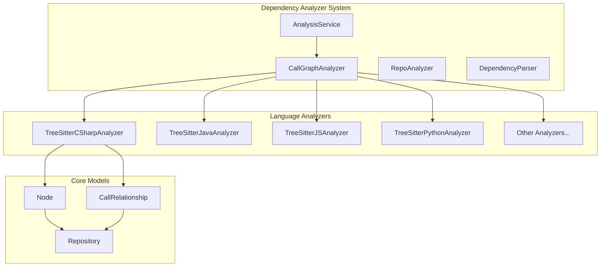
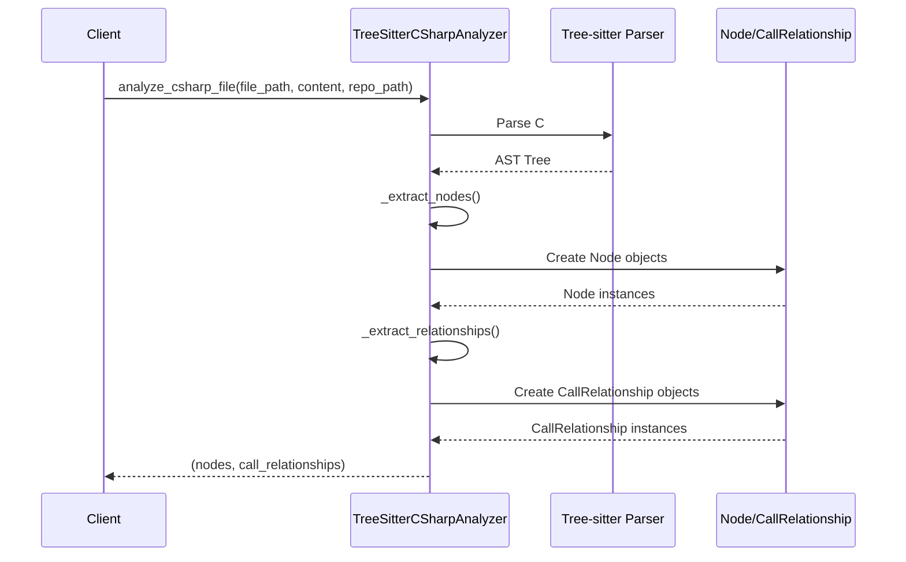

# C# Analyzer Module Documentation

## Overview

The C# Analyzer module (`TreeSitterCSharpAnalyzer`) is a specialized component within the dependency_analyzer system that provides static analysis capabilities for C# source code files. It leverages Tree-sitter parsing technology to extract structural information about C# code elements such as classes, interfaces, structs, enums, records, delegates, and their relationships.

This module is part of the broader dependency analysis system that enables the CodeWiki platform to understand code structure and relationships across multiple programming languages.

## Architecture



## Core Components

### TreeSitterCSharpAnalyzer

The main class responsible for analyzing C# source code files. It implements the following key functionality:

- **File Analysis**: Parses C# source code using Tree-sitter
- **Node Extraction**: Identifies and extracts code elements (classes, interfaces, etc.)
- **Relationship Detection**: Discovers dependencies between code elements
- **Path Resolution**: Converts file paths to module paths for component identification

#### Constructor
```python
def __init__(self, file_path: str, content: str, repo_path: str = None)
```

**Parameters:**
- `file_path`: Path to the C# source file being analyzed
- `content`: The actual source code content as a string
- `repo_path`: Optional repository root path for relative path calculations

#### Key Methods

**`_analyze()`**: Internal method that orchestrates the parsing and analysis process using Tree-sitter.

**`_extract_nodes()`**: Identifies and creates Node objects for various C# constructs:
- Classes (including abstract and static classes)
- Interfaces
- Structs
- Enums
- Records
- Delegates

**`_extract_relationships()`**: Discovers relationships between code elements, including:
- Class inheritance relationships
- Property type dependencies
- Field type dependencies
- Method parameter type dependencies

**`_get_component_id()`**: Generates unique component identifiers using the module path and element name.

### Standalone Function

**`analyze_csharp_file()`**: A convenience function that creates an analyzer instance and returns the extracted nodes and relationships.

## Data Flow



## Component Relationships

The C# Analyzer integrates with the broader system through several key relationships:

- **Dependency on Tree-sitter**: Uses `tree_sitter_c_sharp` for parsing
- **Integration with AnalysisService**: Called by the [analysis_service](analysis_service.md) as part of repository-wide analysis
- **Data Models**: Produces [Node](core_models.md) and [CallRelationship](core_models.md) objects that conform to the system's data model
- **AST Parser Integration**: Works with the [DependencyParser](ast_parser.md) to build comprehensive dependency graphs

## Supported C# Constructs

The analyzer identifies and processes the following C# language constructs:

### Types
- **Classes**: Regular, abstract, and static classes
- **Interfaces**: Interface declarations
- **Structs**: Value type declarations
- **Enums**: Enumeration types
- **Records**: Immutable reference types (C# 9.0+)
- **Delegates**: Function pointer types

### Relationships
- **Inheritance**: Class-to-base class relationships via `base_list`
- **Type Dependencies**: Property, field, and parameter type references
- **Primitive Type Recognition**: Built-in C# types are identified to avoid false dependencies

## Integration Points

### With Analysis Service
The C# Analyzer is invoked by the [AnalysisService](analysis_service.md) as part of the multi-language analysis pipeline. It follows the same interface contract as other language analyzers.

### With Dependency Graph Builder
The extracted nodes and relationships feed into the [DependencyGraphBuilder](dependency_graph_builder.md) to create comprehensive dependency graphs for the entire repository.

### With Documentation Generator
The structural information extracted by this analyzer supports the [DocumentationGenerator](documentation_generator.md) in creating accurate documentation for C# codebases.

## Implementation Details

### Path Handling
The analyzer converts file paths to module-style identifiers using dot notation, replacing path separators with dots and removing file extensions. For example, `src/models/user.cs` becomes `src.models.user` when in a repository context.

### Primitive Type Recognition
The analyzer includes a comprehensive list of C# primitive and common built-in types to avoid creating false dependency relationships. This includes both C# keywords (like `int`, `string`) and .NET Framework types (like `Int32`, `String`).

### Line Number Tracking
All extracted nodes include precise line number information (start and end lines) to support accurate source code location and context extraction.

## Usage Context

This module is typically used as part of the broader CodeWiki analysis pipeline when processing repositories containing C# code. It works in conjunction with other language analyzers to provide comprehensive multi-language dependency analysis.

For more information about the broader dependency analysis system, see the [dependency_analyzer](dependency_analyzer.md) documentation. For details about how this analyzer fits into the overall analysis workflow, see the [analysis_service](analysis_service.md) documentation.