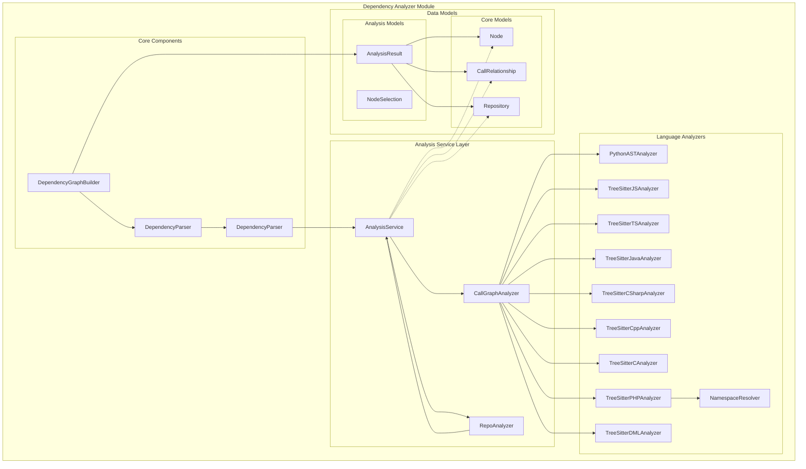

# Dependency Analyzer Module Overview

## Purpose

The `dependency_analyzer` module is a core component of the CodeWiki system responsible for static code analysis and dependency graph construction. It provides multi-language support for analyzing code repositories, extracting code components (functions, classes, methods), and identifying relationships between them to build comprehensive dependency graphs. This module enables understanding of code structure, call relationships, and dependencies across various programming languages including Python, JavaScript, TypeScript, Java, C#, C/C++, PHP, and DML.

## Architecture

## Core Components Documentation

- **[Analysis Service](dependency_analyzer/analysis_service.md)** - Main orchestrator for repository analysis with support for multiple programming languages
- **[Language Analyzers](dependency_analyzer/language_analyzers.md)** - Collection of language-specific analyzers using tree-sitter and AST parsing
- **[AST Parser](dependency_analyzer/ast_parser.md)** - Core parsing functionality that builds dependency graphs from repository analysis
- **[Dependency Graph Builder](dependency_analyzer/dependency_graph_builder.md)** - Constructs comprehensive dependency graphs and identifies leaf nodes for documentation
- **[Core Models](dependency_analyzer/core_models.md)** - Fundamental data structures (Node, CallRelationship, Repository) for representing code components
- **[Analysis Models](dependency_analyzer/analysis_models.md)** - Data models for analysis results and node selection for partial exports