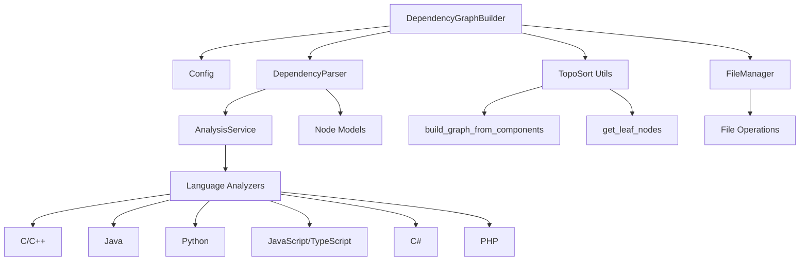
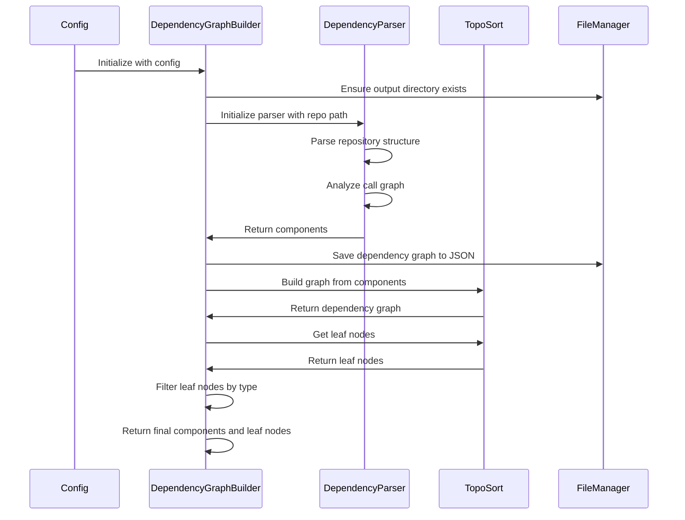
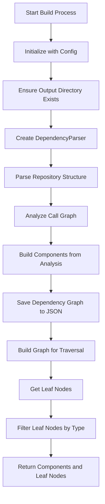

# Dependency Graph Builder Module

## Overview

The `dependency_graph_builder` module is responsible for analyzing code repositories and constructing dependency graphs that represent the relationships between different code components. This module serves as a critical component in the CodeWiki system, enabling the identification of code structure, dependencies, and leaf nodes that can be used for documentation generation.

The module leverages AST parsing and call graph analysis to extract component relationships and builds a comprehensive dependency graph that can be used for various downstream tasks including documentation generation and code analysis.

## Architecture

## Core Components

### DependencyGraphBuilder

The main class responsible for orchestrating the dependency graph building process. It takes a configuration object and performs the following operations:

- Initializes with a `Config` object containing repository and output paths
- Builds dependency graphs using the `DependencyParser`
- Processes and filters leaf nodes based on component types
- Saves dependency graphs to JSON files

#### Key Methods

- `build_dependency_graph()`: Main method that orchestrates the entire process, returning components and filtered leaf nodes

## Data Flow

## Component Interactions

The `DependencyGraphBuilder` interacts with several key components:

1. **Config**: Provides repository path, output directories, and other configuration parameters
2. **DependencyParser**: Performs AST parsing and call graph analysis to extract components
3. **TopoSort Utilities**: Builds dependency graphs and identifies leaf nodes
4. **FileManager**: Handles file I/O operations for saving dependency graphs

## Process Flow

## Dependencies

The `dependency_graph_builder` module depends on:

- [config](config.md): For repository and output path configuration
- [ast_parser](ast_parser.md): For parsing repository and extracting components
- [topo_sort](topo_sort.md): For building dependency graphs and identifying leaf nodes
- [utils](utils.md): For file management operations
- [analysis_service](analysis_service.md): For repository analysis capabilities
- [core_models](core_models.md): For Node and component models

## Integration Points

The module integrates with the broader system through:

1. **CLI Layer**: Receives configuration from the CLI and provides dependency graphs for documentation generation
2. **Analysis Pipeline**: Works as part of the dependency analysis pipeline in the backend
3. **Documentation Generator**: Provides dependency information used by the documentation generator

## Key Features

- **Multi-language Support**: Works with various programming languages through the underlying analysis service
- **Smart Leaf Node Filtering**: Filters leaf nodes based on component types, including functions for C-based projects
- **Persistent Storage**: Saves dependency graphs to JSON files for later use
- **Error Handling**: Includes validation and filtering of invalid leaf node identifiers

## Usage Context

This module is typically used as part of the larger CodeWiki analysis pipeline where it:

1. Takes a repository path as input
2. Analyzes the code structure and dependencies
3. Builds a dependency graph
4. Identifies leaf nodes suitable for documentation
5. Returns structured data for further processing

The resulting dependency graph and leaf nodes are used by other modules in the system for documentation generation and code analysis tasks.