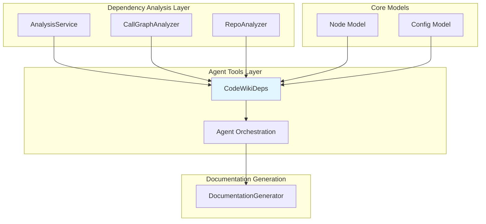
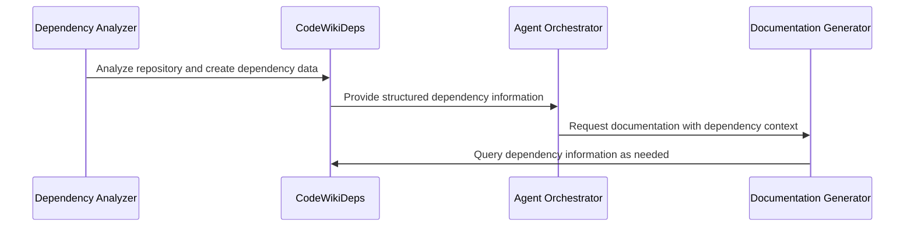

# CodeWiki Dependencies Module Documentation

## Overview

The `deps` module is a core component of the CodeWiki system that manages dependency information for code documentation generation. It provides the `CodeWikiDeps` dataclass that encapsulates all necessary information about code dependencies, module relationships, and configuration parameters needed for the documentation generation process.

This module serves as a bridge between the dependency analysis phase and the documentation generation phase, providing structured access to dependency information that agents can use to understand code relationships and generate comprehensive documentation.

## Architecture



## Core Component: CodeWikiDeps

### Class Definition

The `CodeWikiDeps` class is a dataclass that contains all the necessary information for dependency-aware documentation generation:

```python
@dataclass
class CodeWikiDeps:
    absolute_docs_path: str
    absolute_repo_path: str
    registry: dict
    components: dict[str, Node]
    path_to_current_module: list[str]
    current_module_name: str
    module_tree: dict[str, any]
    max_depth: int
    current_depth: int
    config: Config  # LLM configuration
```

### Properties

| Property | Type | Description |
|----------|------|-------------|
| `absolute_docs_path` | `str` | Absolute path to the documentation output directory |
| `absolute_repo_path` | `str` | Absolute path to the source code repository |
| `registry` | `dict` | Registry containing all discovered components and their relationships |
| `components` | `dict[str, Node]` | Mapping of component IDs to Node objects containing detailed information |
| `path_to_current_module` | `list[str]` | List of module names representing the path to the current module |
| `current_module_name` | `str` | Name of the currently analyzed module |
| `module_tree` | `dict[str, any]` | Hierarchical representation of the module structure |
| `max_depth` | `int` | Maximum allowed depth for dependency analysis |
| `current_depth` | `int` | Current depth in the dependency analysis |
| `config` | `Config` | Configuration object containing LLM settings and paths |

### Dependencies

The `CodeWikiDeps` class depends on:

- [Node](dependency_analyzer.md) - Core model representing code components with their relationships and metadata
- [Config](config.md) - Configuration class containing system settings and LLM parameters

## Data Flow



## Component Interactions

The `CodeWikiDeps` module interacts with several other modules in the CodeWiki system:

### With Dependency Analyzer
- Receives analyzed dependency data from [AnalysisService](dependency_analyzer.md)
- Provides component relationships through the `Node` model
- Supplies the module tree structure for navigation

### With Agent Tools
- Used by [AgentOrchestrator](agent_orchestrator.md) to provide dependency context to agents
- Supplies information needed by documentation generation tools
- Enables agents to understand code relationships and dependencies

### With Configuration System
- Utilizes [Config](config.md) for system-wide settings
- Provides path information for documentation output
- Manages depth limits for analysis

## Usage Context

The `CodeWikiDeps` module is primarily used in the following scenarios:

1. **Documentation Generation**: When agents need to understand code relationships to generate comprehensive documentation
2. **Dependency Analysis**: When analyzing how different components interact within a codebase
3. **Module Navigation**: When traversing the module tree to understand code structure
4. **Context Provision**: When providing agents with the necessary context about code dependencies

## Integration Points

### Agent Integration
The `CodeWikiDeps` object is passed to agents through the [AgentOrchestrator](agent_orchestrator.md) to provide them with dependency information needed for documentation generation.

### Tool Integration
The module integrates with [str_replace_editor](str_replace_editor.md) tools to provide dependency context when editing or generating documentation files.

## Key Features

1. **Hierarchical Module Representation**: Maintains a tree structure of modules for easy navigation
2. **Component Registry**: Provides quick access to all analyzed components and their relationships
3. **Depth Management**: Controls analysis depth to prevent infinite recursion in circular dependencies
4. **Path Tracking**: Maintains current module path for context-aware operations
5. **Configuration Integration**: Incorporates system configuration for consistent behavior

## Relationship to Other Modules

The `deps` module is a critical component that connects the dependency analysis phase with the documentation generation phase. It serves as the data structure that carries dependency information from the [dependency_analyzer](dependency_analyzer.md) to the [documentation_generator](documentation_generator.md) through the [agent_orchestrator](agent_orchestrator.md).

For more information about related modules:
- [dependency_analyzer](dependency_analyzer.md) - For dependency analysis implementation
- [agent_orchestrator](agent_orchestrator.md) - For agent coordination
- [documentation_generator](documentation_generator.md) - For documentation generation process
- [config](config.md) - For system configuration details