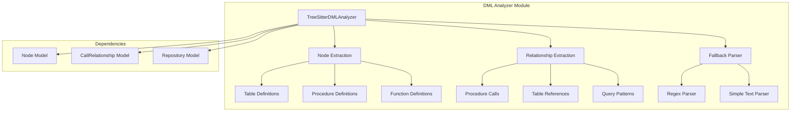
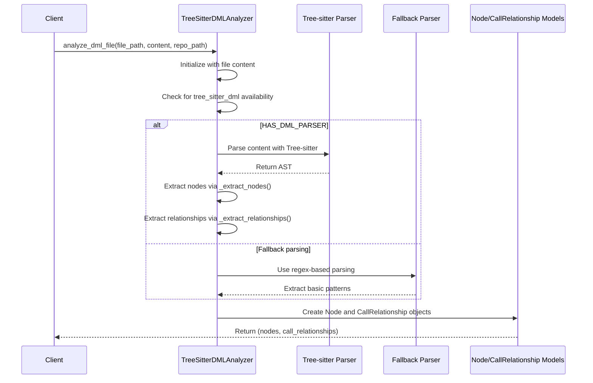
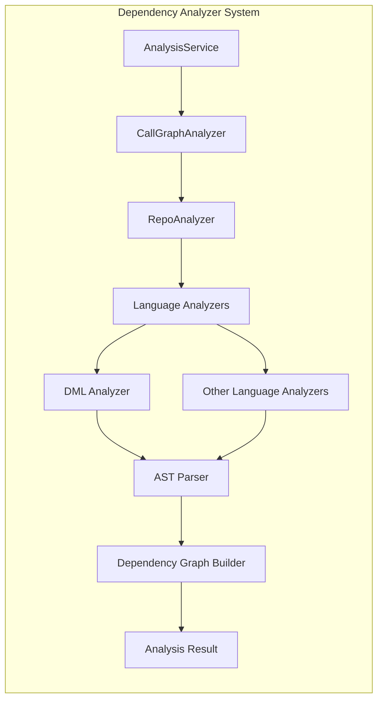

# DML Analyzer Module Documentation

## Overview

The DML (Data Manipulation Language) Analyzer is a specialized component within the dependency analyzer system that handles parsing and analysis of database-related files such as SQL, DML, and DDL files. This module uses Tree-sitter for AST-based parsing when available, with a fallback to regex-based parsing when the DML parser is not available.

The analyzer extracts database objects like tables, procedures, functions, and their relationships to build a comprehensive dependency graph for database-related code.

## Architecture



## Core Components

### TreeSitterDMLAnalyzer Class

The main analyzer class that handles DML file parsing and analysis:

- **Purpose**: Extracts database objects and relationships from DML files
- **Input**: File path, content, and optional repository path
- **Output**: List of `Node` objects and `CallRelationship` objects

#### Key Methods:

1. **`__init__(file_path, content, repo_path)`**: Initializes the analyzer and performs analysis
2. **`_analyze()`**: Uses Tree-sitter parser for detailed analysis
3. **`_analyze_fallback()`**: Uses regex-based parsing when Tree-sitter is unavailable
4. **`_extract_nodes()`**: Recursively extracts database objects from AST
5. **`_extract_relationships()`**: Identifies relationships between database objects
6. **`_find_containing_procedure()`**: Locates the procedure containing a specific node

### Helper Functions

- **`analyze_dml_file(file_path, content, repo_path)`**: Main entry point function that returns nodes and relationships

## Data Flow



## Analysis Capabilities

### Database Objects Identified

1. **Tables**: Extracted from `CREATE TABLE` statements
2. **Procedures**: Extracted from `CREATE PROCEDURE` statements
3. **Functions**: Extracted from `CREATE FUNCTION` statements
4. **Query Patterns**: SELECT, INSERT, UPDATE, DELETE operations

### Relationships Detected

1. **Procedure Calls**: When one procedure calls another
2. **Table References**: When procedures query specific tables
3. **Query Dependencies**: Relationships between queries and database objects

## Dependencies

The DML analyzer module depends on:

- [Node](core_models.md) and [CallRelationship](core_models.md) models for representing database objects and their relationships
- Tree-sitter parser for DML (with fallback to regex parsing)
- [Repository](core_models.md) model for path resolution

## Integration with Dependency Analyzer System



The DML analyzer integrates with the broader dependency analysis system by:

1. Being invoked by the [RepoAnalyzer](analysis_service.md) for DML files
2. Producing [Node](core_models.md) and [CallRelationship](core_models.md) objects compatible with the system
3. Contributing to the overall dependency graph through the [DependencyGraphBuilder](dependency_graph_builder.md)

## Fallback Mechanism

The analyzer includes a robust fallback mechanism:

- When `tree_sitter_dml` is not available, it uses regex-based parsing
- Basic patterns for CREATE TABLE, CREATE PROCEDURE, CREATE FUNCTION statements
- Simple text parsing for extracting database object definitions

## File Extensions Supported

The analyzer handles the following file extensions:
- `.dml` - Data Manipulation Language files
- `.sql` - SQL files
- `.ddl` - Data Definition Language files

## Usage Example

```python
from codewiki.src.be.dependency_analyzer.analyzers.dml import analyze_dml_file

# Analyze a DML file
nodes, relationships = analyze_dml_file(
    file_path="path/to/database.sql",
    content="CREATE TABLE users (id INT, name VARCHAR(50));",
    repo_path="/path/to/repo"
)

# Process extracted nodes and relationships
for node in nodes:
    print(f"Found {node.component_type}: {node.name}")

for rel in relationships:
    print(f"Relationship: {rel.caller} -> {rel.callee}")
```

## Error Handling

The analyzer gracefully handles:
- Missing Tree-sitter parser (uses fallback)
- Invalid DML syntax (continues analysis where possible)
- File path resolution issues (uses absolute paths as fallback)

## Performance Considerations

- Uses Tree-sitter for efficient parsing when available
- Implements recursive AST traversal for comprehensive analysis
- Includes fallback parsing to ensure functionality without external dependencies