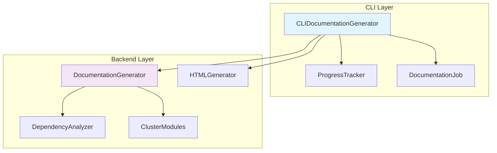
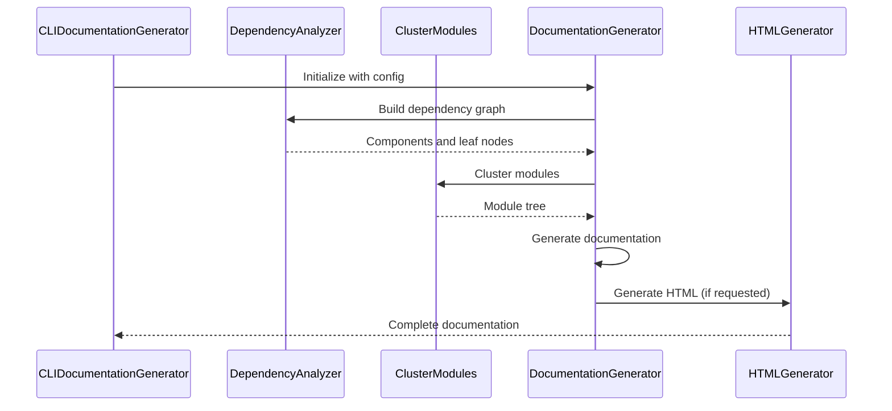
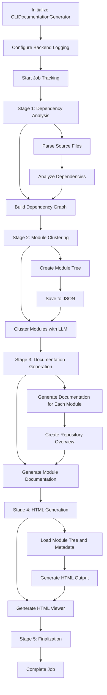

# Documentation Generator CLI Module

## Overview

The `doc_generator` module serves as a CLI adapter for the backend documentation generation system. It wraps the core backend `DocumentationGenerator` and provides CLI-specific functionality including progress tracking, error handling, and logging configuration. This module bridges the gap between the command-line interface and the sophisticated backend documentation generation capabilities.

## Architecture

## Core Components

### CLIDocumentationGenerator

The main class that orchestrates the documentation generation process. It manages the entire workflow from dependency analysis to final documentation output.

**Key Responsibilities:**
- Initialize and configure the backend documentation generator
- Track progress through multiple generation stages
- Handle CLI-specific configuration and logging
- Manage job lifecycle and statistics

**Initialization Parameters:**
- `repo_path`: Path to the repository to document
- `output_dir`: Directory for generated documentation
- `config`: LLM configuration dictionary
- `verbose`: Enable verbose output mode
- `generate_html`: Flag to generate HTML viewer

## Dependencies

The `doc_generator` module depends on several other modules in the system:

- **[config_manager](config_manager.md)**: For configuration management
- **[progress](progress.md)**: For progress tracking and reporting
- **[job_models](job_models.md)**: For job status and statistics tracking
- **[html_generator](html_generator.md)**: For HTML output generation
- **[dependency_analyzer](dependency_analyzer.md)**: For code analysis and dependency graph building
- **[documentation_generator](documentation_generator.md)**: For core documentation generation capabilities

## Data Flow

## Process Flow

## Key Features

### Progress Tracking
The module provides detailed progress tracking through 5 distinct stages:
1. Dependency Analysis
2. Module Clustering
3. Documentation Generation
4. HTML Generation (optional)
5. Finalization

### Logging Configuration
The module configures backend logging for CLI use with colored output formatting, supporting both verbose and non-verbose modes.

### Error Handling
Comprehensive error handling with job failure tracking and API error propagation.

### HTML Generation
Optional HTML viewer generation for easy documentation browsing.

## Integration Points

The `doc_generator` module integrates with the broader system through:

- **[CLI](cli.md)**: As the main entry point for documentation generation
- **[Backend Services](documentation_generator.md)**: For core documentation capabilities
- **[Configuration System](config.md)**: For managing LLM and generation settings
- **[Progress Tracking](progress.md)**: For user feedback during generation

## Usage Context

This module is typically used when generating documentation from the command line, providing a user-friendly interface to the sophisticated backend documentation generation system while maintaining detailed progress reporting and error handling appropriate for CLI usage.