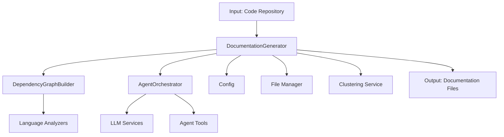
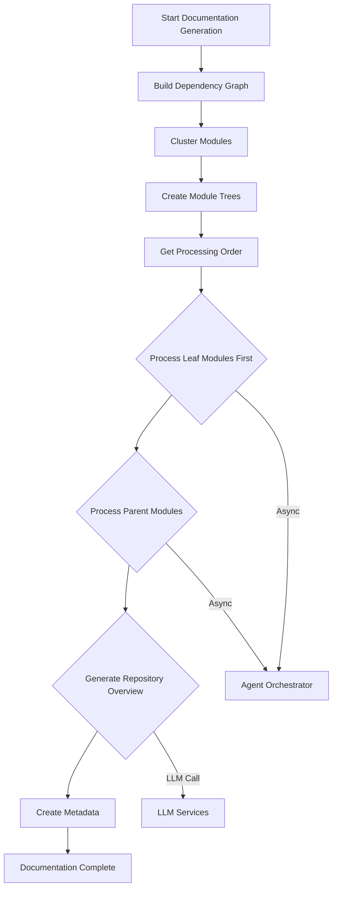
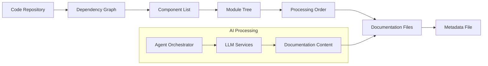
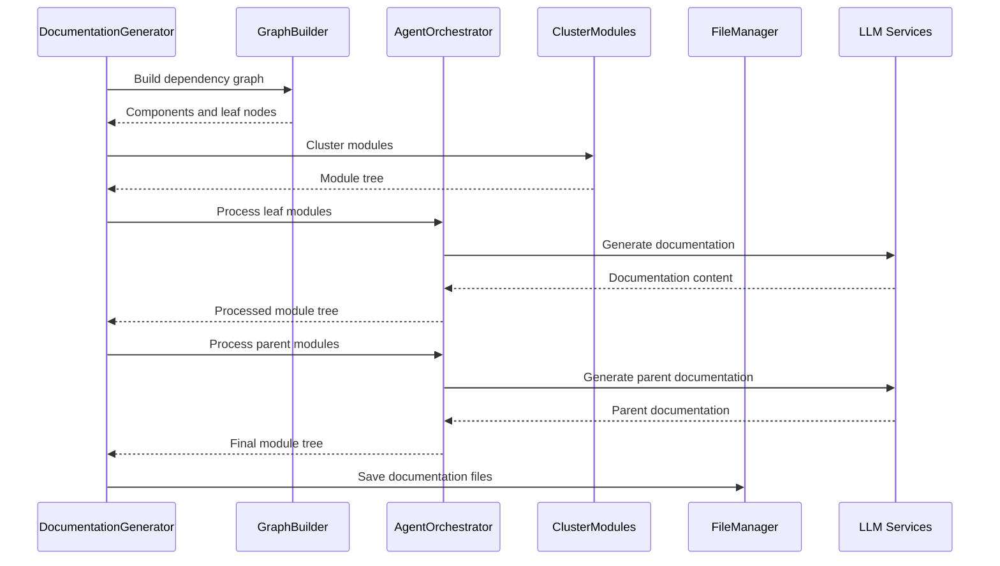

# Documentation Generator Module

## Overview

The Documentation Generator module is the core component responsible for orchestrating the automated generation of comprehensive documentation for code repositories. It implements a dynamic programming approach to efficiently process code modules in dependency order, starting with leaf modules and working up to parent modules and repository overviews.

The module serves as the main entry point for the documentation generation process, coordinating with various backend services including dependency analysis, clustering algorithms, and AI agents to produce structured documentation in markdown format.

## Architecture



## Core Components

### DocumentationGenerator Class

The main orchestrator class that manages the entire documentation generation workflow:

- **Initialization**: Takes a configuration object and optional commit ID
- **Dependency Management**: Uses DependencyGraphBuilder to analyze code structure
- **Agent Coordination**: Leverages AgentOrchestrator for AI-powered documentation
- **Processing Logic**: Implements dynamic programming approach for efficient processing

## Key Features

### 1. Dynamic Programming Approach
The module implements a sophisticated processing order that:
- Processes leaf modules first (modules with no dependencies)
- Then processes parent modules that depend on leaf modules
- Finally generates repository overview documentation
- Ensures dependencies are documented before dependent modules

### 2. Module Clustering
- Groups related code components into logical modules
- Creates hierarchical module trees for organized documentation
- Supports both initial clustering and refined module organization

### 3. Hierarchical Documentation Generation
- Generates documentation for individual modules
- Creates parent module overviews based on child module documentation
- Produces comprehensive repository overview

### 4. Metadata Management
- Creates detailed metadata files with generation information
- Tracks statistics about the documentation process
- Records model information and processing details

## Dependencies

The Documentation Generator module depends on several key components:

- **[dependency_analyzer](dependency_analyzer.md)**: Provides dependency graph analysis and code structure understanding
- **[agent_orchestrator](agent_orchestrator.md)**: Manages AI agents for documentation generation
- **[config](config.md)**: Configuration management for the documentation process
- **[utils](utils.md)**: File management utilities for handling documentation files
- **[llm_services](llm_services.md)**: Language model services for AI-powered documentation
- **[cluster_modules](cluster_modules.md)**: Module clustering algorithms for organizing code components

## Processing Workflow



## Data Flow



## Component Interaction



## Processing Order Algorithm

The module implements a topological sort algorithm to determine processing order:

1. **Leaf Module First**: Modules with no children are processed first
2. **Parent Module After Children**: Parent modules are processed after all their children
3. **Repository Overview Last**: The overall repository documentation is generated last

```python
def get_processing_order(self, module_tree: Dict[str, Any], parent_path: List[str] = []) -> List[tuple[List[str], str]]:
    processing_order = []
    
    def collect_modules(tree: Dict[str, Any], path: List[str]):
        for module_name, module_info in tree.items():
            current_path = path + [module_name]
            
            # If this module has children, process them first
            if module_info.get("children") and isinstance(module_info["children"], dict) and module_info["children"]:
                collect_modules(module_info["children"], current_path)
                # Add this parent module after its children
                processing_order.append((current_path, module_name))
            else:
                # This is a leaf module, add it immediately
                processing_order.append((current_path, module_name))
    
    collect_modules(module_tree, parent_path)
    return processing_order
```

## File Structure

The module generates the following files in the documentation directory:

- `overview.md`: Repository-level overview documentation
- `module_tree.json`: Complete hierarchical module structure
- `first_module_tree.json`: Initial module clustering result
- `metadata.json`: Generation metadata and statistics
- Individual module documentation files (`.md`)

## Error Handling

The module implements comprehensive error handling:

- Try-catch blocks around critical operations
- Detailed logging for debugging
- Graceful degradation when individual modules fail
- Complete traceback logging for debugging

## Integration Points

The Documentation Generator integrates with:

- **CLI Layer**: Through configuration and command-line interfaces
- **Frontend**: Through background workers and job status tracking
- **Storage**: Through file management utilities
- **AI Services**: Through LLM integration for content generation

## Performance Considerations

- **Dynamic Programming**: Efficient processing order reduces redundant work
- **Asynchronous Processing**: Async operations for better performance
- **Caching**: Module trees are cached to avoid recomputation
- **Batch Processing**: Multiple modules can be processed in parallel

## Configuration Options

The module uses configuration from the [config](config.md) module to control:

- Repository path and commit ID
- Output directory for documentation
- Maximum depth for module analysis
- LLM model selection and parameters
- Processing behavior and limits

## Usage

The Documentation Generator is typically used as part of the overall documentation generation pipeline:

```python
from codewiki.src.be.documentation_generator import DocumentationGenerator
from codewiki.src.config import Config

config = Config()
generator = DocumentationGenerator(config, commit_id="abc123")
await generator.run()
```

## Future Enhancements

Potential areas for improvement include:

- Enhanced parallel processing capabilities
- Improved module clustering algorithms
- Better handling of circular dependencies
- More sophisticated content aggregation strategies
- Integration with version control systems for incremental updates