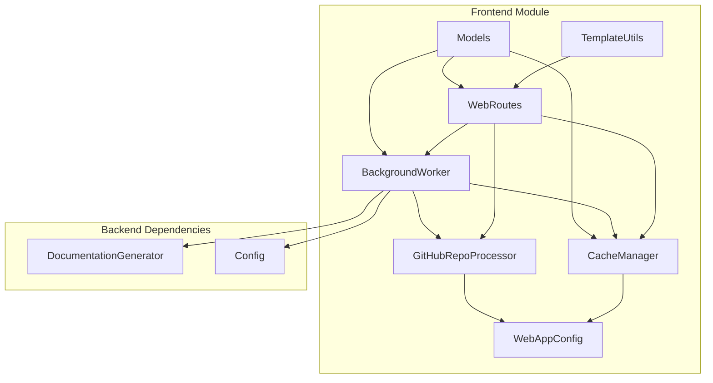
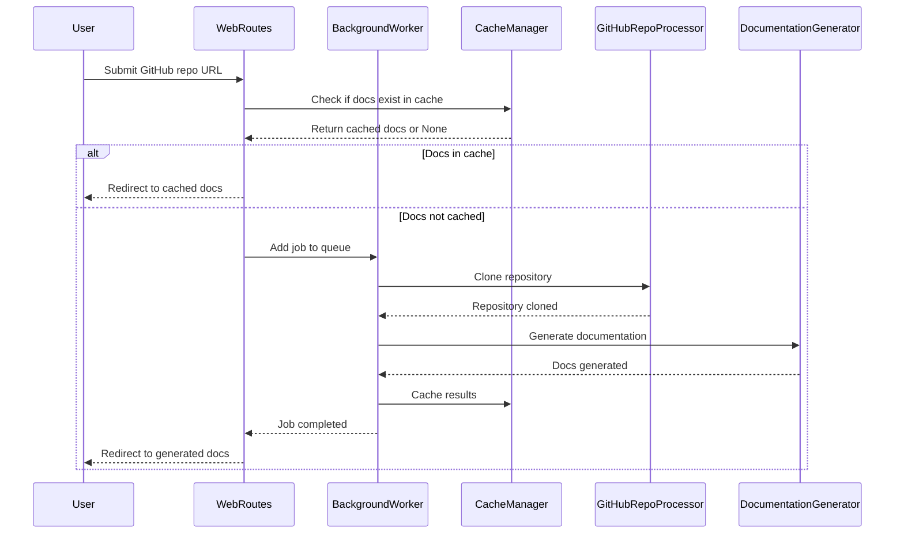

# Frontend Module Documentation

The frontend module of CodeWiki provides a web-based interface for users to submit GitHub repositories for documentation generation and view the results. It handles user interactions, job management, caching, and serves the generated documentation.

## Architecture Overview

## Core Components

### Web Routes (`codewiki.src.fe.routes.WebRoutes`)
Handles all web routes for the application, including:
- Main page with form for submitting GitHub repositories
- Repository submission processing
- Job status API endpoint
- Documentation viewing functionality
- Serving generated documentation files

### Background Worker (`codewiki.src.fe.background_worker.BackgroundWorker`)
Manages documentation generation jobs in the background:
- Processes jobs from a queue
- Handles repository cloning
- Coordinates with the backend documentation generator
- Manages job status tracking
- Handles caching of results

### Cache Manager (`codewiki.src.fe.cache_manager.CacheManager`)
Manages documentation cache to avoid redundant processing:
- Stores generated documentation by repository hash
- Handles cache expiration and cleanup
- Provides fast retrieval of previously generated docs

### GitHub Processor (`codewiki.src.fe.github_processor.GitHubRepoProcessor`)
Handles GitHub repository operations:
- Validates GitHub URLs
- Extracts repository information
- Clones repositories to temporary directories

### Models (`codewiki.src.fe.models`)
Contains data models for the frontend:
- `RepositorySubmission`: Pydantic model for repository submission form
- `JobStatusResponse`: Pydantic model for job status API response
- `JobStatus`: Tracks the status of documentation generation jobs
- `CacheEntry`: Represents a cached documentation result

### Configuration (`codewiki.src.fe.config.WebAppConfig`)
Centralized configuration for web application settings:
- Directory paths (cache, temp, output)
- Queue settings
- Cache expiration settings
- Server settings

### Template Utilities (`codewiki.src.fe.template_utils`)
Handles template rendering using Jinja2:
- String template loader
- Template rendering functions
- Navigation and job list rendering

## Sub-modules Documentation

For detailed information about specific sub-modules, see:
- [frontend_cache_manager.md](frontend_cache_manager.md) - Detailed documentation for cache management
- [frontend_background_worker.md](frontend_background_worker.md) - Detailed documentation for background job processing
- [frontend_routes.md](frontend_routes.md) - Detailed documentation for web routes and API endpoints
- [frontend_github_processor.md](frontend_github_processor.md) - Detailed documentation for GitHub repository processing
- [frontend_models.md](frontend_models.md) - Detailed documentation for data models
- [frontend_config.md](frontend_config.md) - Detailed documentation for configuration settings
- [frontend_template_utils.md](frontend_template_utils.md) - Detailed documentation for template utilities

## Integration with Other Modules

The frontend module integrates with several other modules in the CodeWiki system:

- **Backend Documentation Generator**: The frontend's background worker uses the [documentation_generator](documentation_generator.md) module to actually generate documentation
- **Configuration**: Uses the [config](config.md) module for application-wide settings
- **Utilities**: Leverages the [utils](utils.md) module for file operations and other utilities

## Data Flow

## Key Features

1. **Job Queue Management**: Handles multiple documentation generation requests concurrently
2. **Caching System**: Avoids redundant processing by caching previously generated documentation
3. **Progress Tracking**: Provides real-time progress updates for documentation generation jobs
4. **GitHub Integration**: Direct integration with GitHub repositories for easy documentation generation
5. **Web Interface**: User-friendly web interface for submitting repositories and viewing results
6. **Documentation Serving**: Built-in capability to serve generated documentation as web pages