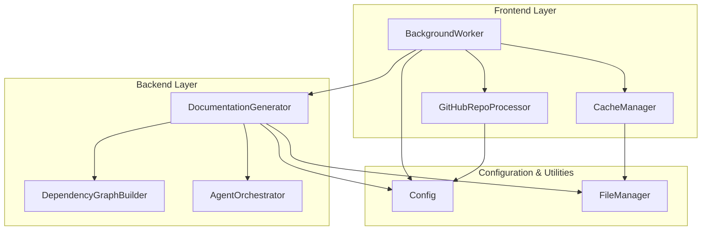
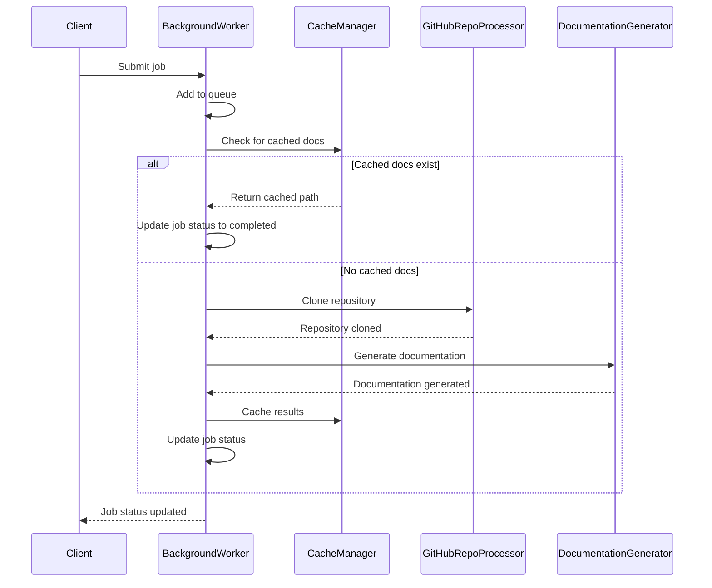
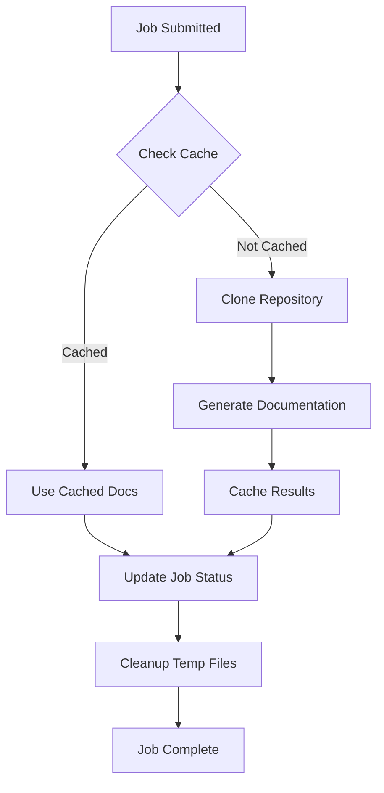

# Frontend Background Worker Module

## Overview

The `frontend_background_worker` module is responsible for processing documentation generation jobs in the background. It manages a queue of jobs, processes them asynchronously, and maintains job status information. This module acts as the core processing engine that coordinates with other backend components to generate documentation for GitHub repositories.

The background worker handles the complete lifecycle of documentation generation, from repository cloning to final documentation output, while providing real-time progress updates and caching capabilities to optimize performance.

## Architecture

## Core Components

### BackgroundWorker

The `BackgroundWorker` class is the main component of this module. It manages the job queue, processes documentation generation tasks, and maintains job status information.

#### Key Responsibilities:
- Job queue management
- Job status tracking
- Repository cloning and processing
- Documentation generation orchestration
- Caching integration
- Progress reporting

#### Key Methods:

**`start()`** - Starts the background worker thread
- Creates and starts a daemon thread that runs the `_worker_loop()`
- Sets the `running` flag to True

**`stop()`** - Stops the background worker
- Sets the `running` flag to False to terminate the worker loop

**`add_job(job_id, job)`** - Adds a job to the processing queue
- Stores job status in memory
- Adds job ID to the processing queue

**`get_job_status(job_id)`** - Retrieves job status by ID
- Returns the JobStatus object for the specified job

**`_process_job(job_id)`** - Processes a single documentation generation job
- Handles the complete job lifecycle from start to finish
- Manages repository cloning, documentation generation, and cleanup

**`load_job_statuses()`** - Loads job statuses from disk
- Restores job state from persistent storage
- Handles backward compatibility with cache-based job reconstruction

## Data Flow

## Component Interactions

### Job Lifecycle Management

The background worker manages the complete lifecycle of documentation generation jobs:

1. **Job Submission**: Jobs are added to the processing queue via the `add_job()` method
2. **Queue Processing**: The worker loop continuously processes jobs from the queue
3. **Status Tracking**: Job status is maintained in memory and persisted to disk
4. **Progress Updates**: Real-time progress updates are provided during processing

### Caching Integration

The worker integrates with the [CacheManager](frontend_cache_manager.md) to:
- Check for existing cached documentation before processing
- Store newly generated documentation in the cache
- Handle cache expiration and cleanup

### Repository Processing

The worker uses [GitHubRepoProcessor](frontend_github_processor.md) to:
- Validate GitHub repository URLs
- Extract repository information
- Clone repositories to temporary directories

### Documentation Generation

The worker orchestrates the documentation generation process by:
- Creating configuration objects for the [DocumentationGenerator](documentation_generator.md)
- Running the async documentation generation process
- Managing temporary directories and cleanup

## Process Flow

## Configuration and Dependencies

The background worker depends on several configuration parameters:

- `WebAppConfig.TEMP_DIR`: Directory for temporary repository clones
- `WebAppConfig.QUEUE_SIZE`: Maximum size of the processing queue
- `WebAppConfig.CACHE_DIR`: Directory for job status persistence
- `WebAppConfig.CLONE_TIMEOUT`: Timeout for repository cloning operations

## Error Handling and Recovery

The background worker implements robust error handling:

- **Repository Clone Failures**: Jobs fail gracefully with error messages
- **Documentation Generation Errors**: Exceptions are caught and reported
- **Temporary File Cleanup**: Ensures cleanup even when errors occur
- **Job Status Persistence**: Job states are saved to disk for recovery
- **Cache Reconstruction**: Handles backward compatibility with cache-based job reconstruction

## Persistence and State Management

The worker maintains state across application restarts:

- **Job Status Storage**: Job statuses are saved to `jobs.json` in the cache directory
- **State Recovery**: Loads previous job states on startup
- **Cache Integration**: Leverages cache for persistent documentation storage

## Integration Points

The background worker integrates with:

- **[Frontend Routes](frontend_routes.md)**: Provides job status endpoints
- **[Cache Manager](frontend_cache_manager.md)**: Manages documentation caching
- **[GitHub Processor](frontend_github_processor.md)**: Handles repository operations
- **[Documentation Generator](documentation_generator.md)**: Core documentation generation
- **[Config System](config.md)**: Application configuration management

## Performance Considerations

- **Queue Management**: Configurable queue size to manage memory usage
- **Concurrent Processing**: Single-threaded processing to avoid resource conflicts
- **Caching**: Reduces redundant processing of the same repositories
- **Temporary Storage**: Efficient cleanup of temporary repository clones

## Security Considerations

- **Repository Validation**: Validates GitHub URLs before processing
- **Temporary Directory Security**: Uses secure temporary directory management
- **Input Sanitization**: Sanitizes repository names for file system safety