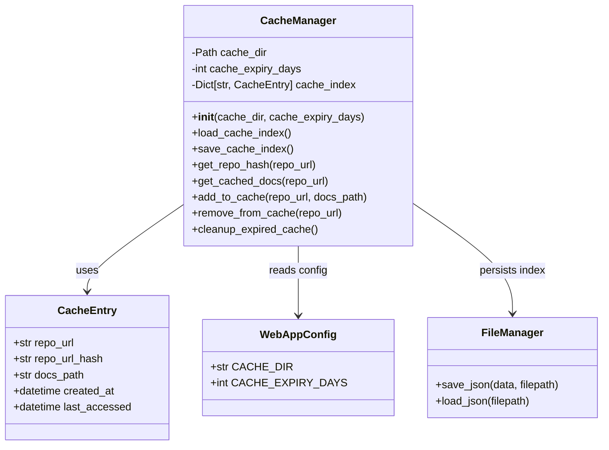
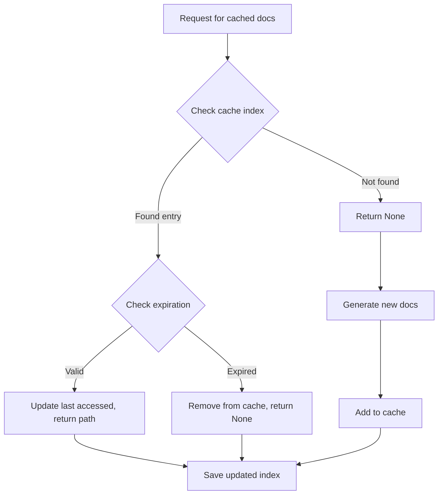
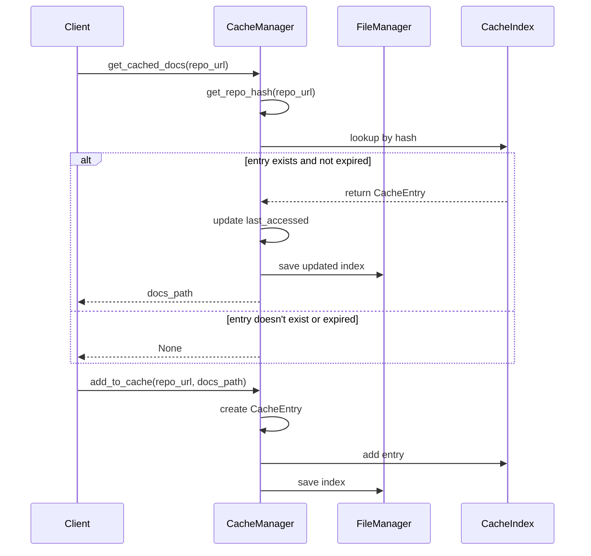

# Frontend Cache Manager

## Introduction

The `frontend_cache_manager` module provides caching functionality for the CodeWiki web application. It manages the storage and retrieval of generated documentation for repositories, implementing an efficient caching system that reduces redundant processing and improves response times. The module is responsible for maintaining a cache index, handling cache expiration, and managing the lifecycle of cached documentation.

## Architecture

The cache manager follows a simple but effective architecture that stores documentation results in a file-based cache system with an in-memory index for fast lookups.

## Core Components

### CacheManager

The main class that manages the caching system:

- **Initialization**: Creates cache directory and loads existing cache index
- **Hash Generation**: Creates unique identifiers for repository URLs
- **Cache Operations**: Provides methods to add, retrieve, and remove cached documentation
- **Index Management**: Maintains an in-memory index of cached entries
- **Expiration Handling**: Manages cache expiration and cleanup

### CacheEntry

A data model representing a cached documentation result:

- `repo_url`: The original repository URL
- `repo_url_hash`: Hashed version of the repository URL for efficient lookup
- `docs_path`: File path to the cached documentation
- `created_at`: Timestamp when the cache entry was created
- `last_accessed`: Timestamp of the last access to this cache entry

## Dependencies

The cache manager module depends on several other components:

- [frontend_models](frontend_models.md): Contains the `CacheEntry` model definition
- [frontend_config](frontend_config.md): Provides default cache directory and expiration settings
- [utils](utils.md): Uses `FileManager` for JSON persistence operations

## Data Flow

## Component Interactions

## Process Flow

The cache manager follows these key processes:

1. **Initialization**: On startup, the cache manager loads the existing cache index from disk
2. **Cache Lookup**: When checking for cached documentation, it generates a hash of the repository URL and looks up the entry in the index
3. **Expiration Check**: Valid entries are checked for expiration based on the configured expiry period
4. **Cache Update**: When adding new entries, the cache index is updated and persisted to disk
5. **Cleanup**: Periodically, expired entries are removed from the cache

## Configuration

The cache manager uses the following configuration parameters from [WebAppConfig](frontend_config.md):

- `CACHE_DIR`: Directory where cached documentation is stored (default: "./output/cache")
- `CACHE_EXPIRY_DAYS`: Number of days before cache entries expire (default: 365)

## Error Handling

The cache manager includes error handling for:

- File I/O operations when loading/saving the cache index
- Invalid cache entries that cannot be parsed
- Missing cache directories that are automatically created

## Integration Points

The cache manager integrates with the broader system through:

- [frontend_routes](frontend_routes.md): Provides cached documentation to API endpoints
- [frontend_background_worker](frontend_background_worker.md): Uses cache to avoid redundant documentation generation
- [frontend_github_processor](frontend_github_processor.md): Checks cache before processing GitHub repositories