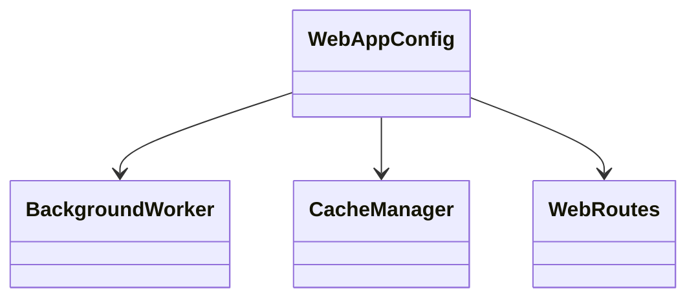
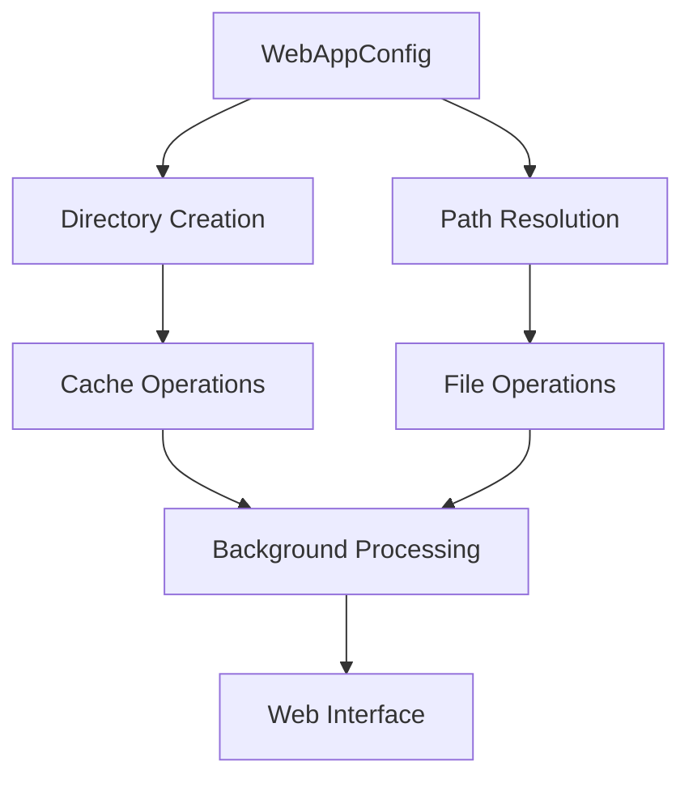

# Frontend Configuration Module (frontend_config)

## Introduction

The `frontend_config` module provides centralized configuration management for the CodeWiki web application. It defines static configuration parameters that control various aspects of the frontend application, including directory paths, queue settings, caching policies, job management, server settings, and Git operations.

The module is built around the `WebAppConfig` class which serves as a central repository for all configuration constants used throughout the frontend application.

## Core Component: WebAppConfig

The `WebAppConfig` class is a static configuration class that defines various settings for the web application:

### Directory Configuration
- `CACHE_DIR`: Path to the cache directory (`./output/cache`)
- `TEMP_DIR`: Path to the temporary files directory (`./output/temp`)
- `OUTPUT_DIR`: Path to the main output directory (`./output`)

### Queue Configuration
- `QUEUE_SIZE`: Maximum size of the processing queue (100 items)

### Cache Configuration
- `CACHE_EXPIRY_DAYS`: Number of days after which cached items expire (365 days)

### Job Management Configuration
- `JOB_CLEANUP_HOURS`: Number of hours after which jobs are cleaned up (24000 hours)
- `RETRY_COOLDOWN_MINUTES`: Number of minutes to wait before retrying failed operations (3 minutes)

### Server Configuration
- `DEFAULT_HOST`: Default host address for the web server (`127.0.0.1`)
- `DEFAULT_PORT`: Default port number for the web server (8000)

### Git Configuration
- `CLONE_TIMEOUT`: Timeout for Git clone operations in seconds (300 seconds)
- `CLONE_DEPTH`: Depth for shallow Git clones (1)

## Architecture

## Component Relationships

The `WebAppConfig` class serves as a foundational component that is used by several other frontend modules:

- [BackgroundWorker](frontend_background_worker.md) uses queue and job management settings
- [CacheManager](frontend_cache_manager.md) uses cache directory and expiry settings
- [WebRoutes](frontend_routes.md) uses server configuration settings
- [GitHubRepoProcessor](frontend_github_processor.md) uses Git configuration settings

## Data Flow

## Usage Patterns

### Directory Management
The `ensure_directories()` class method ensures that all required directories exist before the application starts processing requests. This method creates the cache, temporary, and output directories if they don't already exist.

### Path Resolution
The `get_absolute_path()` method provides a utility for converting relative paths to absolute paths, which is useful for file operations throughout the application.

## Dependencies

The frontend_config module is a foundational component that is used by:
- [frontend_cache_manager](frontend_cache_manager.md) for cache directory configuration
- [frontend_background_worker](frontend_background_worker.md) for queue and job settings
- [frontend_routes](frontend_routes.md) for server configuration
- [frontend_github_processor](frontend_github_processor.md) for Git operation settings

## Integration with System Architecture

The `WebAppConfig` class integrates with the broader system by providing configuration parameters that are used across multiple layers:

- **Frontend Layer**: Server settings, directory paths
- **Background Processing**: Queue sizes, job cleanup policies
- **Caching System**: Cache expiry policies, directory locations
- **Git Operations**: Clone settings, timeout values

## Best Practices

1. **Centralized Configuration**: All configuration values are defined in one place for easy management
2. **Static Class Pattern**: Uses class methods and attributes to avoid instantiation
3. **Directory Initialization**: Provides utility methods to ensure required directories exist
4. **Path Resolution**: Offers absolute path conversion for consistent file operations

## Configuration Parameters

| Parameter | Default Value | Purpose |
|-----------|---------------|---------|
| CACHE_DIR | ./output/cache | Directory for cached data |
| TEMP_DIR | ./output/temp | Directory for temporary files |
| OUTPUT_DIR | ./output | Main output directory |
| QUEUE_SIZE | 100 | Maximum items in processing queue |
| CACHE_EXPIRY_DAYS | 365 | Days after which cache expires |
| JOB_CLEANUP_HOURS | 24000 | Hours after which jobs are cleaned |
| RETRY_COOLDOWN_MINUTES | 3 | Minutes to wait before retrying |
| DEFAULT_HOST | 127.0.0.1 | Default server host |
| DEFAULT_PORT | 8000 | Default server port |
| CLONE_TIMEOUT | 300 | Git clone timeout in seconds |
| CLONE_DEPTH | 1 | Depth for shallow Git clones |

## Related Modules

- [config](config.md) - Main application configuration
- [frontend_cache_manager](frontend_cache_manager.md) - Cache management system
- [frontend_background_worker](frontend_background_worker.md) - Background job processing
- [frontend_routes](frontend_routes.md) - Web route definitions