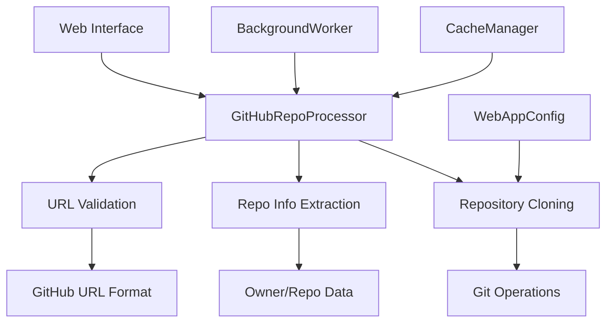
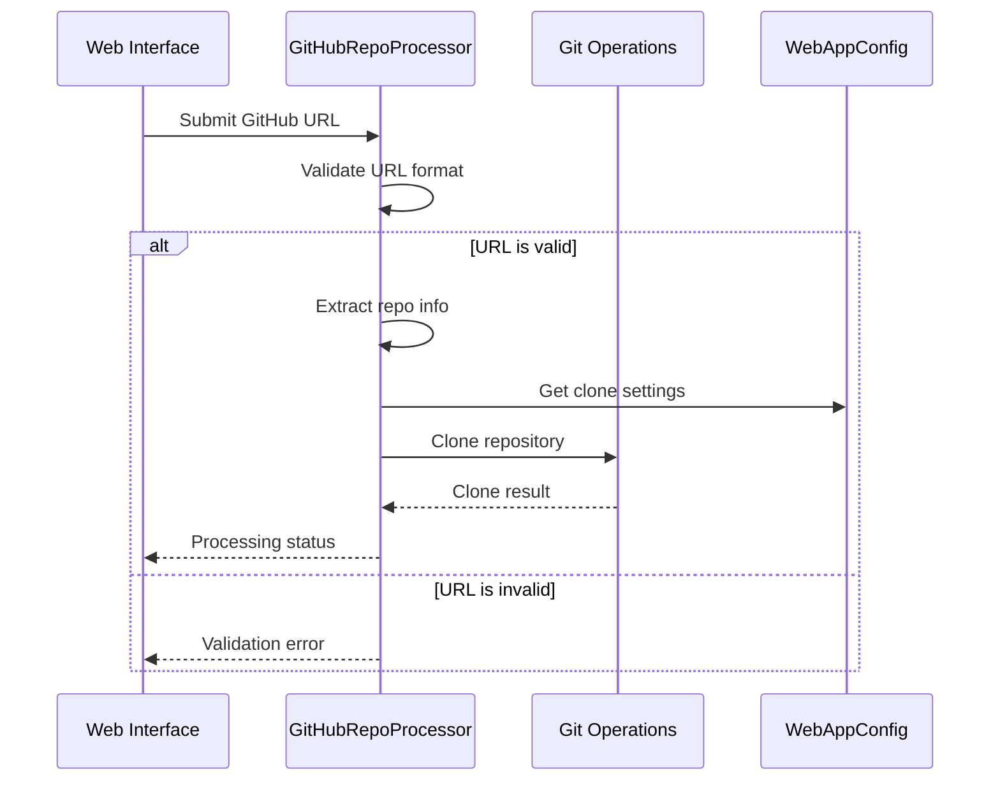

# Frontend GitHub Processor Module

## Overview

The `frontend_github_processor` module provides utilities for processing GitHub repositories within the CodeWiki web application. It handles URL validation, repository information extraction, and repository cloning operations. This module serves as a bridge between the frontend web interface and GitHub repositories, enabling users to submit repositories for documentation generation.

## Architecture



## Core Components

### GitHubRepoProcessor

The main class in this module is `GitHubRepoProcessor`, which provides static methods for handling GitHub repository operations:

#### Methods

1. **`is_valid_github_url(url: str) -> bool`**
   - Validates if a given URL is a valid GitHub repository URL
   - Checks for proper domain (github.com or www.github.com)
   - Verifies the path structure follows the owner/repo format
   - Returns `True` if valid, `False` otherwise

2. **`get_repo_info(url: str) -> Dict[str, str]`**
   - Extracts repository information from a GitHub URL
   - Returns a dictionary containing:
     - `owner`: Repository owner/organization name
     - `repo`: Repository name
     - `full_name`: Combined owner/repo format
     - `clone_url`: Complete URL for cloning the repository

3. **`clone_repository(clone_url: str, target_dir: str, commit_id: str = None) -> bool`**
   - Clones a GitHub repository to a specified target directory
   - Supports cloning specific commits if provided
   - Uses shallow cloning by default for efficiency
   - Returns `True` on success, `False` on failure

## Dependencies

The `frontend_github_processor` module depends on:

- **[WebAppConfig](frontend_config.md)**: Provides configuration values for cloning operations (timeout, depth)
- **[BackgroundWorker](frontend_background_worker.md)**: Manages asynchronous repository processing tasks
- **[CacheManager](frontend_cache_manager.md)**: Caches processed repository information

## Data Flow



## Integration with System

The GitHubRepoProcessor integrates with the broader system through:

1. **[Web Routes](frontend_routes.md)**: Processes repository submission requests from the web interface
2. **[Background Worker](frontend_background_worker.md)**: Queues repository cloning operations to avoid blocking the web interface
3. **[Cache Manager](frontend_cache_manager.md)**: Stores processed repository information for quick retrieval
4. **[Dependency Analyzer](dependency_analyzer.md)**: Provides cloned repositories for analysis
5. **[Documentation Generator](documentation_generator.md)**: Supplies source code for documentation creation

## Configuration

The processor uses the following configuration parameters from [WebAppConfig](frontend_config.md):

- `CLONE_TIMEOUT`: Maximum time allowed for repository cloning operations
- `CLONE_DEPTH`: Depth for shallow cloning operations (default behavior)

## Error Handling

The module implements robust error handling:

- URL validation catches malformed GitHub URLs
- Git operations are wrapped in try-catch blocks
- Timeout protection prevents hanging operations
- Detailed error messages are logged for debugging

## Usage Examples

```python
# Validate a GitHub URL
is_valid = GitHubRepoProcessor.is_valid_github_url("https://github.com/owner/repo")

# Extract repository information
repo_info = GitHubRepoProcessor.get_repo_info("https://github.com/owner/repo")

# Clone a repository
success = GitHubRepoProcessor.clone_repository(
    clone_url="https://github.com/owner/repo.git",
    target_dir="/path/to/target",
    commit_id="abc123"  # Optional specific commit
)
```

## Security Considerations

- Validates GitHub URLs to prevent arbitrary repository cloning
- Uses HTTPS URLs for secure cloning operations
- Implements timeout limits to prevent resource exhaustion
- Sanitizes input paths to prevent directory traversal attacks

## Performance Optimization

- Uses shallow cloning by default to reduce download size
- Implements timeout limits to prevent hanging operations
- Provides commit-specific cloning for targeted analysis