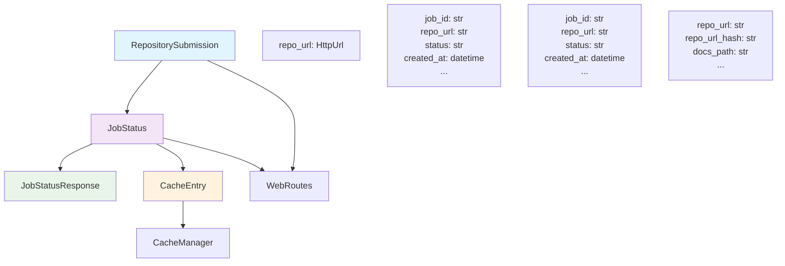
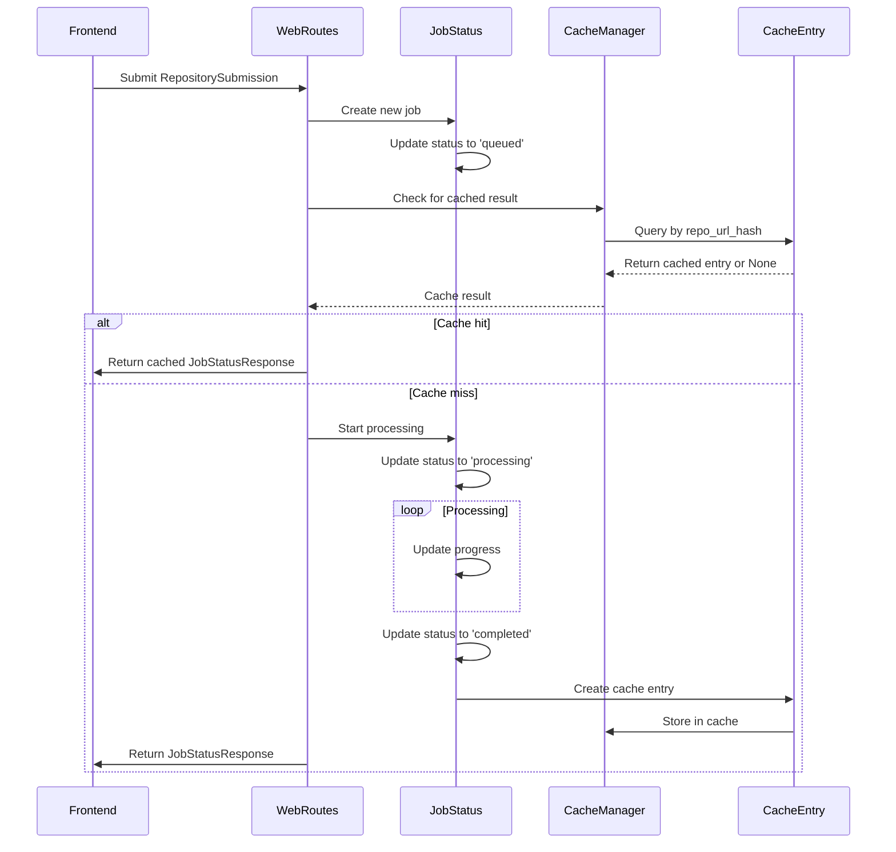

# Frontend Models Module Documentation

## Introduction

The `frontend_models` module provides the core data models and classes used by the CodeWiki web application frontend. These models define the structure for repository submissions, job status tracking, and caching mechanisms that support the documentation generation workflow. The module contains Pydantic models for API requests/responses and dataclasses for internal state management.

## Architecture Overview



## Component Details

### RepositorySubmission

The `RepositorySubmission` model is a Pydantic model that represents the data structure for repository submission requests. It validates that the submitted URL is a valid HTTP/HTTPS URL.

**Attributes:**
- `repo_url` (HttpUrl): The URL of the repository to be documented

**Usage:**
This model is used to validate incoming repository submission requests from the frontend, ensuring that only properly formatted repository URLs are accepted.

### JobStatusResponse

The `JobStatusResponse` model is a Pydantic model that represents the API response for job status queries. It provides a structured way to return job status information to the frontend.

**Attributes:**
- `job_id` (str): Unique identifier for the documentation generation job
- `repo_url` (str): URL of the repository being processed
- `status` (str): Current status of the job ('queued', 'processing', 'completed', 'failed')
- `created_at` (datetime): Timestamp when the job was created
- `started_at` (Optional[datetime]): Timestamp when the job started processing
- `completed_at` (Optional[datetime]): Timestamp when the job completed
- `error_message` (Optional[str]): Error message if the job failed
- `progress` (str): Progress information as a string
- `docs_path` (Optional[str]): Path to generated documentation
- `main_model` (Optional[str]): Main model used for documentation generation
- `commit_id` (Optional[str]): Commit ID of the repository at processing time

### JobStatus

The `JobStatus` dataclass tracks the internal state of a documentation generation job. It's used internally by the application to manage job lifecycle.

**Attributes:**
- `job_id` (str): Unique identifier for the documentation generation job
- `repo_url` (str): URL of the repository being processed
- `status` (str): Current status of the job ('queued', 'processing', 'completed', 'failed')
- `created_at` (datetime): Timestamp when the job was created
- `started_at` (Optional[datetime]): Timestamp when the job started processing
- `completed_at` (Optional[datetime]): Timestamp when the job completed
- `error_message` (Optional[str]): Error message if the job failed
- `progress` (str): Progress information as a string
- `docs_path` (Optional[str]): Path to generated documentation
- `main_model` (Optional[str]): Main model used for documentation generation
- `commit_id` (Optional[str]): Commit ID of the repository at processing time

### CacheEntry

The `CacheEntry` dataclass represents a cached documentation result, enabling efficient retrieval of previously generated documentation.

**Attributes:**
- `repo_url` (str): URL of the cached repository
- `repo_url_hash` (str): Hash of the repository URL for quick lookup
- `docs_path` (str): Path to the cached documentation
- `created_at` (datetime): Timestamp when the cache entry was created
- `last_accessed` (datetime): Timestamp of the last access to this cache entry

## Data Flow



## Component Interactions

The frontend models work together in the following ways:

1. **RepositorySubmission** is received by [frontend_routes](frontend_routes.md) and validated
2. A **JobStatus** object is created to track the job internally
3. **CacheEntry** objects are managed by [frontend_cache_manager](frontend_cache_manager.md) to store completed documentation
4. **JobStatusResponse** is returned to the frontend via API endpoints

## Integration with Other Modules

- **[frontend_routes](frontend_routes.md)**: Uses these models to handle API requests and responses
- **[frontend_cache_manager](frontend_cache_manager.md)**: Uses CacheEntry to manage documentation caching
- **[frontend_background_worker](frontend_background_worker.md)**: Updates JobStatus during processing
- **[cli](cli.md)**: The job status concepts align with CLI job models
- **[config](config.md)**: Configuration may affect caching and job processing parameters

## Usage Examples

```python
from codewiki.src.fe.models import RepositorySubmission, JobStatus, JobStatusResponse
from datetime import datetime

# Creating a repository submission
submission = RepositorySubmission(repo_url="https://github.com/example/repo")

# Creating a job status tracker
job = JobStatus(
    job_id="job_123",
    repo_url="https://github.com/example/repo",
    status="processing",
    created_at=datetime.now()
)

# Creating a job status response for API
response = JobStatusResponse(
    job_id="job_123",
    repo_url="https://github.com/example/repo",
    status="completed",
    created_at=datetime.now(),
    completed_at=datetime.now(),
    docs_path="/path/to/docs"
)
```

## Best Practices

1. Always validate RepositorySubmission inputs before processing
2. Update JobStatus objects consistently to maintain accurate job tracking
3. Use CacheEntry appropriately to avoid regenerating documentation unnecessarily
4. Ensure proper timestamp management for accurate job lifecycle tracking
5. Handle error states properly in JobStatus and JobStatusResponse models

## Error Handling

The models include optional error handling fields:
- `error_message` in JobStatus and JobStatusResponse for capturing processing errors
- Proper validation of HttpUrl in RepositorySubmission
- Optional fields that can be None when not applicable

This design allows the system to gracefully handle various error conditions while maintaining data integrity.