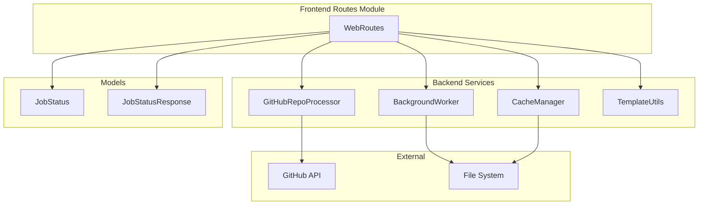
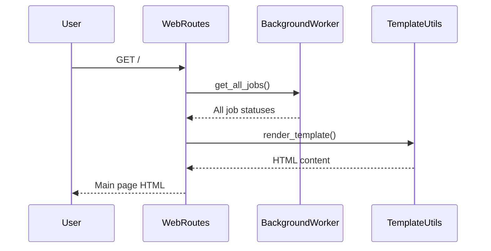
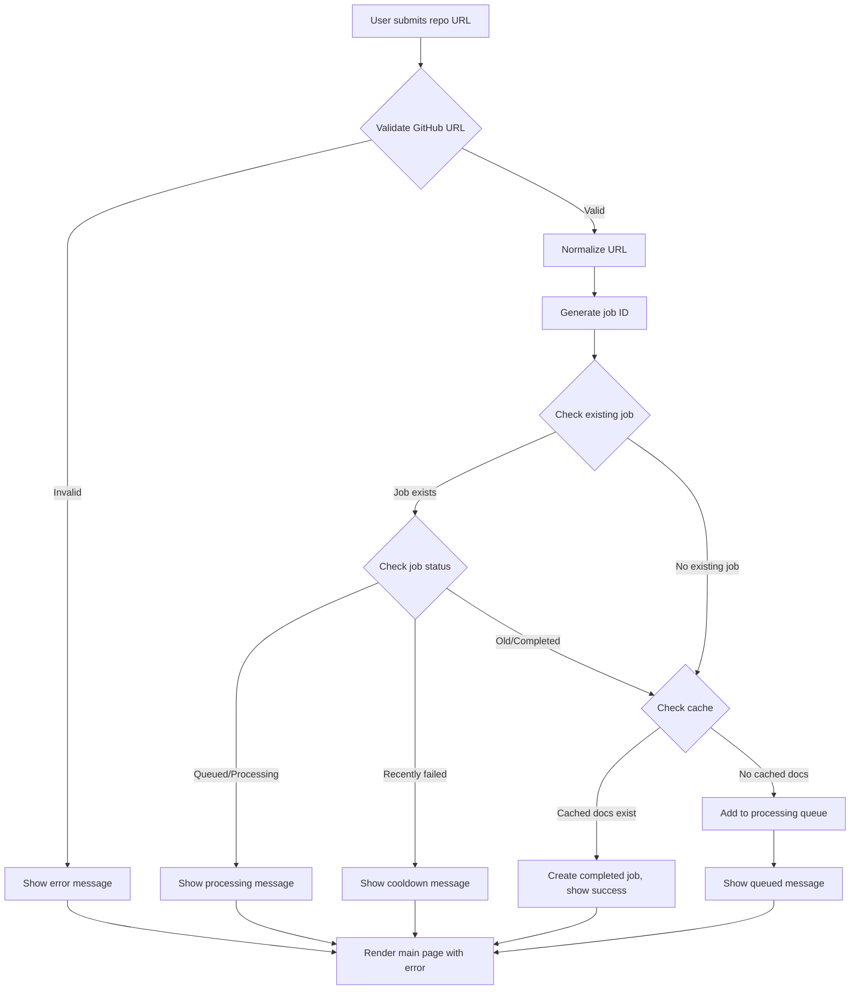
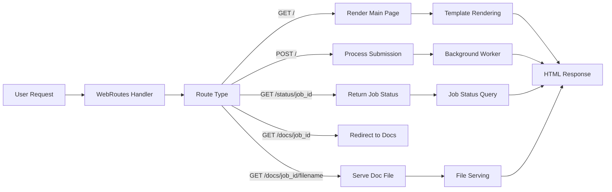

# Frontend Routes Module Documentation

## Overview

The `frontend_routes` module is a critical component of the CodeWiki web application that handles all HTTP request routing and response generation. It provides the web interface for users to submit GitHub repositories for documentation generation and serves the generated documentation. The module is built on FastAPI and manages the user interaction layer of the application.

## Architecture

The `frontend_routes` module follows a service-oriented architecture pattern where the `WebRoutes` class acts as the main controller that coordinates between various backend services:

## Core Components

### WebRoutes Class

The `WebRoutes` class is the central component that handles all web routes for the application. It manages:

- Main page rendering with repository submission form
- Repository submission processing
- Job status tracking
- Documentation serving
- Job cleanup operations

#### Dependencies

- `BackgroundWorker`: Manages documentation generation jobs in the background
- `CacheManager`: Handles caching of generated documentation
- `GitHubRepoProcessor`: Processes GitHub repository URLs and cloning
- `TemplateUtils`: Renders HTML templates for the web interface
- `WebAppConfig`: Provides configuration settings

## Functionality

### Main Page Handling

The `index_get` method renders the main web interface with:
- A form for submitting GitHub repository URLs
- Display of recent documentation generation jobs
- Status indicators for each job

### Repository Submission Processing

The `index_post` method handles repository submissions with the following workflow:

1. Validates the GitHub URL format
2. Normalizes the repository URL for consistent comparison
3. Checks if the repository is already in processing queue
4. Checks for cached documentation
5. Adds the job to the background processing queue if needed

### Job Status API

The `get_job_status` method provides an API endpoint for checking the status of documentation generation jobs. It returns structured data about the job including:

- Job ID
- Repository URL
- Current status (queued, processing, completed, failed)
- Progress information
- Error messages (if any)
- Documentation path (when completed)

### Documentation Serving

The module provides two methods for serving generated documentation:

1. `view_docs`: Redirects to the documentation viewer
2. `serve_generated_docs`: Serves individual documentation files with proper templating

## Data Flow

## Component Interactions

### WebRoutes and BackgroundWorker Integration

The `WebRoutes` class maintains a tight integration with the `BackgroundWorker` to track job statuses:

- Jobs are added to the worker's queue through `add_job()`
- Job statuses are retrieved using `get_job_status()` and `get_all_jobs()`
- The worker updates job status during processing, which is accessible to the routes

### WebRoutes and CacheManager Integration

The `WebRoutes` class uses the `CacheManager` to:

- Check for existing cached documentation before processing
- Add newly generated documentation to the cache
- Retrieve cached documentation paths

### WebRoutes and GitHubRepoProcessor Integration

The `WebRoutes` class relies on `GitHubRepoProcessor` to:

- Validate GitHub repository URLs
- Extract repository information from URLs
- Clone repositories for processing

## Error Handling

The module implements comprehensive error handling:

- **Invalid URLs**: Validates GitHub URL format and shows appropriate error messages
- **Duplicate submissions**: Prevents duplicate processing of the same repository
- **Job conflicts**: Manages job state to prevent conflicts
- **File access errors**: Handles missing documentation files gracefully
- **Processing failures**: Provides detailed error messages for failed jobs

## Configuration

The module uses `WebAppConfig` for various settings:

- `RETRY_COOLDOWN_MINUTES`: Minimum time before retrying failed jobs
- `JOB_CLEANUP_HOURS`: Time after which completed/failed jobs are cleaned up
- Cache and temporary directory settings

## API Endpoints

| Method | Endpoint | Purpose |
|--------|----------|---------|
| GET | `/` | Main page with repository submission form |
| POST | `/` | Process repository submission |
| GET | `/status/{job_id}` | Get job status via API |
| GET | `/docs/{job_id}` | Redirect to documentation viewer |
| GET | `/docs/{job_id}/{filename}` | Serve specific documentation file |

## Template System

The module uses Jinja2-based templating through the `TemplateUtils` module:

- `WEB_INTERFACE_TEMPLATE`: Main page with submission form and job list
- `DOCS_VIEW_TEMPLATE`: Documentation viewer with navigation sidebar
- Dynamic content rendering based on job status and documentation content

## Security Considerations

- Input validation for GitHub URLs
- URL normalization to prevent duplicate processing
- Job ID generation using repository names (URL-safe)
- File path validation to prevent directory traversal

## Performance Optimizations

- Caching of generated documentation to avoid reprocessing
- Job status persistence to maintain state across application restarts
- Cleanup of old job entries to prevent memory bloat
- Efficient job queue management

## Integration Points

The `frontend_routes` module integrates with several other modules:

- [background_worker](frontend_background_worker.md): For job processing and status tracking
- [cache_manager](frontend_cache_manager.md): For documentation caching
- [github_processor](frontend_github_processor.md): For repository processing
- [models](frontend_models.md): For data structures
- [config](frontend_config.md): For application settings
- [template_utils](frontend_template_utils.md): For HTML template rendering

## Usage Patterns

The module is designed to handle concurrent users submitting documentation requests while maintaining job state and providing real-time status updates. It efficiently manages resources by leveraging caching and background processing to provide a responsive user experience.