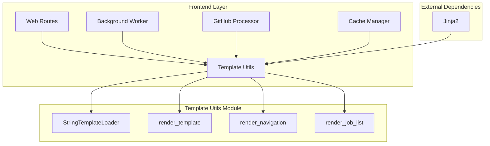
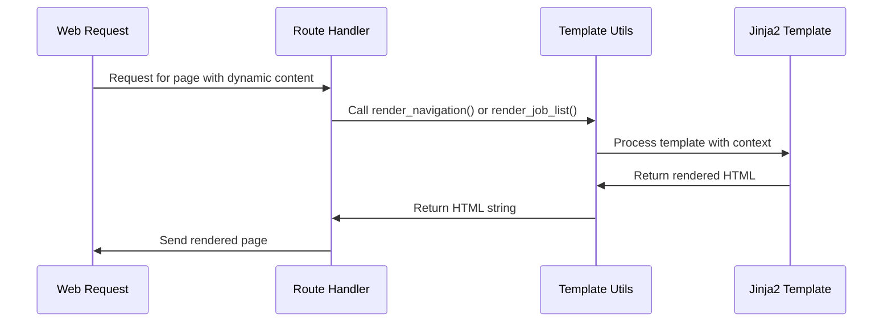
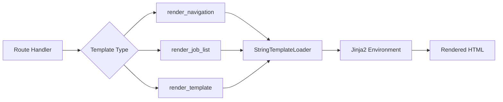

# Frontend Template Utilities Module

## Overview

The `frontend_template_utils` module provides template rendering utilities for the CodeWiki frontend application. It leverages Jinja2 templating engine to render HTML content dynamically, primarily for generating navigation menus and job lists in the web interface. This module is part of the frontend layer ([frontend](frontend.md)) and serves as a utility component that supports the web application's dynamic content generation.

## Architecture



## Core Components

### StringTemplateLoader

The `StringTemplateLoader` is a custom Jinja2 loader that enables template rendering from string content rather than files. This is particularly useful for dynamic template generation in web applications.

**Key Features:**
- Inherits from `jinja2.BaseLoader`
- Accepts template strings directly in constructor
- Provides template source for Jinja2 environment

**Usage:**
```python
loader = StringTemplateLoader(template_string)
```

### Template Rendering Functions

#### render_template
Renders a Jinja2 template string with provided context data.

**Parameters:**
- `template` (str): HTML template string with Jinja2 syntax
- `context` (Dict[str, Any]): Dictionary of variables to substitute

**Returns:**
- `str`: Rendered HTML string

#### render_navigation
Generates navigation HTML from a module tree structure, creating links for different sections and highlighting the current page.

**Parameters:**
- `module_tree` (Dict[str, Any]): Dictionary representing the module tree
- `current_page` (str): Current page filename for highlighting

**Returns:**
- `str`: HTML string for navigation

#### render_job_list
Renders a list of job items in HTML format, showing repository URLs, status, progress, and action buttons.

**Parameters:**
- `jobs` (list): List of job objects

**Returns:**
- `str`: HTML string for job list

## Dependencies

This module depends on:
- [Jinja2](https://jinja.palletsprojects.com/): Template engine for Python
- Standard Python libraries: `typing`

## Integration with Other Modules

The `frontend_template_utils` module integrates with several other modules in the CodeWiki system:

- **[frontend_routes](frontend_routes.md)**: Uses template utilities to render dynamic HTML responses
- **[frontend_models](frontend_models.md)**: Works with job status and repository submission models to render appropriate UI elements
- **[frontend_github_processor](frontend_github_processor.md)**: Provides templates for displaying GitHub repository processing status
- **[frontend_background_worker](frontend_background_worker.md)**: Renders job status information for background processing tasks

## Data Flow



## Component Interactions



## Usage Examples

### Rendering Navigation
```python
module_tree = {
    "cli": {"components": ["ConfigManager"], "children": {}},
    "dependency_analyzer": {"components": ["AnalysisService"], "children": {}}
}
nav_html = render_navigation(module_tree, "cli.md")
```

### Rendering Job List
```python
jobs = [
    {"repo_url": "https://github.com/example/repo", "status": "completed", "job_id": "123", "docs_path": "/path/to/docs"},
    {"repo_url": "https://github.com/example/repo2", "status": "processing", "progress": "50%"}
]
job_html = render_job_list(jobs)
```

## Error Handling

The template utilities implement basic error handling:
- Empty module trees return empty strings in `render_navigation`
- Empty job lists return empty strings in `render_job_list`
- Jinja2 template syntax errors will propagate as template rendering exceptions

## Performance Considerations

- Templates are processed in memory without file I/O overhead
- String templates are compiled on each call, which may impact performance for frequently rendered content
- Consider caching rendered templates for static content

## Security Considerations

- Templates use Jinja2's autoescape feature to prevent XSS attacks
- Input validation should be performed on context data before template rendering
- Template strings should be validated to prevent template injection

## Testing Strategy

When testing this module, consider:
- Template rendering with various context data
- Edge cases like empty lists or missing context values
- Template syntax validation
- XSS prevention with autoescape functionality

## Future Enhancements

Potential improvements for this module include:
- Template caching to improve performance
- Support for more complex template structures
- Integration with frontend asset management
- Enhanced error reporting for template rendering failures