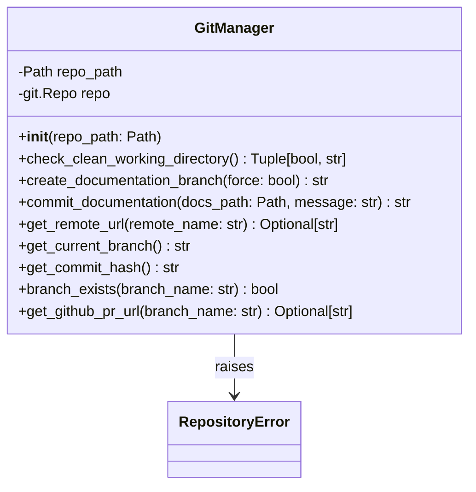
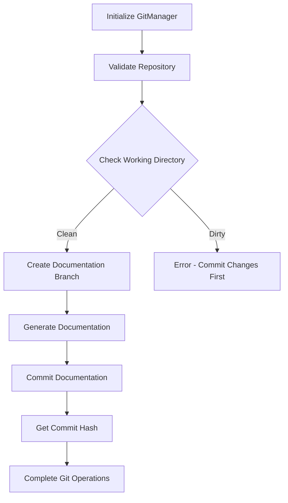
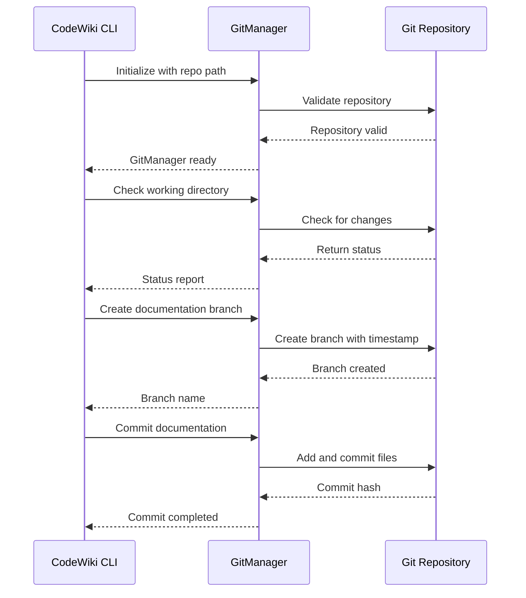

# GitManager Module Documentation

## Overview

The `GitManager` module is a core component of the CodeWiki CLI that handles all git operations related to documentation generation. It provides a clean interface for managing git repositories, creating documentation branches, committing generated documentation, and handling repository status checks.

This module is essential for the documentation generation workflow, ensuring that generated documentation is properly version-controlled and can be easily integrated into existing git workflows.

## Architecture



## Core Components

### GitManager Class

The `GitManager` class is the primary component of this module, providing comprehensive git operations for documentation workflows.

#### Constructor
```python
def __init__(self, repo_path: Path)
```
Initializes the GitManager with a repository path. Validates that the path is a valid git repository.

#### Key Methods

**`check_clean_working_directory()`**
- Checks if the working directory has uncommitted changes
- Returns a tuple of (is_clean, status_message)
- Essential for ensuring clean state before creating documentation branches

**`create_documentation_branch(force: bool = False)`**
- Creates a new documentation branch with timestamp-based naming
- Validates clean working directory unless force is True
- Returns the created branch name

**`commit_documentation(docs_path: Path, message: Optional[str] = None)`**
- Commits generated documentation to the current branch
- Accepts an optional custom commit message
- Returns the commit hash

**`get_remote_url(remote_name: str = "origin")`**
- Retrieves the URL of the specified remote (default: origin)
- Returns None if no remote exists

**`get_github_pr_url(branch_name: str)`**
- Generates a GitHub pull request URL for the specified branch
- Returns None if the repository is not hosted on GitHub

## Dependencies

The GitManager module depends on:

- **GitPython library**: Provides the underlying git operations
- **RepositoryError**: Custom error handling from [errors](errors.md)
- **Path objects**: From pathlib for path manipulation

## Integration with Other Modules

### CLI Integration
The GitManager integrates closely with:
- [ConfigManager](config_manager.md): Uses repository path from configuration
- [CLIDocumentationGenerator](doc_generator.md): Provides git operations for documentation generation workflow
- [HTMLGenerator](html_generator.md): Commits generated HTML documentation

### Error Handling
- Raises `RepositoryError` for git-related issues
- Integrates with the CLI's error handling system

## Data Flow



## Usage Patterns

### Documentation Generation Workflow
1. Initialize GitManager with repository path
2. Validate clean working directory
3. Create timestamped documentation branch
4. Generate documentation files
5. Commit documentation to branch
6. Provide PR URL for review

### Branch Naming Convention
The module uses a timestamp-based naming convention: `docs/codewiki-YYYYMMDD-HHMMSS`

## Error Handling

The GitManager module implements comprehensive error handling:

- **RepositoryError**: Raised when the path is not a valid git repository
- **GitCommandError**: Wrapped and re-raised as RepositoryError for git command failures
- **Working Directory Validation**: Prevents branch creation with uncommitted changes

## Process Flow



## Configuration and Parameters

The GitManager accepts the following parameters:
- `repo_path`: Path to the git repository (required)
- `force`: Whether to force branch creation with uncommitted changes (optional)
- `remote_name`: Name of the git remote to use (default: "origin")
- `message`: Custom commit message (optional)

## Best Practices

1. **Always validate repository state** before performing git operations
2. **Use timestamped branch names** to avoid conflicts
3. **Check for clean working directory** before creating documentation branches
4. **Provide meaningful commit messages** for documentation changes
5. **Handle RepositoryError exceptions** appropriately in calling code

## Related Modules

- [ConfigManager](config_manager.md): Provides repository path configuration
- [CLIDocumentationGenerator](doc_generator.md): Uses GitManager for documentation workflow
- [HTMLGenerator](html_generator.md): Generates documentation that GitManager commits
- [Errors](errors.md): Contains RepositoryError used by GitManager