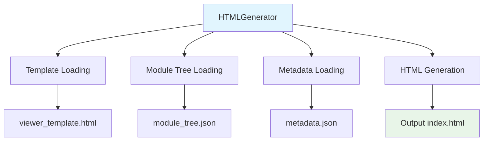
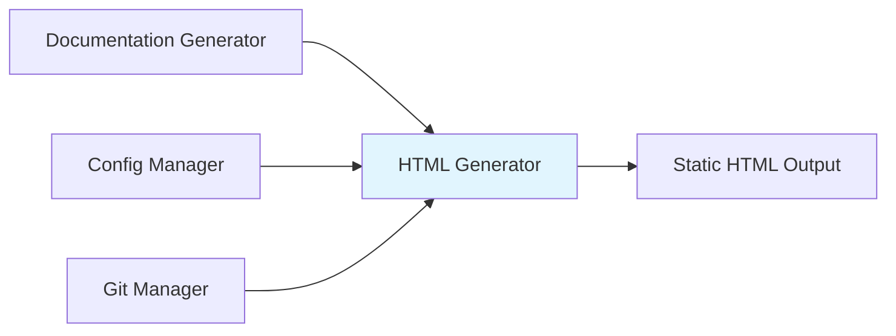
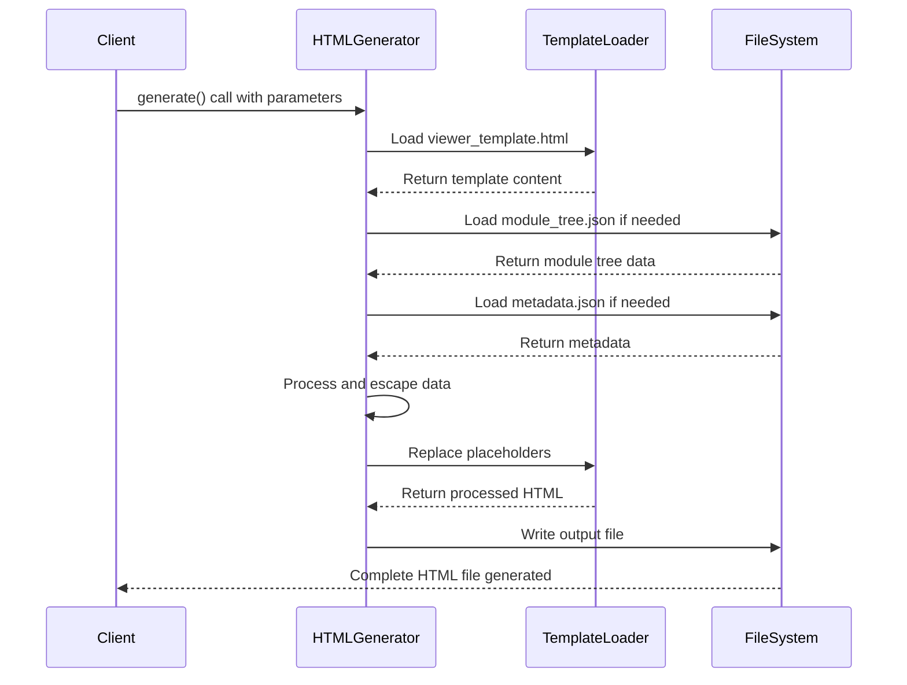

# HTML Generator Module Documentation

## Overview

The HTML Generator module is responsible for creating static HTML documentation viewers for GitHub Pages. It generates a self-contained `index.html` file with embedded styles, scripts, and configuration for client-side markdown rendering. This module serves as the final output component in the documentation generation pipeline, transforming processed documentation data into a user-friendly web interface.

## Core Component: HTMLGenerator

The `HTMLGenerator` class is the primary component of this module, providing functionality to generate static HTML documentation viewers with embedded configuration and module tree data.

### Key Features

- Generates self-contained HTML files for GitHub Pages deployment
- Embeds module tree structure and metadata directly in the HTML
- Provides repository information display capabilities
- Supports configurable documentation viewers with client-side rendering
- Handles safe file operations with error handling

### Architecture

## Component Relationships

### Dependencies

The HTML Generator module depends on several utility components:

- **File System Utilities**: Uses `safe_write` and `safe_read` functions for secure file operations
- **Error Handling**: Leverages `FileSystemError` for proper error reporting
- **Template System**: Works with HTML templates from the `templates/github_pages` directory

### Integration with Other Modules

- **CLI Module**: Works as part of the CLI documentation generation pipeline
- **Config Manager**: May receive configuration data from the configuration system
- **Documentation Generator**: Receives processed documentation data to transform into HTML

## Data Flow

The HTML Generator follows this data flow pattern:

1. **Input Collection**: Gathers configuration, module tree, and metadata
2. **Template Loading**: Loads the HTML template from the template directory
3. **Data Processing**: Processes and escapes data for safe HTML embedding
4. **Template Replacement**: Replaces placeholders in the template with actual data
5. **Output Generation**: Creates the final HTML file with embedded data

## Key Methods

### `generate()`
The main method that orchestrates HTML generation, handling template loading, data embedding, and file output.

### `load_module_tree()`
Loads the module tree structure from the documentation directory, with fallback to a default structure if the file doesn't exist.

### `load_metadata()`
Loads metadata from the documentation directory, returning None if the file doesn't exist.

### `detect_repository_info()`
Detects repository information from git, including name, URL, and GitHub Pages URL.

## Configuration and Templates

The HTML Generator uses a template-based approach with the following key template files:

- `viewer_template.html`: Main HTML template with placeholders for dynamic content
- Template placeholders include:
  - `{{TITLE}}`: Documentation title
  - `{{REPO_LINK}}`: Repository link HTML
  - `{{SHOW_INFO}}`: Info section display control
  - `{{INFO_CONTENT}}`: Repository information content
  - `{{CONFIG_JSON}}`: Embedded configuration data
  - `{{MODULE_TREE_JSON}}`: Embedded module tree data
  - `{{METADATA_JSON}}`: Embedded metadata
  - `{{DOCS_BASE_PATH}}`: Base path for documentation links

## Error Handling

The module implements robust error handling through:

- `FileSystemError` exceptions for file system operations
- Graceful fallbacks when optional files (like metadata) are missing
- Safe HTML escaping to prevent XSS vulnerabilities
- Proper exception handling in template loading and data processing

## Integration Points

For more information about related components, see:
- [config_manager.md](config_manager.md) for configuration management
- [doc_generator.md](doc_generator.md) for the documentation generation process
- [logging.md](logging.md) for logging utilities used in the module
- [progress.md](progress.md) for progress tracking during generation

## Usage Context

The HTML Generator module is typically used in the final stage of the documentation generation pipeline, after:
1. Repository analysis and dependency mapping
2. Documentation content generation
3. Module tree and metadata creation

The generated HTML files are designed for deployment to GitHub Pages or other static hosting services, providing an interactive documentation viewer with navigation capabilities.