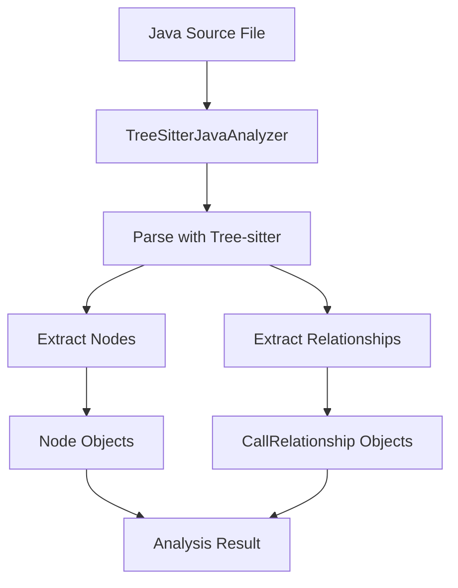
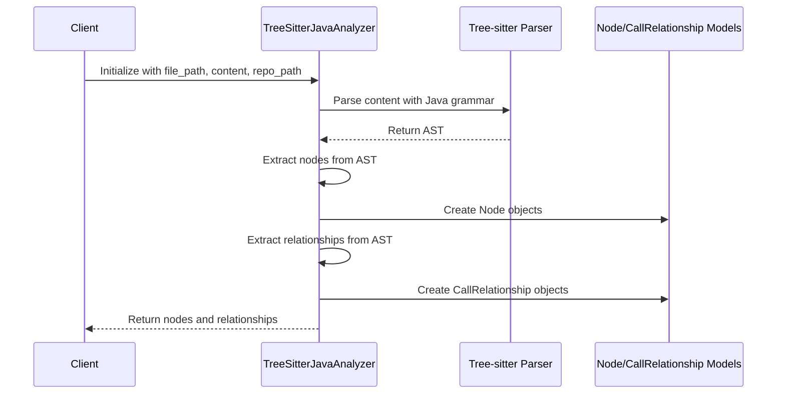
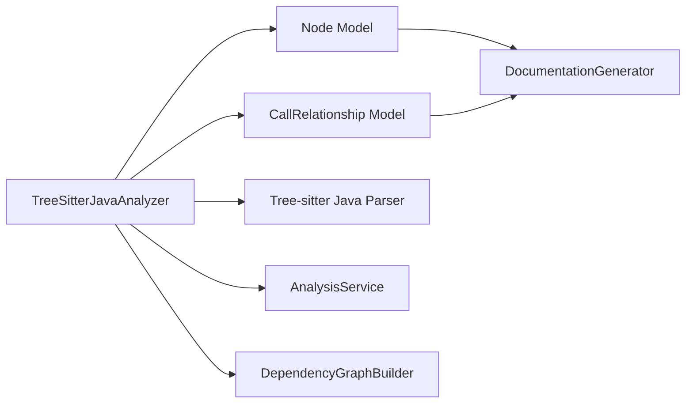

# Java Analyzer Module

## Introduction

The Java Analyzer module (`TreeSitterJavaAnalyzer`) is a specialized component within the dependency analyzer system that provides static analysis capabilities for Java source code files. It leverages the Tree-sitter parsing library with Java-specific grammar to extract structural information, identify code components, and map relationships between different elements in Java code.

This module is part of the broader [dependency_analyzer](dependency_analyzer.md) system and works in conjunction with other language-specific analyzers to provide comprehensive multi-language code analysis capabilities.

## Architecture Overview

The Java Analyzer follows a tree-sitter-based parsing approach to analyze Java source code. It identifies various Java language constructs and maps relationships between them to build a comprehensive dependency graph.



## Core Components

### TreeSitterJavaAnalyzer Class

The main class responsible for analyzing Java files and extracting structural information.

#### Key Properties:
- `file_path`: Path to the Java source file being analyzed
- `content`: Content of the Java source file
- `repo_path`: Repository root path for relative path calculations
- `nodes`: List of extracted Node objects representing code components
- `call_relationships`: List of CallRelationship objects representing dependencies

#### Key Methods:

**`__init__(self, file_path: str, content: str, repo_path: str = None)`**
- Initializes the analyzer with file path, content, and optional repository path
- Automatically triggers the analysis process

**`_analyze(self)`**
- Main analysis method that parses the Java file using Tree-sitter
- Extracts nodes and relationships from the parsed AST

**`_extract_nodes(self, node, top_level_nodes, lines)`**
- Extracts various Java language constructs including:
  - Classes (regular and abstract)
  - Interfaces
  - Enums
  - Records
  - Annotations
  - Methods

**`_extract_relationships(self, node, top_level_nodes)`**
- Identifies and maps various types of relationships:
  - Inheritance (class extends another class)
  - Interface implementation
  - Field type usage
  - Method calls
  - Object creation

### Helper Methods

**`_get_component_id(name: str, parent_class: str = None)`**
- Generates unique component IDs following Java package/class naming conventions

**`_is_primitive_type(type_name: str)`**
- Checks if a type is a Java primitive or common built-in type

**`_find_containing_class(node, top_level_nodes)`**
- Locates the containing class for a given AST node

**`_find_variable_type(node, variable_name, top_level_nodes)`**
- Determines the type of a variable within its scope

### Standalone Function

**`analyze_java_file(file_path: str, content: str, repo_path: str = None)`**
- Convenience function that creates an analyzer instance and returns nodes and relationships

## Data Flow



## Component Interactions

The Java Analyzer interacts with several other components in the system:



## Supported Java Language Features

The analyzer supports extraction of the following Java constructs:

- **Classes**: Regular and abstract classes with inheritance information
- **Interfaces**: Interface declarations and implementations
- **Enums**: Enum declarations and their usage
- **Records**: Java record declarations (Java 14+)
- **Annotations**: Annotation type declarations
- **Methods**: Method declarations with containing class information
- **Inheritance**: Class extension relationships
- **Interface Implementation**: Class/interface implementation relationships
- **Field Usage**: Field type dependencies
- **Method Calls**: Method invocation relationships
- **Object Creation**: Object instantiation relationships

## Relationship Types Identified

The analyzer identifies several types of relationships between Java components:

1. **Inheritance Relationships**: Class extends another class
2. **Implementation Relationships**: Class implements interface
3. **Field Type Usage**: Class uses another type as field
4. **Method Call Relationships**: Method calls on objects of other types
5. **Object Creation Relationships**: Object instantiation of other types

## Integration with System

The Java Analyzer integrates with the broader system through:

- **[analysis_service](analysis_service.md)**: Called by the analysis service to process Java files
- **[dependency_graph_builder](dependency_graph_builder.md)**: Provides nodes and relationships for building dependency graphs
- **[documentation_generator](documentation_generator.md)**: Supplies structural information for documentation generation

## Usage Example

```python
from codewiki.src.be.dependency_analyzer.analyzers.java import analyze_java_file

# Analyze a Java file
nodes, relationships = analyze_java_file(
    file_path="/path/to/MyClass.java",
    content="class MyClass { ... }",
    repo_path="/path/to/repository"
)

# Process the extracted information
for node in nodes:
    print(f"Found {node.component_type}: {node.name}")

for rel in relationships:
    print(f"Relationship: {rel.caller} -> {rel.callee}")
```

## Dependencies

- `tree_sitter`: Tree-sitter parsing library
- `tree_sitter_java`: Java language grammar for Tree-sitter
- [core_models](core_models.md): Node and CallRelationship models
- [analysis_models](analysis_models.md): Analysis result models

## Error Handling

The analyzer includes error handling for:
- Invalid file paths
- Malformed Java code
- Tree-sitter parsing errors
- Missing repository paths

## Performance Considerations

- Uses efficient Tree-sitter parsing for fast analysis
- Processes files in a single pass to extract both nodes and relationships
- Handles large Java files efficiently through streaming AST traversal

## Limitations

- May not resolve all method calls to their exact targets due to dynamic dispatch
- Complex generic type relationships may not be fully resolved
- External library dependencies are not resolved without additional context