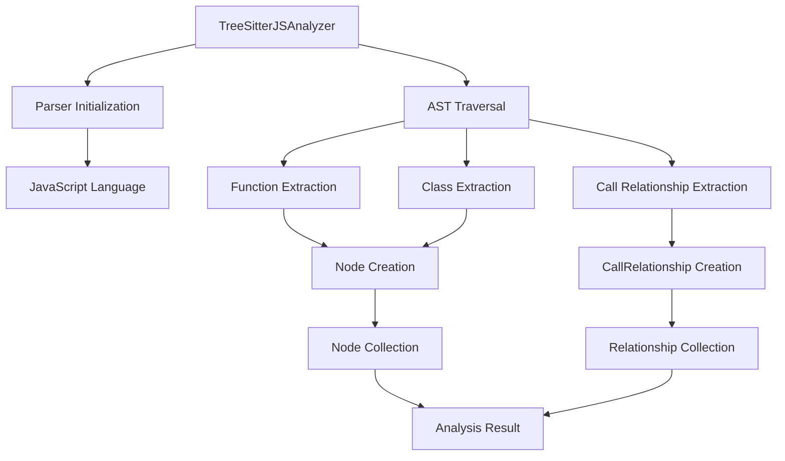
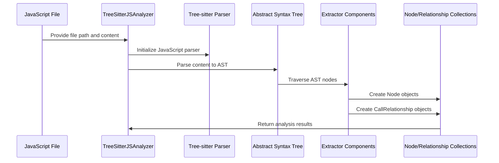
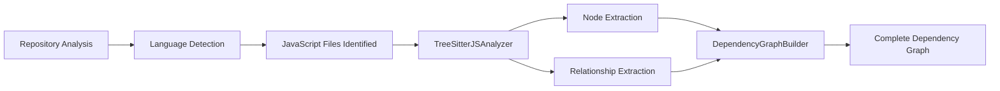

# JavaScript Analyzer Module Documentation

## Introduction

The JavaScript Analyzer module (`TreeSitterJSAnalyzer`) is a specialized component within the dependency analyzer system that provides static analysis capabilities for JavaScript and related file types (JS, TS, JSX, TSX, MJS, CJS). This module leverages Tree-sitter parsing technology to extract function declarations, class definitions, method calls, and dependency relationships from JavaScript source code.

The analyzer is part of the broader [dependency_analyzer](dependency_analyzer.md) system and works in conjunction with other language-specific analyzers to build comprehensive dependency graphs for multi-language repositories.

## Architecture Overview

The JavaScript analyzer follows a tree-sitter-based parsing approach to analyze JavaScript code. It identifies various code constructs and builds relationships between them to form a dependency graph.

## Core Components

### TreeSitterJSAnalyzer Class

The main analyzer class that handles JavaScript file analysis:

- **Purpose**: Parses JavaScript files and extracts functions, classes, methods, and call relationships
- **Input**: File path, file content, and optional repository path
- **Output**: Collection of `Node` objects and `CallRelationship` objects

### Key Methods

#### `__init__(self, file_path: str, content: str, repo_path: str = None)`
Initializes the analyzer with file information and sets up the Tree-sitter parser for JavaScript.

#### `analyze(self) -> None`
Main analysis method that parses the file content and extracts all relevant code constructs and relationships.

#### `_extract_functions(self, node) -> None`
Traverses the AST to identify and extract various function types:
- Function declarations
- Generator function declarations
- Exported functions
- Arrow functions
- Class methods

#### `_extract_call_relationships(self, node) -> None`
Identifies function calls and creates relationships between calling and called functions.

#### `_extract_class_declaration(self, node) -> Optional[Node]`
Extracts class, abstract class, and interface declarations with inheritance information.

## Supported JavaScript Constructs

The analyzer identifies and processes the following JavaScript constructs:

### Functions
- Function declarations (`function name() {}`)
- Generator functions (`function* name() {}`)
- Arrow functions (`const name = () => {}`)
- Exported functions (`export function name() {}`)
- Export default functions (`export default function() {}`)

### Classes
- Class declarations (`class Name {}`)
- Abstract class declarations (`abstract class Name {}`)
- Interface declarations (TypeScript)
- Class inheritance information

### Methods
- Class methods (`methodName() {}`)
- Arrow function properties in classes
- Method calls within classes

### Call Relationships
- Function calls (`funcName()`)
- Method calls (`obj.methodName()`)
- Constructor calls (`new ClassName()`)
- Await expressions (`await funcName()`)

## Data Flow

## Component Relationships

The JavaScript analyzer integrates with several core components:

- **[Node](core_models.md)**: Represents code constructs (functions, classes, methods) extracted from the JavaScript file
- **[CallRelationship](core_models.md)**: Represents dependencies between code constructs
- **[AnalysisService](analysis_service.md)**: Orchestrates the analysis process across different language analyzers
- **[DependencyGraphBuilder](dependency_graph_builder.md)**: Uses the extracted nodes and relationships to build comprehensive dependency graphs

## File Path Handling

The analyzer normalizes file paths to create consistent component IDs:

- Converts file paths to module paths (e.g., `src/utils/helper.js` → `src.utils.helper`)
- Handles various JavaScript file extensions (.js, .ts, .jsx, .tsx, .mjs, .cjs)
- Creates component IDs in the format: `{module_path}.{class_name}.{method_name}` for methods or `{module_path}.{name}` for functions

## JSDoc Type Dependencies

The analyzer extracts type dependencies from JSDoc comments:

- `@param {Type}` annotations
- `@return {Type}` or `@returns {Type}` annotations
- `@type {Type}` annotations
- Identifies built-in JavaScript types vs. custom types
- Creates relationships for custom type references

## Error Handling

The analyzer includes comprehensive error handling:

- Parser initialization failures are logged and handled gracefully
- Individual function extraction errors don't stop the entire analysis
- Invalid AST nodes are skipped with debug logging
- File processing continues even if some constructs cannot be parsed

## Integration with Dependency Analysis Pipeline

## Performance Considerations

- Uses Tree-sitter for efficient parsing
- Maintains a set of seen relationships to avoid duplicates
- Processes files incrementally to handle large codebases
- Includes logging at different levels for debugging and monitoring

## Dependencies

The JavaScript analyzer depends on:
- `tree_sitter` - Core parsing library
- `tree_sitter_javascript` - JavaScript language grammar for Tree-sitter
- `tree_sitter_typescript` - TypeScript language grammar (for TS files)
- [Core models](core_models.md) - Node and CallRelationship data structures

## Usage Context

This analyzer is typically used as part of the broader dependency analysis system when processing JavaScript/TypeScript repositories. It works alongside other language analyzers to provide comprehensive multi-language dependency analysis.

For more information about the overall dependency analysis system, see the [dependency_analyzer](dependency_analyzer.md) documentation.