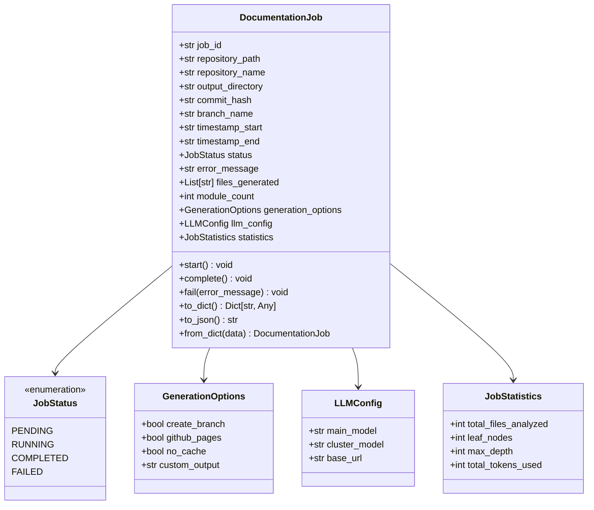
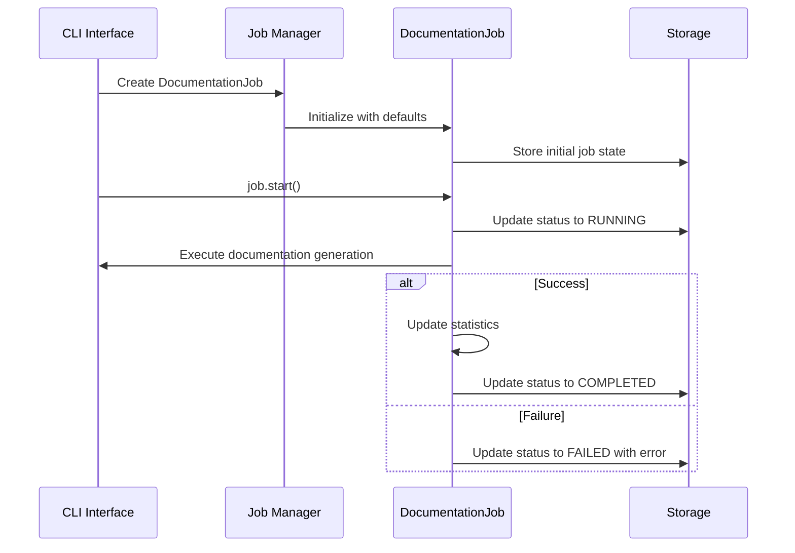

# Job Models Module Documentation

## Overview

The `job_models` module provides data models for managing documentation generation jobs in the CodeWiki system. These models define the structure and lifecycle of documentation jobs, including their configuration, status tracking, and statistics. The module is part of the CLI component and serves as the foundation for job management across the system.

## Architecture



## Core Components

### JobStatus Enum

The `JobStatus` enum defines the possible states of a documentation job:

- `PENDING`: Job is queued and waiting to start
- `RUNNING`: Job is currently executing
- `COMPLETED`: Job finished successfully
- `FAILED`: Job encountered an error and stopped

### GenerationOptions Dataclass

The `GenerationOptions` dataclass contains configuration options for documentation generation:

- `create_branch`: Whether to create a new git branch for changes
- `github_pages`: Whether to generate GitHub Pages compatible output
- `no_cache`: Whether to bypass caching mechanisms
- `custom_output`: Custom output directory path (optional)

### JobStatistics Dataclass

The `JobStatistics` dataclass tracks metrics for a documentation job:

- `total_files_analyzed`: Number of files processed during documentation generation
- `leaf_nodes`: Number of leaf nodes in the dependency graph
- `max_depth`: Maximum depth of the dependency graph
- `total_tokens_used`: Total number of tokens consumed by LLM operations

### LLMConfig Dataclass

The `LLMConfig` dataclass holds configuration for language model operations:

- `main_model`: Primary LLM model identifier
- `cluster_model`: Model used for clustering operations
- `base_url`: Base URL for LLM API endpoint

### DocumentationJob Dataclass

The `DocumentationJob` dataclass represents a complete documentation generation job with the following key attributes:

- `job_id`: Unique identifier for the job (auto-generated)
- `repository_path`: Absolute path to the repository being documented
- `repository_name`: Name of the repository
- `output_directory`: Path where documentation will be generated
- `commit_hash`: Git commit SHA at the time of job execution
- `branch_name`: Git branch name (if applicable)
- `timestamp_start`: ISO format timestamp when job started
- `timestamp_end`: ISO format timestamp when job completed/failed
- `status`: Current [JobStatus](#jobstatus-enum)
- `error_message`: Error details if job failed
- `files_generated`: List of files created during documentation
- `module_count`: Number of modules documented
- `generation_options`: [GenerationOptions](#generationoptions-dataclass) instance
- `llm_config`: [LLMConfig](#llmconfig-dataclass) instance
- `statistics`: [JobStatistics](#jobstatistics-dataclass) instance

## Key Methods

### DocumentationJob Methods

- `start()`: Updates job status to `RUNNING` and sets start timestamp
- `complete()`: Updates job status to `COMPLETED` and sets end timestamp
- `fail(error_message)`: Updates job status to `FAILED`, sets error message and end timestamp
- `to_dict()`: Converts job to dictionary for JSON serialization
- `to_json()`: Returns JSON string representation of the job
- `from_dict(data)`: Class method to create a DocumentationJob from dictionary data

## Data Flow



## Dependencies

The job_models module has the following dependencies:

- Standard Python libraries: `dataclasses`, `datetime`, `typing`, `enum`, `uuid`, `json`
- No external dependencies beyond Python standard library

## Integration with Other Modules

- [config_manager](config_manager.md): Uses configuration data to populate job settings
- [git_manager](git_manager.md): Interacts with git operations for repository information
- [logging](logging.md): Provides job status updates for logging systems
- [progress](progress.md): Supplies job statistics for progress tracking

## Usage Examples

### Creating a New Job
```python
from codewiki.cli.models.job import DocumentationJob, GenerationOptions, LLMConfig

job = DocumentationJob(
    repository_path="/path/to/repo",
    repository_name="my-repo",
    output_directory="/output/docs",
    generation_options=GenerationOptions(create_branch=True),
    llm_config=LLMConfig(
        main_model="gpt-4",
        cluster_model="gpt-3.5-turbo",
        base_url="https://api.openai.com/v1"
    )
)
```

### Job Lifecycle Management
```python
# Start the job
job.start()

# Perform documentation work...
# Update statistics as needed

# Complete the job
job.complete()

# Or fail the job with an error
job.fail("Failed to parse source files")
```

### Serialization
```python
# Convert to JSON for storage or transmission
json_data = job.to_json()

# Restore from JSON
restored_job = DocumentationJob.from_dict(json.loads(json_data))
```

## Best Practices

1. Always call `start()` before beginning job execution to properly set timestamps
2. Update statistics regularly during job execution for accurate progress tracking
3. Use `fail()` method with descriptive error messages when jobs encounter errors
4. Serialize jobs to persistent storage after status changes for fault tolerance
5. Use the `to_dict()` method when integrating with external systems or APIs

## Error Handling

The module provides built-in error handling through:
- The `fail()` method which properly sets job status and error messages
- Validation through dataclass initialization
- JSON serialization/deserialization error handling