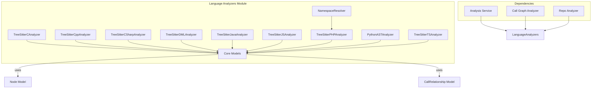

# Language Analyzers Module

The Language Analyzers module is a core component of the dependency analysis system that provides language-specific parsing and analysis capabilities. It uses tree-sitter parsers and AST analysis to extract nodes (classes, functions, methods, etc.) and relationships (calls, inheritance, etc.) from source code files across multiple programming languages.

## Architecture Overview

## Module Purpose

The Language Analyzers module serves as the foundation for static code analysis by:

1. **Parsing source code** in multiple programming languages using tree-sitter or AST-based parsers
2. **Extracting code entities** such as classes, functions, methods, variables, and interfaces
3. **Identifying relationships** between code entities including function calls, inheritance, and dependencies
4. **Generating standardized output** in the form of Node and CallRelationship objects for further processing

## Supported Languages

The module currently supports analysis for the following programming languages:

- C (using tree-sitter-c)
- C++ (using tree-sitter-cpp)
- C# (using tree-sitter-c-sharp)
- DML/SQL (with fallback parsing)
- Java (using tree-sitter-java)
- JavaScript (using tree-sitter-javascript)
- PHP (using tree-sitter-php with namespace resolution)
- Python (using Python AST module)
- TypeScript (using tree-sitter-typescript)

## Core Functionality

### C Analyzer ([c_analyzer.md](c_analyzer.md))
The C analyzer uses tree-sitter to parse C source files and extract functions, structs, and global variables. It identifies function calls and relationships between top-level entities.

### C++ Analyzer ([cpp_analyzer.md](cpp_analyzer.md))
The C++ analyzer handles classes, structs, functions, and methods with proper class hierarchy detection. It identifies inheritance, method calls, and object creation patterns.

### C# Analyzer ([csharp_analyzer.md](csharp_analyzer.md))
The C# analyzer extracts classes, interfaces, structs, enums, records, and delegates. It identifies inheritance, interface implementation, and type dependencies.

### DML Analyzer ([dml_analyzer.md](dml_analyzer.md))
The DML analyzer handles database-related files with support for table definitions, procedures, and query patterns. It includes fallback parsing when tree-sitter support is unavailable.

### Java Analyzer ([java_analyzer.md](java_analyzer.md))
The Java analyzer extracts classes, interfaces, enums, records, and annotations. It identifies inheritance, interface implementation, method calls, and object creation.

### JavaScript Analyzer ([javascript_analyzer.md](javascript_analyzer.md))
The JavaScript analyzer handles functions, classes, methods, and arrow functions. It identifies method calls, object creation, and type dependencies from JSDoc comments.

### PHP Analyzer ([php_analyzer.md](php_analyzer.md))
The PHP analyzer includes namespace resolution capabilities and extracts classes, interfaces, traits, enums, and functions. It handles use statements, inheritance, and static method calls.

### Python Analyzer ([python_analyzer.md](python_analyzer.md))
The Python analyzer uses Python's built-in AST module to extract classes, functions, and methods. It identifies function calls and inheritance relationships.

### TypeScript Analyzer ([typescript_analyzer.md](typescript_analyzer.md))
The TypeScript analyzer handles classes, interfaces, type aliases, enums, and functions with type information. It identifies inheritance, implementation, and type dependencies.

## Integration with Other Modules

The Language Analyzers module integrates with other components of the system:

- **Analysis Service**: Provides the core analysis functionality
- **Call Graph Analyzer**: Uses extracted relationships to build call graphs
- **Repo Analyzer**: Processes entire repositories using language-specific analyzers
- **Models**: Uses Node and CallRelationship models for standardized output

## Key Features

- **Multi-language support**: Consistent interface across different programming languages
- **Tree-sitter integration**: Efficient parsing using language-specific tree-sitter grammars
- **Relationship extraction**: Identification of dependencies and call relationships
- **Namespace resolution**: Proper handling of imports, includes, and namespaces
- **Fallback parsing**: Support for languages without tree-sitter grammars
- **Standardized output**: Consistent Node and CallRelationship objects across all analyzers