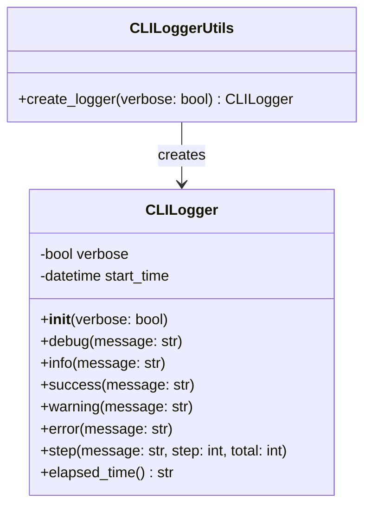
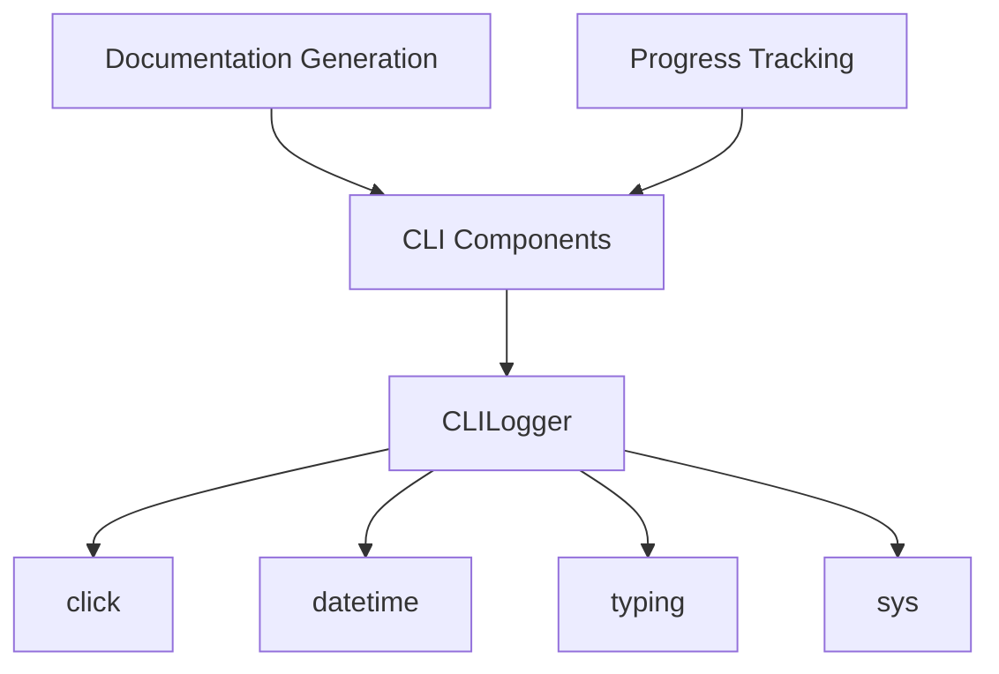
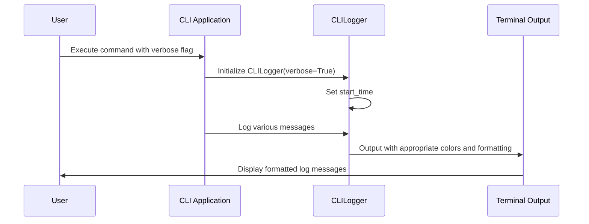
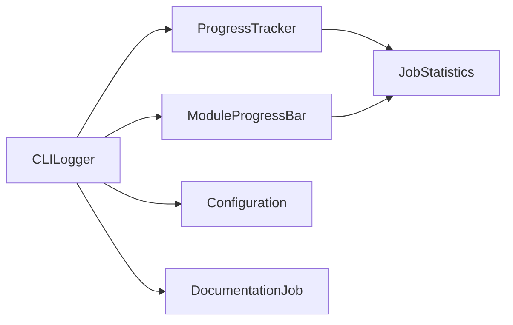

# Logging Module Documentation

## Introduction

The logging module provides CLI-specific logging utilities with colored output and progress tracking capabilities. It is designed to enhance user experience during command-line operations by providing clear, visually distinct log messages with support for both verbose and normal output modes.

The core component of this module is the `CLILogger` class, which offers various logging levels and formatting options specifically tailored for CLI applications.

## Architecture Overview

## Core Components

### CLILogger

The `CLILogger` class is the primary component of the logging module, providing comprehensive logging functionality for CLI applications.

#### Properties
- `verbose`: Boolean flag to enable verbose output mode
- `start_time`: Timestamp when the logger was initialized (used for elapsed time calculations)

#### Methods

**`__init__(verbose: bool = False)`**
- Initializes the logger with optional verbose mode
- Sets the start time for elapsed time tracking

**`debug(message: str)`**
- Logs debug messages in cyan color (only displayed in verbose mode)
- Includes timestamp in HH:MM:SS format

**`info(message: str)`**
- Logs standard information messages
- Uses default terminal color

**`success(message: str)`**
- Logs success messages in green color
- Prefixes message with a checkmark (✓)

**`warning(message: str)`**
- Logs warning messages in yellow color
- Prefixes message with a warning symbol (⚠️)

**`error(message: str)`**
- Logs error messages in red color
- Directs output to stderr
- Prefixes message with an X symbol (✗)

**`step(message: str, step: Optional[int] = None, total: Optional[int] = None)`**
- Logs processing steps with optional progress tracking
- Uses blue color with bold formatting
- Shows progress as [step/total] or simple arrow (→) prefix

**`elapsed_time() -> str`**
- Calculates and returns elapsed time since logger initialization
- Formats time as "Xm Ys" for minutes and seconds, or just "Ys" for seconds only

### Utility Functions

**`create_logger(verbose: bool = False) -> CLILogger`**
- Factory function to create and return a configured `CLILogger` instance
- Provides a convenient way to initialize the logger with specified verbose settings

## Integration and Dependencies

The logging module integrates with the broader system through the following relationships:

The module depends on:
- `click`: For colored terminal output
- `datetime`: For timestamp generation and elapsed time calculations
- `typing`: For type hints
- `sys`: For system-level operations (used by click for stderr)

## Usage Examples

The logging module is primarily used by other CLI components such as:
- [CLI Documentation Generator](doc_generator.md)
- [Progress Tracking Utilities](progress.md)
- [Configuration Manager](config_manager.md)
- [Git Manager](git_manager.md)

## Data Flow

## Component Interactions

The logging module works in conjunction with other CLI utilities:

## System Integration

The logging module fits into the overall system architecture as a foundational utility that supports:

1. **CLI Operations**: Provides consistent logging across all CLI commands
2. **Documentation Generation**: Supports logging during documentation creation processes
3. **Progress Tracking**: Integrates with progress indicators for better user experience
4. **Error Handling**: Provides structured error reporting throughout the system

## References

- [CLI Documentation Generator](doc_generator.md) - Uses logging for documentation generation processes
- [Progress Tracking Utilities](progress.md) - Integrates with progress indicators
- [Configuration Management](config_manager.md) - Uses logging for configuration operations
- [Git Management](git_manager.md) - Uses logging for repository operations