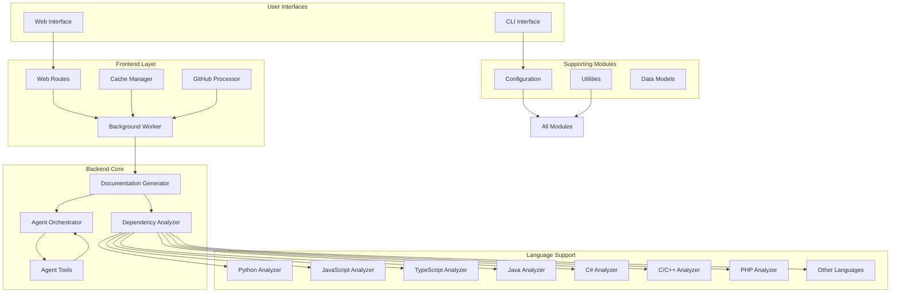
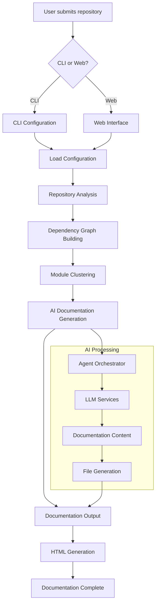

# CodeWiki Repository Overview

## Purpose

CodeWiki is an automated documentation generation system that creates comprehensive documentation for code repositories using AI-powered analysis. The system analyzes codebases across multiple programming languages, builds dependency graphs, and generates structured documentation using large language models. It provides both command-line and web-based interfaces for users to generate and view documentation for their software projects.

## Architecture

## End-to-End Flow

## Core Modules Documentation

### [CLI Module](cli.md)
Provides command-line interface for documentation generation with configuration management, git integration, and progress tracking.

### [Dependency Analyzer Module](dependency_analyzer.md)
Performs static code analysis across multiple languages to build dependency graphs and identify code relationships.

### [Documentation Generator Module](documentation_generator.md)
Orchestrates the entire documentation generation process using dynamic programming to process modules in dependency order.

### [Agent Orchestrator Module](agent_orchestrator.md)
Manages AI agents that generate documentation for individual modules using LLMs and specialized tools.

### [Agent Tools Module](agent_tools.md)
Provides file system and code analysis tools for AI agents to interact with the codebase during documentation generation.

### [Frontend Module](frontend.md)
Web-based interface for submitting repositories and viewing generated documentation with job management and caching.

### [Configuration Module](config.md)
Manages both persistent user settings and runtime job configurations for the documentation generation system.

### [Utilities Module](utils.md)
Provides essential file operations and utility functions used throughout the CodeWiki system.