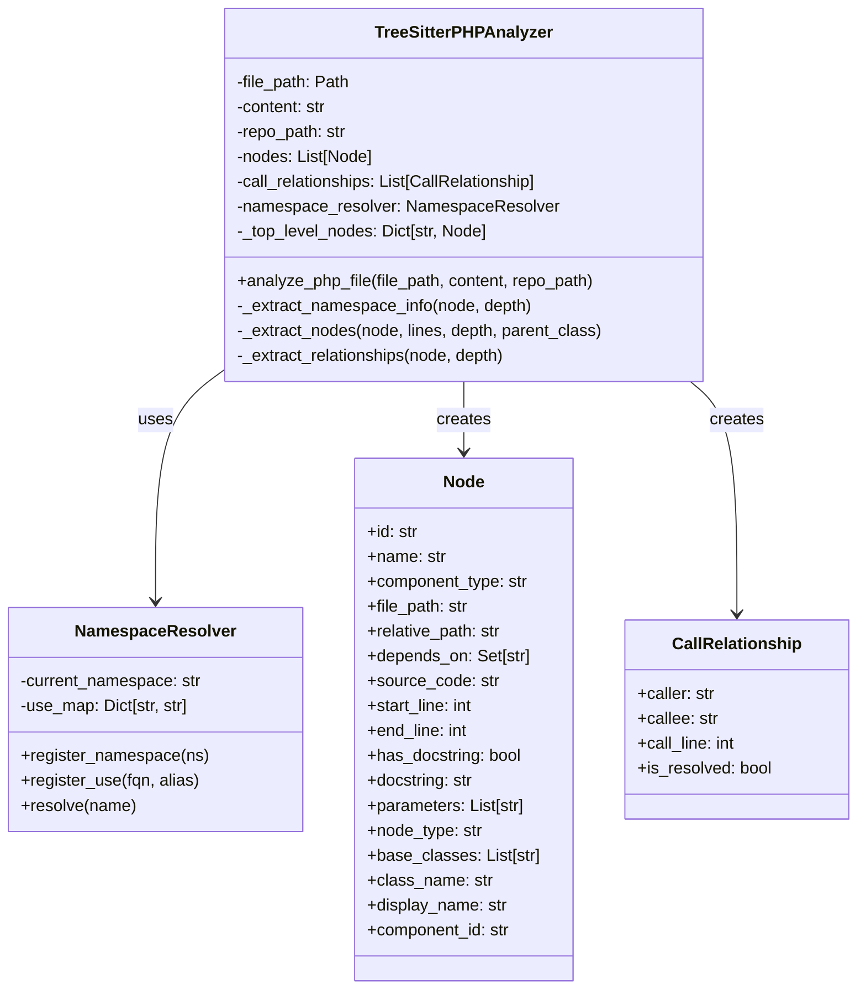
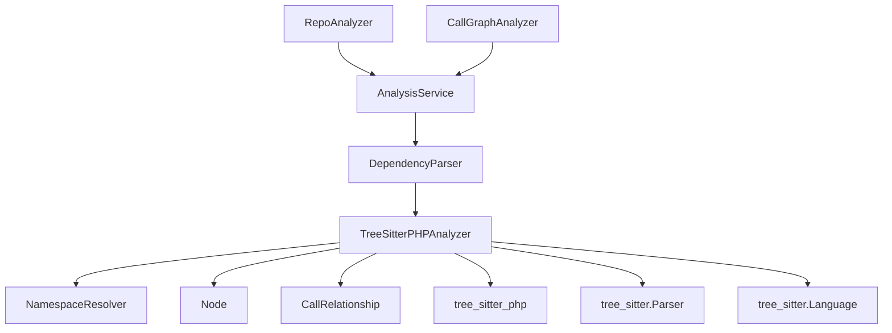
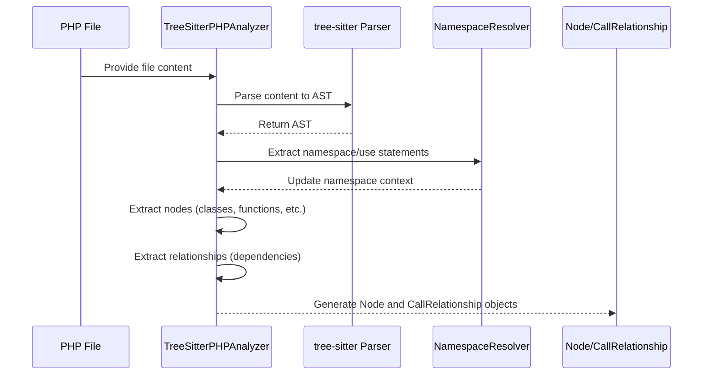

# PHP Analyzer Module Documentation

## Introduction

The PHP Analyzer module is a specialized component of the dependency analyzer system that provides PHP language-specific analysis capabilities. It uses tree-sitter parsing to extract classes, interfaces, traits, enums, functions, and methods from PHP files, along with their dependency relationships such as use statements, extends, implements, object creation, and static calls.

This module is part of the larger [dependency_analyzer](dependency_analyzer.md) system and works in conjunction with other language analyzers to provide comprehensive multi-language repository analysis.

## Architecture Overview

The PHP Analyzer module consists of two main components:

1. **TreeSitterPHPAnalyzer**: The primary analyzer class that parses PHP files using tree-sitter
2. **NamespaceResolver**: A utility class that handles PHP namespace resolution and use statement mapping



## Core Components

### TreeSitterPHPAnalyzer

The `TreeSitterPHPAnalyzer` class is the main component responsible for analyzing PHP files. It performs the following operations:

- Parses PHP files using tree-sitter-php
- Extracts classes, interfaces, traits, enums, functions, and methods
- Identifies dependency relationships (use, extends, implements, new, static calls)
- Handles namespace resolution using the `NamespaceResolver`
- Skips template files (Blade, PHTML, Twig templates)

#### Key Methods

- `_extract_namespace_info()`: Extracts namespace and use statements from the AST
- `_extract_nodes()`: Extracts class, interface, trait, enum, function, and method nodes
- `_extract_relationships()`: Extracts dependency relationships from the AST
- `_analyze()`: Main analysis entry point that orchestrates the parsing process

### NamespaceResolver

The `NamespaceResolver` class handles PHP namespace resolution and use statement mapping:

- Tracks the current namespace context
- Maintains a mapping of use statement aliases to fully qualified names
- Resolves partial class names to fully qualified names
- Handles both simple and group use statements

#### Key Methods

- `register_namespace()`: Sets the current namespace
- `register_use()`: Registers a use statement with optional alias
- `resolve()`: Resolves a name to its fully qualified form

## Dependencies and Integration

The PHP Analyzer module integrates with several other components in the system:



### External Dependencies

- **tree-sitter-php**: Provides the PHP grammar for parsing
- **tree-sitter**: Core parsing library
- **Python standard library**: For file operations and utilities

### Integration with Core Models

The analyzer produces [Node](core_models.md) and [CallRelationship](core_models.md) objects that are compatible with the system's core data models, allowing seamless integration with the overall dependency analysis pipeline.

## Data Flow

The PHP analyzer follows a three-pass analysis approach:



### Analysis Process

1. **First Pass**: Extract namespace and use statements to build the namespace resolution context
2. **Second Pass**: Extract nodes (classes, interfaces, traits, enums, functions, methods) with their metadata
3. **Third Pass**: Extract relationships (dependencies) between nodes

## Supported PHP Features

The analyzer supports a comprehensive set of PHP language features:

### Class Types
- Classes (including abstract classes)
- Interfaces
- Traits
- Enums

### Functions and Methods
- Global functions
- Class methods
- Method parameters with type hints
- PHPDoc comments extraction

### Dependency Relationships
- Use statements (imports)
- Class inheritance (extends)
- Interface implementation (implements)
- Object creation (new)
- Static method calls (::)
- Property promotion in constructors (PHP 8+)

### Namespace Handling
- Namespace resolution
- Use statement aliasing
- Group use statements
- Fully qualified name resolution

## Configuration and Filtering

The analyzer includes several built-in filtering mechanisms:

### Template File Filtering
The analyzer automatically skips template files based on:
- File extensions: `.blade.php`, `.phtml`, `.twig.php`
- Directory patterns: `views`, `templates`, `resources/views`

### Primitive Type Filtering
Built-in PHP types are excluded from dependency relationships:
- Primitive types: `string`, `int`, `float`, `bool`, `array`, etc.
- Built-in classes: `Exception`, `Error`, `DateTime`, `stdClass`, etc.

### Recursion Protection
- Maximum recursion depth of 100 to prevent stack overflow
- Warning logging when recursion limits are reached

## Usage Examples

### Direct Usage

```python
from codewiki.src.be.dependency_analyzer.analyzers.php import analyze_php_file

nodes, relationships = analyze_php_file(
    file_path="/path/to/file.php",
    content="file content as string",
    repo_path="/path/to/repo"
)
```

### Integration with Analysis Service

The PHP analyzer integrates with the [AnalysisService](analysis_service.md) through the [DependencyParser](ast_parser.md), which coordinates analysis across multiple language analyzers.

## Error Handling

The analyzer includes robust error handling:

- **Recursion errors**: Limited to prevent stack overflow
- **Parsing errors**: Caught and logged with file information
- **File path errors**: Handled gracefully with fallbacks
- **Namespace resolution errors**: Gracefully handled with partial results

## Performance Considerations

- Uses tree-sitter for efficient parsing
- Implements recursion depth limits to prevent stack overflow
- Skips template files to avoid unnecessary processing
- Optimized AST traversal algorithms

## Relationship to Other Modules

The PHP Analyzer module works as part of the broader dependency analysis system:

- **[AnalysisService](analysis_service.md)**: Coordinates analysis across all language analyzers
- **[DependencyParser](ast_parser.md)**: Integrates PHP analysis results with other languages
- **[CallGraphAnalyzer](call_graph_analyzer.md)**: Uses PHP analysis results for call graph construction
- **[RepoAnalyzer](repo_analyzer.md)**: Incorporates PHP analysis into repository-wide analysis

## Testing and Validation

The PHP analyzer is designed to handle various PHP language constructs and edge cases, with built-in validation for:
- Proper namespace resolution
- Accurate dependency relationship extraction
- Correct node type identification
- PHPDoc comment extraction

## Future Enhancements

Potential areas for improvement include:
- Support for more PHP 8+ features
- Enhanced type inference capabilities
- Better handling of dynamic calls
- Improved performance for large codebases