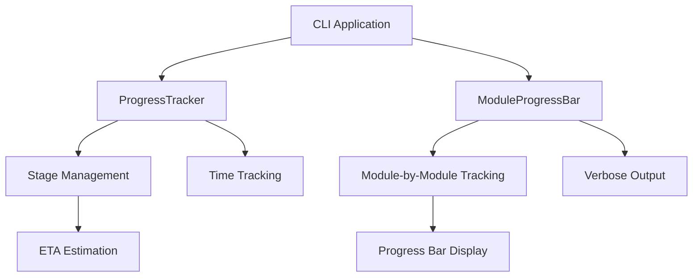
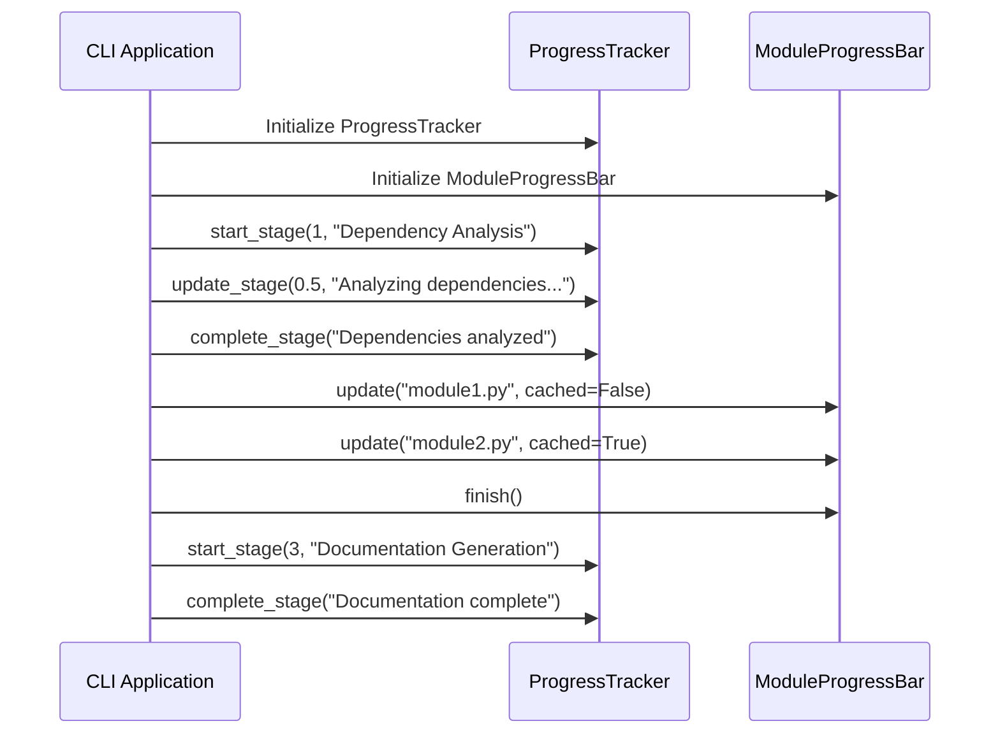

# Progress Module Documentation

## Overview

The progress module provides CLI utilities for tracking and displaying progress during documentation generation workflows. It includes two main components: `ProgressTracker` for tracking multi-stage processes and `ModuleProgressBar` for tracking individual module processing.

This module is part of the CLI layer and works in conjunction with other CLI components like [config_manager](config_manager.md), [doc_generator](doc_generator.md), and [job_models](job_models.md) to provide users with real-time feedback during long-running documentation generation tasks.

## Architecture



## Core Components

### ProgressTracker

The `ProgressTracker` class manages progress across multiple stages of the documentation generation process. It follows a predefined workflow with five distinct stages:

1. **Dependency Analysis** (40% of total time)
2. **Module Clustering** (20% of total time)
3. **Documentation Generation** (30% of total time)
4. **HTML Generation** (5% of total time, optional)
5. **Finalization** (5% of total time)

#### Key Features:
- Stage-based progress tracking
- ETA (Estimated Time of Arrival) calculation
- Verbose and non-verbose output modes
- Time formatting and tracking
- Percentage-based progress calculation

#### Methods:
- `start_stage(stage, description)`: Begin a new processing stage
- `update_stage(progress, message)`: Update progress within the current stage
- `complete_stage(message)`: Mark the current stage as complete
- `get_overall_progress()`: Calculate overall progress percentage
- `get_eta()`: Estimate remaining time

### ModuleProgressBar

The `ModuleProgressBar` class provides progress tracking for individual module processing. It uses Click's built-in progress bar functionality for non-verbose mode and simple text output for verbose mode.

#### Key Features:
- Module-by-module progress tracking
- Support for both verbose and non-verbose modes
- Cache status indication
- Integration with Click's progress bar

#### Methods:
- `update(module_name, cached)`: Update progress for a specific module
- `finish()`: Complete the progress tracking

## Data Flow



## Integration with Other Modules

The progress module integrates with several other components in the system:

- **[cli](cli.md)**: The main CLI application uses progress tracking to provide user feedback
- **[doc_generator](doc_generator.md)**: Documentation generation processes use progress tracking to show generation status
- **[job_models](job_models.md)**: Progress information may be stored in job statistics
- **[logging](logging.md)**: Progress messages are often logged alongside progress updates

## Usage Examples

### Basic Usage
```python
# Initialize progress tracker
tracker = ProgressTracker(verbose=True)

# Start first stage
tracker.start_stage(1, "Dependency Analysis")
tracker.update_stage(0.5, "Halfway through analysis")
tracker.complete_stage("Dependencies analyzed")

# Initialize module progress bar
module_bar = ModuleProgressBar(total_modules=10)
module_bar.update("module1.py", cached=False)
module_bar.update("module2.py", cached=True)
module_bar.finish()
```

### Integration with Documentation Generation
The progress module is typically used within the documentation generation workflow to provide real-time feedback to users during potentially long-running operations.

## Configuration

The progress module supports two main configuration options:
- `verbose`: Enables detailed output with timestamps and messages
- `total_stages`: Configurable number of stages (default is 5)

## Dependencies

- `click`: For progress bar display and CLI formatting
- `time`: For time tracking and ETA calculations
- `datetime`: For time formatting

## Error Handling

The progress module is designed to be robust and not throw exceptions during normal operation. It gracefully handles edge cases such as:
- Invalid progress values (clamped to 0.0-1.0 range)
- Uninitialized stages
- Division by zero in ETA calculations

## Performance Considerations

- The progress module is designed to have minimal impact on overall performance
- ETA calculations are only performed when sufficient data is available
- Verbose mode may slightly impact performance due to additional output operations

## Future Enhancements

Potential areas for improvement include:
- Customizable stage weights
- Progress persistence across application restarts
- Integration with web-based progress tracking for the frontend