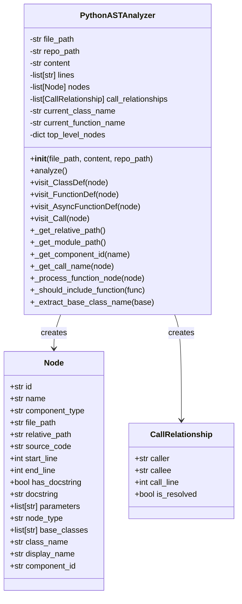
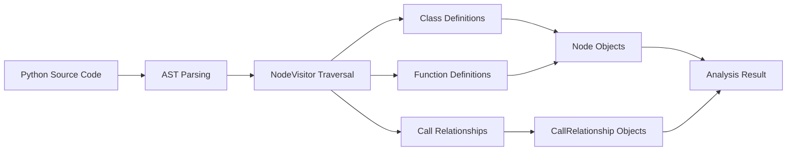
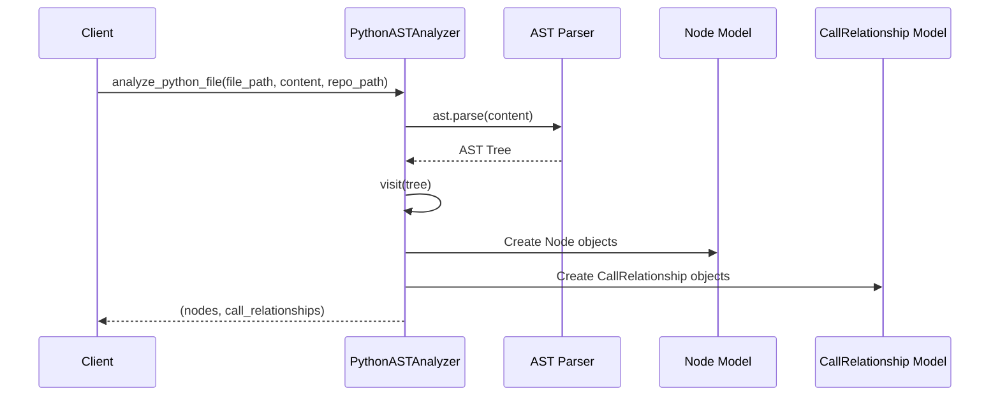
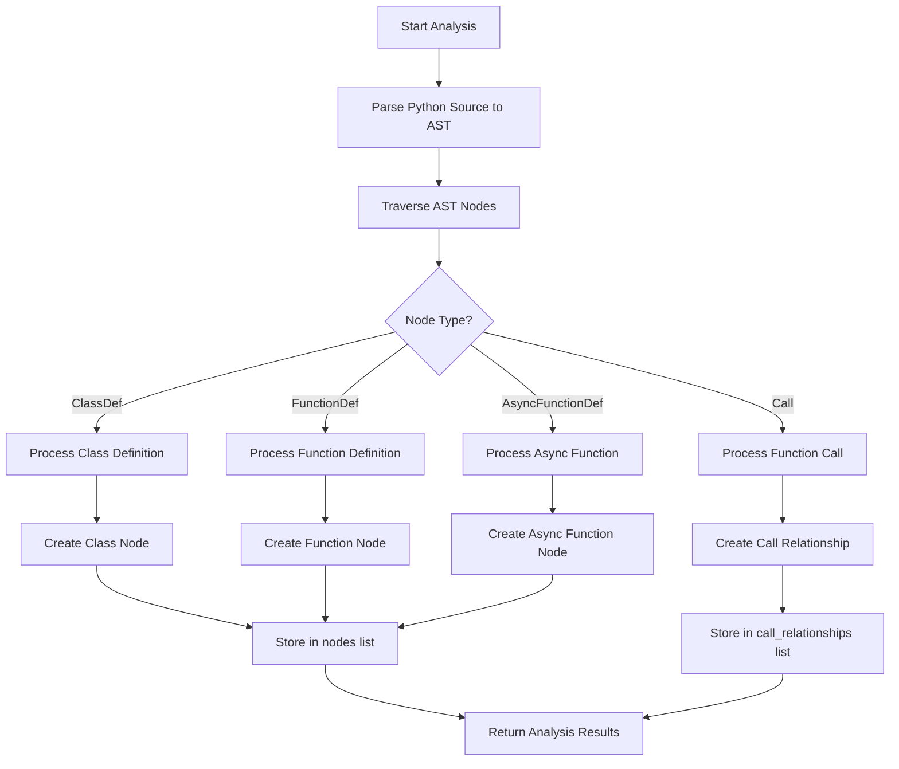

# Python AST Analyzer Module

## Overview

The Python AST Analyzer module (`codewiki.src.be.dependency_analyzer.analyzers.python.PythonASTAnalyzer`) is a specialized component within the dependency analyzer system that performs static analysis of Python code using the Abstract Syntax Tree (AST) approach. This module extracts structural information from Python files, including classes, functions, methods, and their relationships, to build a comprehensive understanding of the codebase for documentation generation and dependency analysis.

The analyzer leverages Python's built-in `ast` module to parse Python source code and extract meaningful information about the code structure, including function signatures, class hierarchies, docstrings, and call relationships between different components.

## Architecture



## Core Components

### PythonASTAnalyzer Class

The `PythonASTAnalyzer` class is the main component of this module, extending Python's `ast.NodeVisitor` to traverse the AST of a Python file. It extracts information about classes, functions, and their relationships.

**Key Responsibilities:**
- Parsing Python source code using the AST module
- Extracting class definitions with inheritance information
- Identifying function and method definitions
- Tracking call relationships between functions and methods
- Filtering out test functions and built-in Python functions
- Generating unique component IDs for each code element

### Helper Functions

#### `analyze_python_file()`
A utility function that provides a convenient interface to analyze a Python file and return the extracted nodes and relationships.

## Data Flow



## Component Interactions



## Process Flow



## Dependencies

The Python AST Analyzer module depends on several core components:

- **[Node](core_models.md)**: Used to represent code elements (classes, functions) in the analysis
- **[CallRelationship](core_models.md)**: Used to represent relationships between code elements
- **[AnalysisService](analysis_service.md)**: Higher-level service that orchestrates the analysis process
- **[RepoAnalyzer](analysis_service.md)**: Repository-level analysis coordinator

## Integration with Overall System

The Python AST Analyzer fits into the broader dependency analysis system as one of several language-specific analyzers. It works in conjunction with other language analyzers (JavaScript, Java, C++, etc.) to provide comprehensive multi-language codebase analysis.

The extracted nodes and relationships are used by:
- **[DependencyGraphBuilder](dependency_graph_builder.md)**: To construct dependency graphs
- **[DocumentationGenerator](documentation_generator.md)**: To generate documentation based on code structure
- **[AnalysisService](analysis_service.md)**: To provide analysis results to the frontend

## Key Features

1. **AST-based Analysis**: Uses Python's built-in AST module for accurate parsing
2. **Multi-level Extraction**: Extracts classes, functions, methods, and their relationships
3. **Inheritance Tracking**: Identifies class inheritance relationships
4. **Call Relationship Mapping**: Maps function calls between different components
5. **Built-in Function Filtering**: Excludes Python built-in functions from analysis
6. **Test Function Filtering**: Excludes test functions from analysis
7. **Docstring Extraction**: Captures docstrings for documentation purposes

## Usage Example

```python
from codewiki.src.be.dependency_analyzer.analyzers.python import analyze_python_file

# Analyze a Python file
nodes, relationships = analyze_python_file(
    file_path="/path/to/file.py",
    content="def hello():\n    print('Hello, World!')",
    repo_path="/path/to/repo"
)

# Process the extracted information
for node in nodes:
    print(f"Found {node.component_type}: {node.name}")

for relationship in relationships:
    print(f"Call from {relationship.caller} to {relationship.callee}")
```

## Error Handling

The analyzer includes robust error handling for:
- Syntax errors in the source code
- Invalid escape sequences (common in regex patterns)
- General parsing exceptions
- File access issues

## Limitations

- Only analyzes top-level classes and functions (does not analyze nested functions)
- May not capture all import relationships
- Limited to static analysis (cannot detect dynamic calls)
- Does not handle complex import scenarios with dynamic module loading

## Performance Considerations

The analyzer is designed to be efficient for static analysis of Python code. It processes files individually and does not maintain complex state between files, making it suitable for parallel processing of large codebases.