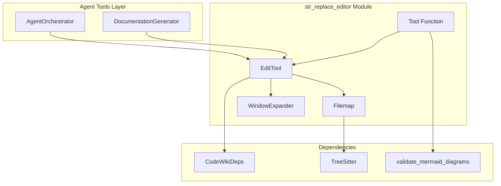
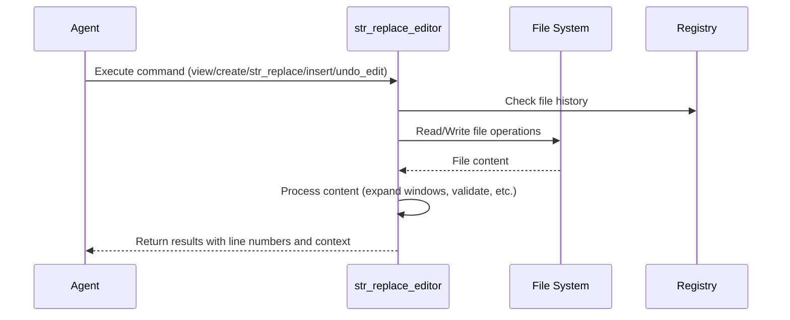
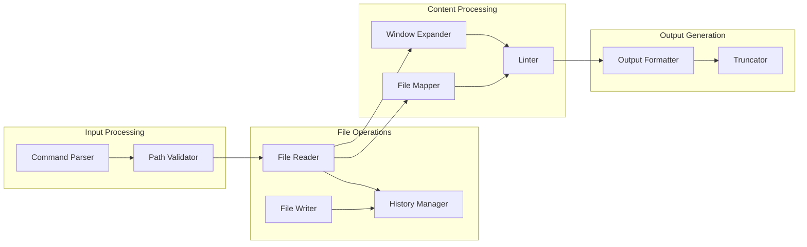
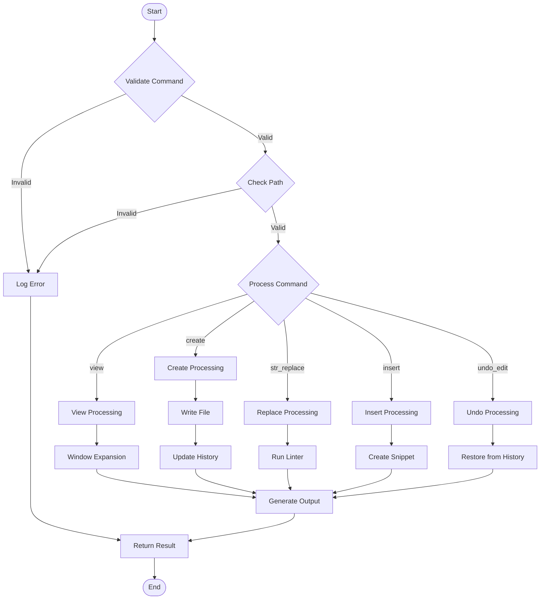

# str_replace_editor Module Documentation

The `str_replace_editor` module provides a comprehensive file editing tool that enables agents to view, create, and modify files within the CodeWiki system. This module is a critical component of the agent toolset, allowing for persistent file operations across command calls.

## Overview

The `str_replace_editor` module implements a filesystem editor tool that allows agents to perform various file operations including viewing file contents, creating new files, replacing text within files, inserting text at specific lines, and undoing edits. The module includes intelligent features like window expansion to show complete functions/classes and file mapping for large Python files.

## Architecture

## Core Components

### EditTool
The main class that implements the file editing functionality. It supports multiple commands:
- `view`: Display file contents or directory structure
- `create`: Create new files
- `str_replace`: Replace text within files
- `insert`: Insert text at specific line numbers
- `undo_edit`: Revert the last edit

### Filemap
A utility class that creates file maps for Python files, showing function and class definitions while eliding their contents for better overview of large files.

### WindowExpander
Intelligently expands viewports to include complete functions, classes, or other code blocks rather than using fixed line windows.

## Dependencies

The `str_replace_editor` module depends on several other modules:

- [CodeWikiDeps](deps.md) - Provides dependency injection for the tool
- [validate_mermaid_diagrams](utils.md) - Validates Mermaid diagrams in documentation files
- TreeSitter libraries - Used for parsing Python code in the Filemap functionality

## Data Flow

## Component Interactions

## Key Features

### File Operations
- **View**: Display file contents with line numbers or directory structure
- **Create**: Create new files with specified content
- **String Replace**: Replace specific text patterns with new content
- **Insert**: Insert text at specific line numbers
- **Undo Edit**: Revert the last edit operation

### Intelligent Display
- **Window Expansion**: Automatically expands viewports to show complete functions/classes
- **File Mapping**: Provides an overview of Python files with elided function bodies
- **Content Truncation**: Handles large files by truncating content with clear indicators

### Validation and Safety
- **Path Validation**: Ensures paths are valid and exist before operations
- **Linter Integration**: Validates Python code after edits
- **History Tracking**: Maintains edit history for undo functionality
- **Duplicate Prevention**: Prevents duplicate operations and invalid replacements

## Process Flow

## Configuration Options

The module includes several configuration constants:
- `MAX_RESPONSE_LEN`: Maximum length of response before truncation (default: 16000)
- `MAX_WINDOW_EXPANSION_VIEW`: Maximum lines to expand when viewing (default: 0)
- `MAX_WINDOW_EXPANSION_EDIT_CONFIRM`: Maximum lines to expand for edit confirmation (default: 0)
- `USE_FILEMAP`: Whether to use file mapping for large Python files (default: False)
- `USE_LINTER`: Whether to run linter on Python files (default: False)

## Error Handling

The module implements comprehensive error handling:
- Unicode decode errors are handled with multiple encoding attempts
- Path validation prevents invalid file operations
- Duplicate text replacements are prevented
- Linter warnings are provided for syntax errors
- History tracking allows for safe undo operations

## Integration Points

The `str_replace_editor` module integrates with:
- The [AgentOrchestrator](agent_orchestrator.md) for tool execution
- The [DocumentationGenerator](documentation_generator.md) for documentation file operations
- The [Registry](config_manager.md) for persistent state management
- The [Mermaid validation system](utils.md) for diagram validation in documentation files

## Usage Examples

The tool is typically used through the `str_replace_editor_tool` which provides a standardized interface for agents to perform file operations. The tool maintains state across command calls and provides detailed feedback about operations performed.