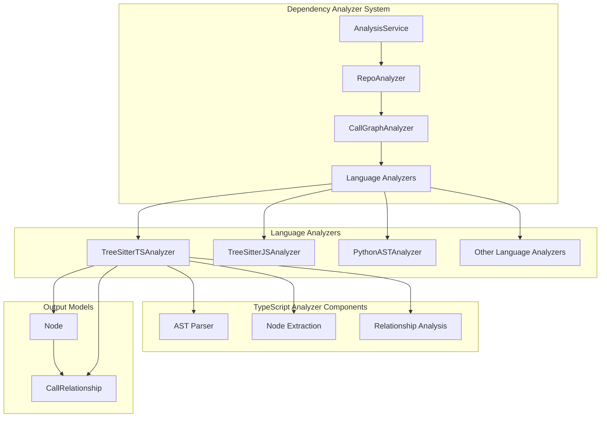
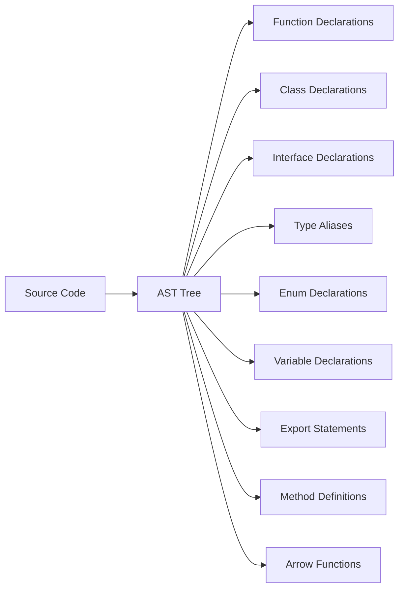
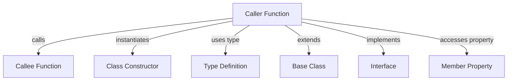
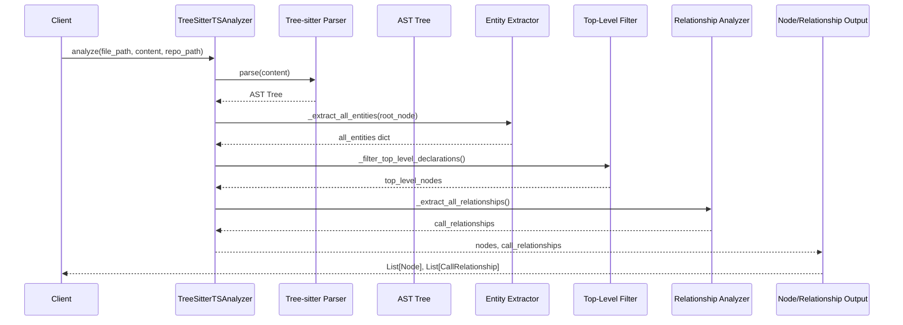

# TypeScript Analyzer Module Documentation

## Introduction

The `typescript_analyzer` module is a specialized component of the dependency analyzer system that focuses on analyzing TypeScript files using Tree-sitter parsing technology. This module extracts top-level declarations, identifies relationships between code entities, and builds dependency graphs for TypeScript codebases.

The module is part of the broader dependency analysis system that supports multiple programming languages and is designed to work within the CodeWiki ecosystem for automated documentation generation and code understanding.

## Architecture Overview

## Core Components

### TreeSitterTSAnalyzer Class

The main component of this module is the `TreeSitterTSAnalyzer` class, which provides comprehensive TypeScript code analysis capabilities.

#### Key Properties:
- `file_path`: Path to the TypeScript file being analyzed
- `content`: Raw content of the file
- `repo_path`: Repository root path for relative path calculations
- `nodes`: List of extracted top-level nodes
- `call_relationships`: List of identified call relationships
- `top_level_nodes`: Dictionary of top-level declarations

#### Initialization
The analyzer initializes with a Tree-sitter parser configured for TypeScript, using the `tree_sitter_typescript` language binding.

## Functionality

### Entity Extraction

The analyzer identifies and extracts various TypeScript language constructs:

#### Supported Entity Types:
- **Functions**: Regular, generator, and arrow functions
- **Classes**: Regular and abstract classes
- **Interfaces**: Interface declarations
- **Types**: Type aliases and enums
- **Variables**: Const/let/var declarations
- **Exports**: Export statements and default exports

### Relationship Analysis

The analyzer identifies various types of relationships between code entities:

#### Relationship Types:
- **Call Relationships**: Function calls and method invocations
- **Instantiation**: `new` expressions creating class instances
- **Type Dependencies**: Type annotations and type arguments
- **Inheritance**: `extends` and `implements` relationships
- **Member Access**: Property and method access patterns

### Top-Level Declaration Filtering

The analyzer implements sophisticated logic to identify truly top-level declarations by:

1. Traversing the AST to find all entities
2. Filtering out nested declarations inside function bodies
3. Handling special contexts like modules and ambient declarations
4. Preserving only relevant top-level constructs

## Data Flow

## Integration with Other Modules

### Core Models Integration
The TypeScript analyzer works closely with the [core_models](core_models.md) module to create `Node` and `CallRelationship` objects that are consistent across all language analyzers.

### Analysis Service Integration
The analyzer is used by the [analysis_service](analysis_service.md) module through the [repo_analyzer](repo_analyzer.md) and [call_graph_analyzer](call_graph_analyzer.md) components.

### AST Parser Integration
The analyzer leverages the [ast_parser](ast_parser.md) module for common AST parsing utilities, though it implements its own TypeScript-specific parsing logic.

## Usage Context

This module is typically used within the broader dependency analysis workflow:

1. The [RepoAnalyzer](repo_analyzer.md) identifies TypeScript files in a repository
2. The [CallGraphAnalyzer](call_graph_analyzer.md) selects this analyzer for `.ts` and `.tsx` files
3. The analyzer processes each file and returns nodes and relationships
4. The [DependencyGraphBuilder](dependency_graph_builder.md) combines results from all files
5. The results feed into the [documentation_generator](documentation_generator.md) module

## Error Handling

The analyzer implements comprehensive error handling:

- Parser initialization failures are logged and handled gracefully
- Individual file analysis errors don't stop the entire process
- Invalid AST structures are handled safely
- Logging is provided at debug and error levels

## Performance Considerations

- The analyzer processes files individually for scalability
- Tree-sitter provides efficient parsing performance
- Memory usage is optimized by only storing top-level entities
- Relationship analysis is performed in a single AST traversal

## Dependencies

- `tree_sitter`: Core parsing library
- `tree_sitter_typescript`: TypeScript language binding
- [core_models](core_models.md): Node and CallRelationship models
- Python standard library components for file handling and logging

## References

- [dependency_analyzer](dependency_analyzer.md) - Parent module documentation
- [analysis_service](analysis_service.md) - Analysis service that orchestrates this module
- [core_models](core_models.md) - Core data models used by this module
- [ast_parser](ast_parser.md) - AST parsing utilities
- [language_analyzers](language_analyzers.md) - Overview of all language analyzers