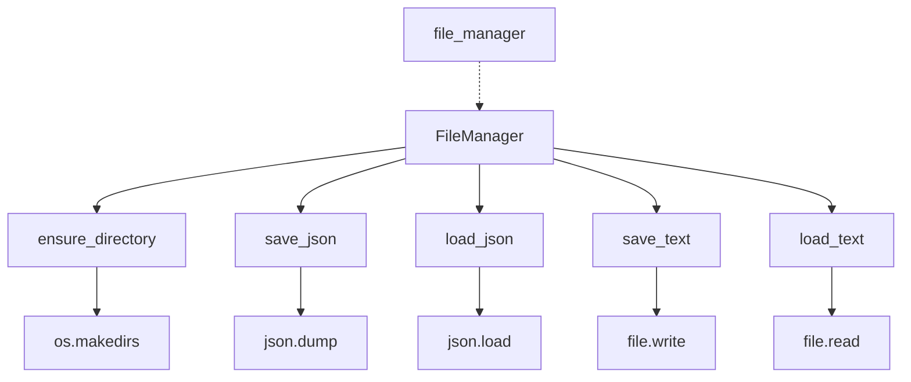
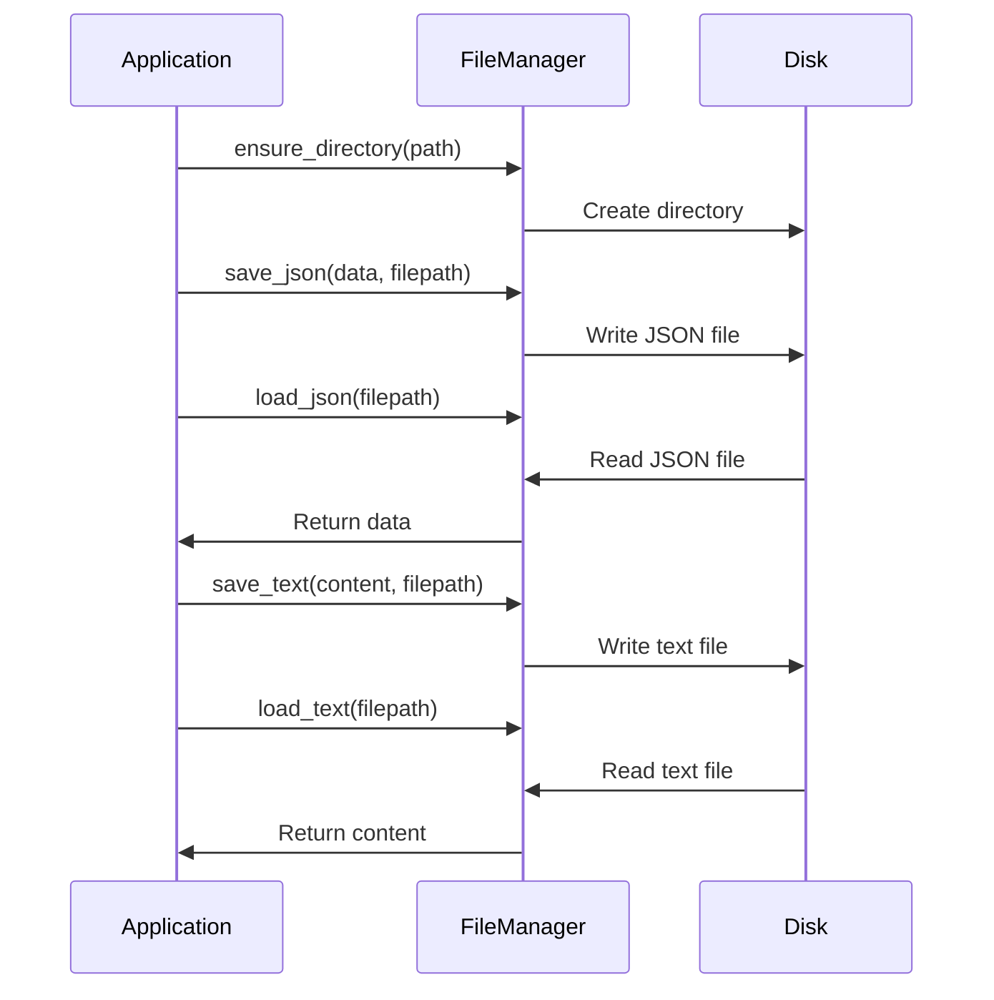
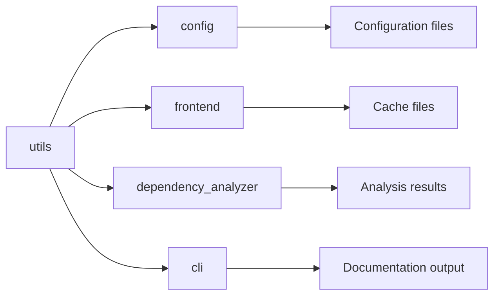

# Utils Module Documentation

## Overview

The `utils` module provides essential utility functions for file operations within the CodeWiki system. It contains the `FileManager` class, which serves as a centralized handler for file input/output operations including JSON and text file management.

## Core Components

### FileManager Class

The `FileManager` class is a utility class that provides static methods for common file operations. It follows a utility pattern with static methods that can be called without instantiating the class.

#### Methods

- **`ensure_directory(path: str) -> None`**: Creates a directory if it doesn't exist using `os.makedirs` with `exist_ok=True`
- **`save_json(data: Any, filepath: str) -> None`**: Saves data as JSON to a specified file with 4-space indentation
- **`load_json(filepath: str) -> Optional[Dict[str, Any]]`**: Loads JSON data from a file, returning None if the file doesn't exist
- **`save_text(content: str, filepath: str) -> None`**: Saves text content to a specified file
- **`load_text(filepath: str) -> str`**: Loads text content from a specified file

#### Instance

An instance of `FileManager` is created and exported as `file_manager` for convenience:

```python
file_manager = FileManager()
```

## Architecture



## Dependencies

The `utils` module has minimal external dependencies:
- `os` - For directory operations
- `json` - For JSON serialization/deserialization
- `typing` - For type hints (Any, Optional, Dict)

## Integration with Other Modules

The `utils` module serves as a foundational component that other modules depend on for file operations:

- [config](config.md) - Uses FileManager for configuration file management
- [frontend](frontend.md) - Uses FileManager for cache and data persistence
- [dependency_analyzer](dependency_analyzer.md) - Uses FileManager for saving analysis results
- [cli](cli.md) - Uses FileManager for documentation output and job data persistence

## Data Flow



## Usage Examples

### Using the static methods directly:

```python
from codewiki.src.utils import FileManager

# Create directory
FileManager.ensure_directory("/path/to/directory")

# Save JSON data
data = {"key": "value"}
FileManager.save_json(data, "data.json")

# Load JSON data
loaded_data = FileManager.load_json("data.json")

# Save text content
FileManager.save_text("Hello, World!", "output.txt")

# Load text content
content = FileManager.load_text("output.txt")
```

### Using the provided instance:

```python
from codewiki.src.utils import file_manager

# Use the provided instance
file_manager.save_json({"example": "data"}, "example.json")
loaded = file_manager.load_json("example.json")
```

## Error Handling

The `FileManager` class provides basic error handling:
- `load_json` returns `None` if the file doesn't exist
- Other methods will raise exceptions if file operations fail (e.g., permission errors)
- The `ensure_directory` method uses `exist_ok=True` to avoid errors if the directory already exists

## Best Practices

1. Use the `ensure_directory` method before attempting to save files to ensure the target directory exists
2. Always check if `load_json` returns `None` before using the loaded data
3. Consider using the provided `file_manager` instance for convenience
4. Handle potential exceptions from file operations in calling code

## Component Relationships



## Module Integration

The `utils` module serves as a foundational utility layer that supports various aspects of the CodeWiki system. It provides the basic file operations needed by higher-level modules to persist and retrieve data, making it a critical component in the overall architecture.

For more information about how this module integrates with specific system components, see the documentation for:
- [config](config.md) - Configuration management
- [frontend](frontend.md) - Frontend services
- [dependency_analyzer](dependency_analyzer.md) - Dependency analysis
- [cli](cli.md) - Command-line interface