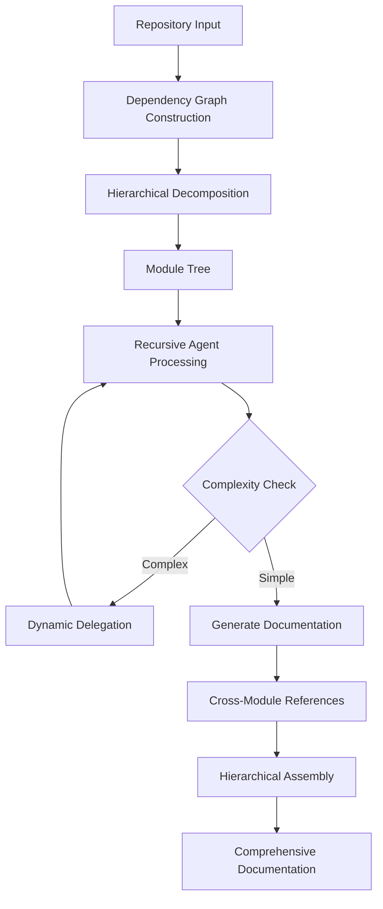

# Development Guide

This guide provides information for developers who want to contribute to or extend CodeWiki.

## Project Structure

```
codewiki/
├── codewiki/                 # Main package
│   ├── cli/                  # CLI implementation
│   │   ├── commands/         # CLI commands (config, generate)
│   │   ├── models/           # Data models
│   │   ├── utils/            # Utilities
│   │   └── adapters/         # External integrations
│   ├── src/                  # Web application
│   │   ├── be/               # Backend (dependency analysis, agents)
│   │   │   ├── agent_orchestrator.py
│   │   │   ├── agent_tools/
│   │   │   ├── cluster_modules.py
│   │   │   ├── dependency_analyzer/
│   │   │   ├── documentation_generator.py
│   │   │   └── llm_services.py
│   │   └── fe/               # Frontend (web interface)
│   │       ├── web_app.py
│   │       ├── routes.py
│   │       ├── github_processor.py
│   │       └── visualise_docs.py
│   ├── templates/            # HTML templates
│   └── run_web_app.py        # Web app entry point
├── docker/                   # Docker configuration
│   ├── Dockerfile
│   ├── docker-compose.yml
│   └── env.example
├── img/                      # Images and assets
├── paper/                    # Research paper source
├── tests/                    # Test suite
├── output/                   # Generated documentation output
├── pyproject.toml           # Project metadata
├── requirements.txt         # Python dependencies
└── README.md                # Main documentation
```

## Development Setup

### Prerequisites

- Python 3.12+
- Node.js (for mermaid validation)
- Git
- Tree-sitter language parsers

### Installation

```bash
# Clone the repository
git clone https://github.com/FSoft-AI4Code/CodeWiki.git
cd CodeWiki

# Create virtual environment
python3.12 -m venv .venv
source .venv/bin/activate  # On Windows: .venv\Scripts\activate

# Install in development mode
pip install -e .

# Install development dependencies
pip install -r requirements.txt
```

## Core Components

### Backend Architecture

#### 1. Dependency Analysis (`src/be/dependency_analyzer/`)

- **AST Parser**: Tree-sitter based parsing for 7 languages
- **Dependency Graph Builder**: Constructs call graphs and dependency relationships
- **Analyzers**: Language-specific analyzers (Python, Java, JavaScript, TypeScript, C, C++, C#)

#### 2. Module Clustering (`src/be/cluster_modules.py`)

- Hierarchical decomposition of repository structure
- Feature-oriented module partitioning
- Topological sorting for dependency ordering

#### 3. Agent System (`src/be/agent_orchestrator.py`)

- Recursive agent-based documentation generation
- Dynamic delegation for complex modules
- Cross-module reference management

#### 4. Agent Tools (`src/be/agent_tools/`)

- `read_code_components.py`: Code reading utilities
- `generate_sub_module_documentations.py`: Sub-module documentation generation
- `str_replace_editor.py`: Documentation editing tools
- `deps.py`: Dependency traversal tools

### Frontend Architecture

#### Web Application (`src/fe/`)

- **FastAPI Backend**: `web_app.py`, `routes.py`
- **GitHub Integration**: `github_processor.py`
- **Documentation Viewer**: `visualise_docs.py`
- **Background Processing**: `background_worker.py`

### CLI Architecture

#### Command Structure (`cli/commands/`)

- `config.py`: Configuration management (API settings + agent instructions)
- `generate.py`: Documentation generation with customization options

#### Models (`cli/models/`)

- `config.py`: Configuration data models including `AgentInstructions`
- `job.py`: Job tracking models

#### Utilities (`cli/utils/`)

- `fs.py`: File system operations
- `validation.py`: Input validation
- `progress.py`: Progress tracking
- `logging.py`: Logging configuration

### Agent Instructions System

The `AgentInstructions` model (`cli/models/config.py`) enables customization:

```python
@dataclass
class AgentInstructions:
    include_patterns: Optional[List[str]] = None  # e.g., ["*.cs"]
    exclude_patterns: Optional[List[str]] = None  # e.g., ["*Tests*"]
    focus_modules: Optional[List[str]] = None     # e.g., ["src/core"]
    doc_type: Optional[str] = None                # api, architecture, etc.
    custom_instructions: Optional[str] = None     # Free-form text
```

**How it flows through the system:**

1. **CLI Options** (`generate.py`) → Runtime `AgentInstructions`
2. **Persistent Config** (`~/.codewiki/config.json`) → Default `AgentInstructions`
3. **Backend Config** (`src/config.py`) → `agent_instructions` dict
4. **Dependency Analyzer** → Uses `include_patterns` and `exclude_patterns` for file filtering
5. **Agent Orchestrator** → Injects `custom_instructions` into LLM prompts

## Extending Agent Instructions

To add new customization options to the agent instructions system:

1. **Update the model** in `cli/models/config.py`:

```python
@dataclass
class AgentInstructions:
    # ... existing fields ...
    new_option: Optional[str] = None  # Add new field
```

2. **Update serialization methods** (`to_dict`, `from_dict`, `is_empty`, `get_prompt_addition`)

3. **Add CLI options** in `cli/commands/generate.py` and `cli/commands/config.py`

4. **Update backend Config** if the option affects analysis (`src/config.py`)

5. **Use in relevant components**:
   - File filtering → `dependency_analyzer/ast_parser.py`
   - Prompts → `be/prompt_template.py`
   - Agent creation → `be/agent_orchestrator.py`

---

## Adding Support for New Languages

To add support for a new programming language:

1. **Add language analyzer** in `src/be/dependency_analyzer/analyzers/`:

```python
# new_language.py
from .base import BaseAnalyzer

class NewLanguageAnalyzer(BaseAnalyzer):
    def __init__(self):
        super().__init__("new_language")
    
    def extract_dependencies(self, ast_node):
        # Implement dependency extraction
        pass
    
    def extract_components(self, ast_node):
        # Implement component extraction
        pass
```

2. **Register the analyzer** in `src/be/dependency_analyzer/ast_parser.py`:

```python
LANGUAGE_ANALYZERS = {
    # ... existing languages ...
    "new_language": NewLanguageAnalyzer,
}
```

3. **Add file extensions** in configuration

4. **Add tests** for the new language

## Testing

```bash
# Run all tests
pytest

# Run specific test file
pytest tests/test_dependency_analyzer.py

# Run with coverage
pytest --cov=codewiki tests/
```

## Code Style

- Follow PEP 8 for Python code
- Use type hints where applicable
- Write docstrings for public functions and classes
- Keep functions focused and modular

## Contributing

1. **Fork the repository**
2. **Create a feature branch**: `git checkout -b feature/your-feature`
3. **Make your changes**
4. **Write/update tests**
5. **Ensure tests pass**: `pytest`
6. **Commit your changes**: `git commit -am 'Add new feature'`
7. **Push to the branch**: `git push origin feature/your-feature`
8. **Submit a pull request**

## Documentation Generation Workflow



## Debugging

### Enable Verbose Logging

```bash
# CLI
codewiki generate --verbose

# Environment variable
export CODEWIKI_LOG_LEVEL=DEBUG
```

### Common Issues

**Tree-sitter parser errors**:
- Ensure language parsers are properly installed
- Check file encoding (UTF-8 expected)

**LLM API errors**:
- Verify API keys and endpoints
- Check rate limits
- Enable retry logic

**Memory issues with large repositories**:
- Adjust module decomposition threshold
- Increase delegation depth limit

## Performance Optimization

- **Caching**: Results are cached to avoid redundant processing
- **Parallel Processing**: Multiple modules can be processed concurrently
- **Incremental Updates**: Only process changed modules (future work)

## Support

For development questions:
- GitHub Issues: https://github.com/FSoft-AI4Code/CodeWiki/issues
- Main Documentation: [README.md](README.md)

