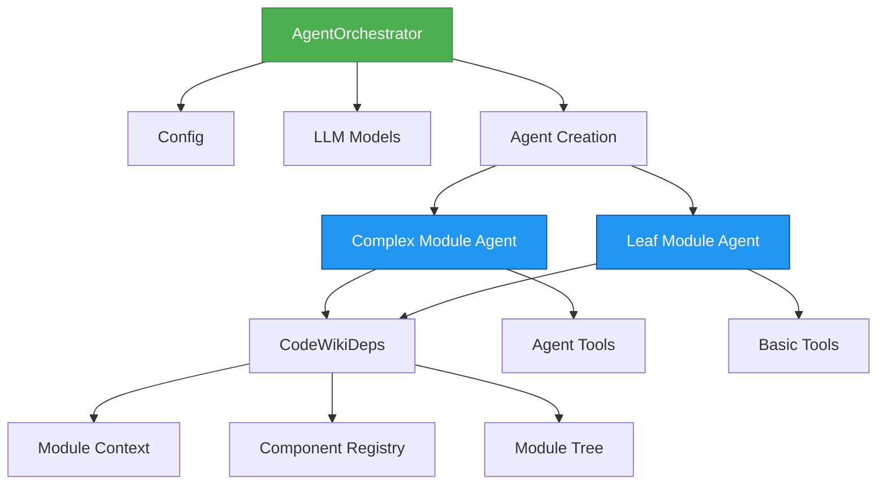
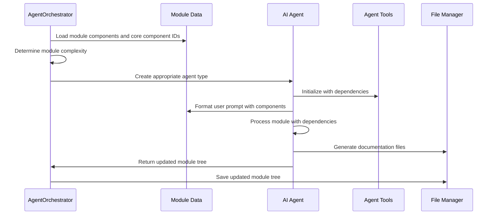

# Agent Orchestrator Module

## Overview

The Agent Orchestrator module is a core component of the CodeWiki system responsible for managing and coordinating AI agents that generate documentation for software repositories. It dynamically creates and manages AI agents based on module complexity, orchestrates the documentation generation process, and ensures proper integration with the overall system architecture.

The module leverages the Pydantic AI framework to create intelligent agents that can analyze code components, generate comprehensive documentation, and interact with various tools to accomplish their tasks.

## Architecture



## Core Components

### AgentOrchestrator Class

The main orchestrator class that manages the entire documentation generation process:

- **Purpose**: Creates and manages AI agents for documentation generation
- **Responsibilities**:
  - Determines module complexity and selects appropriate agent type
  - Creates agents with proper system prompts and tools
  - Processes modules and generates documentation
  - Manages dependencies and context for agents

### Agent Types

The orchestrator creates two types of agents based on module complexity:

#### Complex Module Agent
- Used for modules with components spanning multiple files
- Includes advanced tools for sub-module documentation generation
- Uses the `SYSTEM_PROMPT` template

#### Leaf Module Agent
- Used for simple modules with components in a single file
- Includes basic tools for documentation generation
- Uses the `LEAF_SYSTEM_PROMPT` template

## Dependencies and Integration

### Configuration Integration
The orchestrator integrates with the [config](config.md) module to access:
- Repository path and output directories
- LLM configuration (models, API keys, base URLs)
- Maximum depth settings for analysis

### Agent Tools Integration
The orchestrator utilizes several agent tools from the [agent_tools](agent_tools.md) module:

- **CodeWikiDeps**: Provides dependency injection for agents with context about the current module, components, and file paths
- **read_code_components_tool**: Allows agents to read additional code components not initially provided
- **str_replace_editor_tool**: Enables agents to create and edit documentation files
- **generate_sub_module_documentation_tool**: Allows complex agents to generate documentation for sub-modules

### LLM Services Integration
The orchestrator works with the [llm_services](llm_services.md) module to:
- Create main and fallback LLM models
- Handle model failover scenarios
- Configure model settings (temperature, max tokens)

### Prompt Templates
The orchestrator uses system prompts from the [prompt_template](prompt_template.md) module:
- `SYSTEM_PROMPT`: For complex modules requiring sub-module documentation
- `LEAF_SYSTEM_PROMPT`: For simple modules with basic documentation needs

## Data Flow



## Process Flow

### Module Processing Workflow

1. **Module Analysis**: The orchestrator receives module information including name, components, core component IDs, and working directory
2. **Complexity Assessment**: Uses the `is_complex_module` function to determine if the module spans multiple files
3. **Agent Creation**: Creates either a complex or leaf agent based on complexity assessment
4. **Dependency Injection**: Sets up `CodeWikiDeps` with appropriate context including module tree, current path, and configuration
5. **Documentation Generation**: Runs the agent with formatted prompts to generate documentation
6. **File Management**: Saves generated documentation and updates module tree

### Complexity Determination

The orchestrator determines module complexity by checking if the core components span multiple files:

```python
def is_complex_module(components: dict[str, Node], core_component_ids: list[str]) -> bool:
    files = set()
    for component_id in core_component_ids:
        if component_id in components:
            files.add(components[component_id].file_path)
    return len(files) > 1
```

## Key Features

### Dynamic Agent Selection
The orchestrator intelligently selects the appropriate agent type based on module complexity, optimizing resource usage and documentation quality.

### Fallback Model Support
Integrates with the fallback model system to ensure reliable operation even when primary models are unavailable.

### Context Management
Provides comprehensive context to agents including:
- Current module information
- Component registry
- Module tree structure
- File paths and working directories
- Configuration settings

### File Management
Integrates with the file manager to handle documentation generation, saving, and module tree updates.

## Integration Points

### With Dependency Analyzer
- Receives component analysis data from the [dependency_analyzer](dependency_analyzer.md) module
- Uses `Node` objects to understand component relationships and file locations

### With Documentation Generator
- Works in conjunction with the [documentation_generator](documentation_generator.md) module to create comprehensive documentation
- Coordinates the overall documentation generation workflow

### With Utils Module
- Leverages file management utilities for I/O operations
- Uses complexity assessment functions to determine agent types

## Error Handling

The orchestrator includes comprehensive error handling:
- Catches exceptions during module processing
- Logs detailed error information with stack traces
- Continues processing other modules even if one fails
- Provides meaningful error messages for debugging

## Usage Context

The Agent Orchestrator is typically used in the broader documentation generation pipeline where it:
1. Receives module analysis results from the dependency analyzer
2. Creates and manages AI agents for documentation generation
3. Coordinates with other modules to produce comprehensive documentation
4. Updates the module tree with documentation status and results

This module serves as the central coordination point for the AI-powered documentation generation process, ensuring that each module receives appropriate attention based on its complexity while maintaining consistency across the entire documentation set.