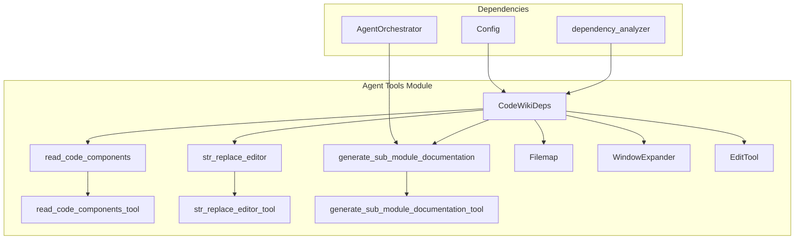
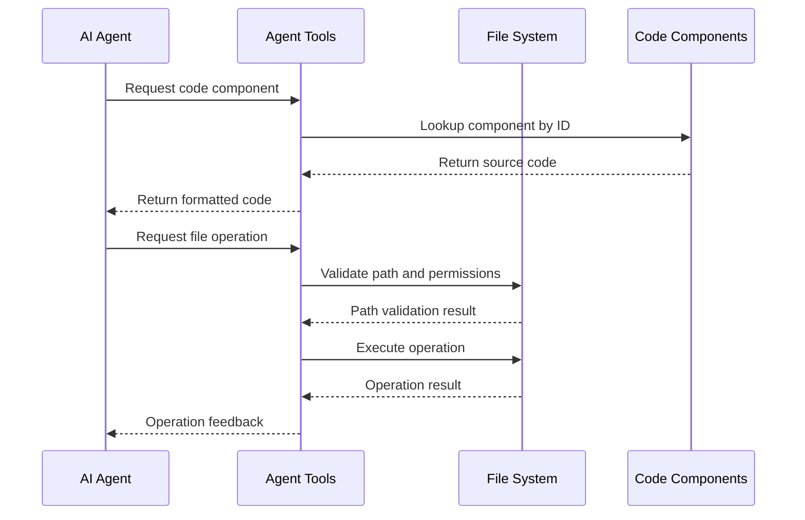
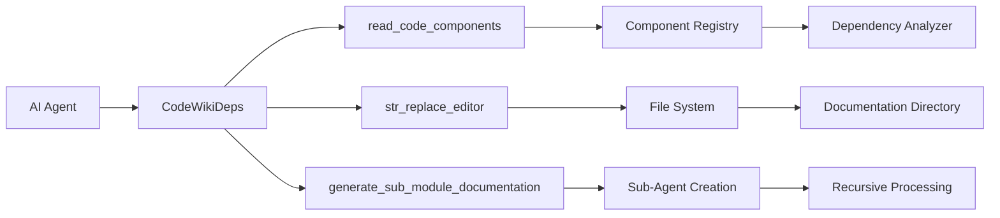
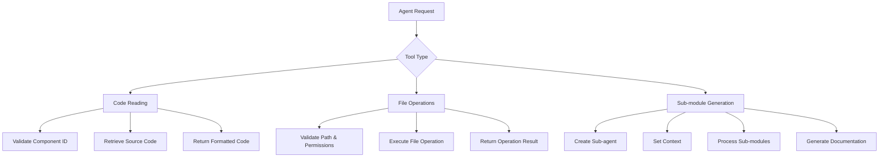

# Agent Tools Module Documentation

## Overview

The `agent_tools` module provides a comprehensive set of tools that enable AI agents to interact with the codebase and documentation system. This module serves as the primary interface between the AI agents and the underlying code repository, allowing for code reading, file manipulation, and documentation generation. The tools are designed to support the automated documentation generation process by providing safe and controlled access to the file system and code components.

## Architecture



## Core Components

### CodeWikiDeps

The `CodeWikiDeps` class is a dataclass that serves as the dependency container for all agent tools. It provides essential context and configuration information to the tools, including:

- `absolute_docs_path`: Absolute path to the documentation directory
- `absolute_repo_path`: Absolute path to the source code repository
- `registry`: Dictionary for maintaining state across tool calls
- `components`: Dictionary mapping component IDs to Node objects containing source code
- `path_to_current_module`: List representing the current path in the module tree
- `current_module_name`: Name of the currently processed module
- `module_tree`: Hierarchical representation of the module structure
- `max_depth`: Maximum allowed depth for recursive documentation generation
- `current_depth`: Current depth in the module tree
- `config`: Configuration object containing LLM settings

### read_code_components Tool

The `read_code_components` tool allows agents to retrieve source code for specific components by their IDs. This tool is essential for the documentation process as it enables agents to examine the actual implementation of components before generating documentation.

**Function Signature:**
```python
async def read_code_components(ctx: RunContext[CodeWikiDeps], component_ids: list[str]) -> str
```

**Parameters:**
- `component_ids`: List of component IDs to read (e.g., ["module.submodule.ClassName"])

**Returns:**
- Formatted string containing the source code for each requested component

**Usage:**
This tool is primarily used when agents need to understand the implementation details of specific components to generate accurate documentation.

### str_replace_editor Tool

The `str_replace_editor` tool provides comprehensive file system operations including viewing, creating, editing, and undoing changes to files. It's designed with safety mechanisms to prevent unauthorized access to the repository while allowing full control over documentation files.

**Function Signature:**
```python
async def str_replace_editor(
    ctx: RunContext[CodeWikiDeps],
    working_dir: Literal["repo", "docs"],
    command: Literal["view", "create", "str_replace", "insert", "undo_edit"],
    path: str,
    file_text: Optional[str] = None,
    view_range: Optional[List[int]] = None,
    old_str: Optional[str] = None,
    new_str: Optional[str] = None,
    insert_line: Optional[int] = None,
) -> str
```

**Parameters:**
- `working_dir`: Either "repo" (for repository files) or "docs" (for documentation files)
- `command`: The operation to perform
- `path`: Path to the file or directory
- Additional parameters based on the command type

**Commands:**
- `view`: Display file contents or directory structure
- `create`: Create a new file (only in docs directory)
- `str_replace`: Replace text in a file
- `insert`: Insert text at a specific line
- `undo_edit`: Revert the last edit

### generate_sub_module_documentation Tool

This tool enables recursive documentation generation for sub-modules. It creates specialized agents for each sub-module and coordinates the documentation process across the module hierarchy.

**Function Signature:**
```python
async def generate_sub_module_documentation(
    ctx: RunContext[CodeWikiDeps],
    sub_module_specs: dict[str, list[str]]
) -> str
```

**Parameters:**
- `sub_module_specs`: Dictionary mapping sub-module names to their core component IDs

### Filemap Class

The `Filemap` class provides intelligent code visualization by creating abbreviated views of Python files. It uses tree-sitter parsing to identify function and class definitions, then elides their bodies to provide a high-level overview of the file structure.

### WindowExpander Class

The `WindowExpander` class intelligently expands viewports to include complete functions, classes, or other logical code blocks rather than fixed line ranges. This ensures that agents see complete logical units when examining code.

### EditTool Class

The `EditTool` class implements the core file manipulation functionality, providing methods for viewing, creating, editing, and undoing changes to files. It includes safety checks and validation mechanisms.

## Data Flow



## Component Interactions



## Integration with Other Modules

### Dependency Analyzer Integration

The agent_tools module relies heavily on the [dependency_analyzer](dependency_analyzer.md) module to provide component information. The `CodeWikiDeps` class contains a `components` dictionary that maps component IDs to Node objects containing source code, which is populated by the dependency analysis process.

### Agent Orchestrator Integration

The [agent_orchestrator](agent_orchestrator.md) module uses the tools provided by this module to enable agents to perform their documentation tasks. The `generate_sub_module_documentation` tool creates sub-agents that use the other tools in this module.

### Configuration Integration

The tools use the [config](config.md) module to access LLM configuration settings, including model selection and fallback strategies.

## Process Flow



## Security and Safety Features

1. **Path Validation**: All file operations validate paths to prevent unauthorized access
2. **Working Directory Restrictions**: Repository files can only be viewed, not modified
3. **Component Access Control**: Code reading is limited to registered components
4. **Operation Logging**: All tool operations are logged for audit purposes

## Usage Examples

### Reading Code Components
```python
# Agent requests to read specific components
result = await read_code_components(ctx, ["my_module.MyClass", "my_module.my_function"])
```

### File Operations
```python
# View a file with specific line range
result = await str_replace_editor(ctx, "docs", "view", "./my_doc.md", view_range=[10, 20])

# Replace text in a documentation file
result = await str_replace_editor(ctx, "docs", "str_replace", "./my_doc.md", 
                                 old_str="old content", new_str="new content")
```

### Sub-module Documentation Generation
```python
# Generate documentation for multiple sub-modules
specs = {
    "sub_module_1": ["component_1", "component_2"],
    "sub_module_2": ["component_3", "component_4"]
}
result = await generate_sub_module_documentation(ctx, specs)
```

## Error Handling

The agent_tools module implements comprehensive error handling:

- **Path Validation Errors**: Invalid paths are caught and reported
- **Component Not Found**: Missing components return appropriate error messages
- **File Operation Errors**: File system errors are caught and logged
- **Permission Errors**: Unauthorized operations are prevented and reported

## Performance Considerations

- **Caching**: File operations maintain history to support undo functionality
- **Truncation**: Large files are truncated to prevent overwhelming the agent
- **Window Expansion**: Intelligent viewport expansion reduces the need for multiple requests
- **Mermaid Validation**: Documentation files are validated for Mermaid diagram syntax

## Future Enhancements

- Enhanced security mechanisms for additional file types
- Improved code visualization tools
- Advanced search and replace capabilities
- Integration with version control systems
- Real-time collaboration features