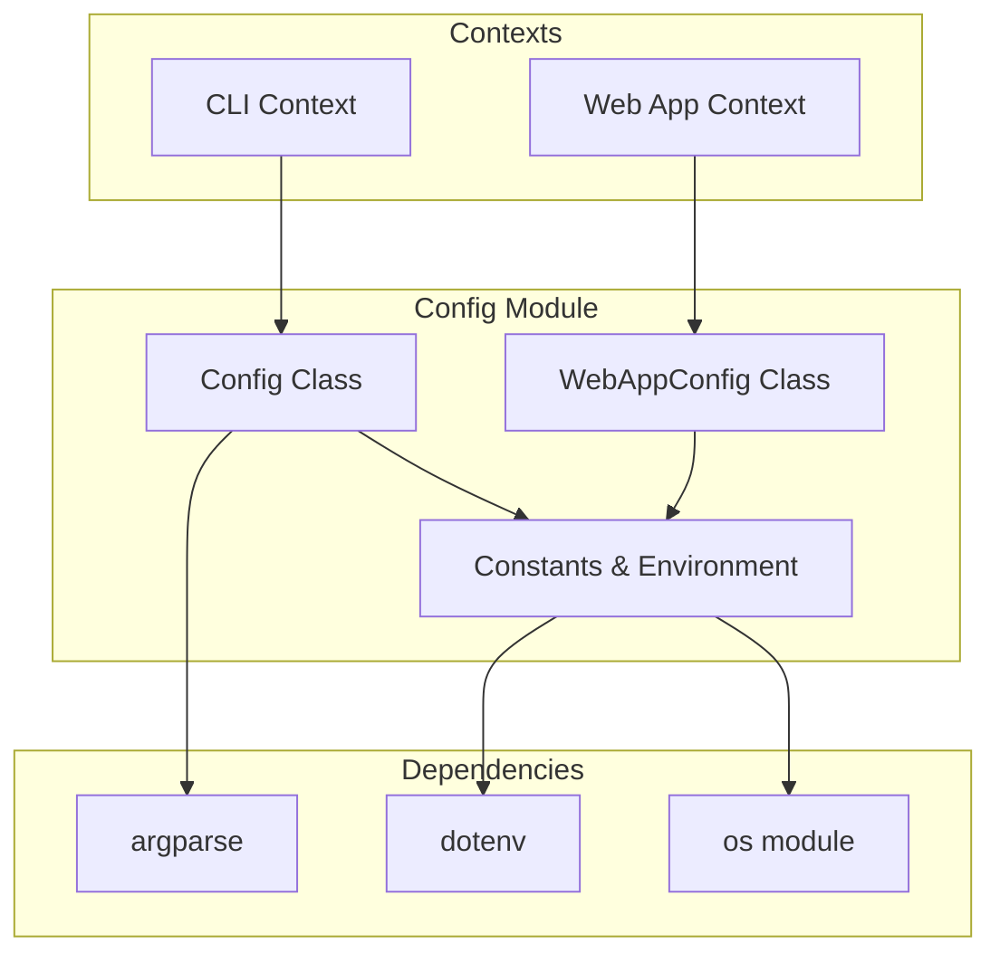
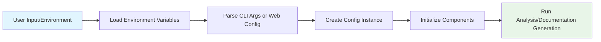

# Config Module

## Overview

The Config module provides centralized configuration management for the CodeWiki application. It handles both backend and frontend configuration settings, managing application constants, LLM service configurations, directory paths, and runtime context detection. The module supports both CLI and web application contexts with appropriate configuration loading mechanisms.

## Architecture



## Components

### Backend Config (`codewiki/src/config.py`)

The backend configuration handles repository analysis, LLM services, and output directory management.

#### Core Class: `Config`

The `Config` dataclass manages the main application configuration:

- **repo_path**: Path to the repository being analyzed
- **output_dir**: Base directory for output files
- **dependency_graph_dir**: Directory for dependency graph files
- **docs_dir**: Directory for generated documentation
- **max_depth**: Maximum depth for module tree analysis
- **llm_base_url**: Base URL for LLM API services
- **llm_api_key**: API key for LLM services
- **main_model**: Primary LLM model identifier
- **cluster_model**: Model used for clustering operations
- **fallback_model**: Fallback LLM model

#### Constants

The module defines several important constants:

- `OUTPUT_BASE_DIR`: Base output directory ('output')
- `DEPENDENCY_GRAPHS_DIR`: Dependency graph storage ('dependency_graphs')
- `DOCS_DIR`: Documentation output directory ('docs')
- `FIRST_MODULE_TREE_FILENAME`: First module tree file ('first_module_tree.json')
- `MODULE_TREE_FILENAME`: Module tree file ('module_tree.json')
- `OVERVIEW_FILENAME`: Overview documentation file ('overview.md')
- `MAX_DEPTH`: Maximum analysis depth (2)
- `MAX_TOKEN_PER_MODULE`: Token limit per module (36,369)
- `MAX_TOKEN_PER_LEAF_MODULE`: Token limit per leaf module (16,000)

#### Context Management

The module provides functions to manage execution context:

- `set_cli_context(enabled: bool)`: Sets whether running in CLI context
- `is_cli_context() -> bool`: Checks if running in CLI context

#### LLM Configuration

LLM services are configured through environment variables:

- `MAIN_MODEL`: Primary model (default: 'claude-sonnet-4')
- `FALLBACK_MODEL_1`: Fallback model (default: 'glm-4p5')
- `CLUSTER_MODEL`: Clustering model (default: MAIN_MODEL)
- `LLM_BASE_URL`: API base URL (default: 'http://0.0.0.0:4000/')
- `LLM_API_KEY`: API key (default: 'sk-1234')

#### Factory Methods

- `from_args(args: argparse.Namespace)`: Creates config from CLI arguments
- `from_cli(...)`: Creates config for CLI context with specific parameters

### Frontend Config (`codewiki/src/fe/config.py`)

The frontend configuration manages web application settings.

#### Core Class: `WebAppConfig`

The `WebAppConfig` class manages web application configuration:

- `CACHE_DIR`: Cache directory ('./output/cache')
- `TEMP_DIR`: Temporary files directory ('./output/temp')
- `OUTPUT_DIR`: Base output directory ('./output')
- `QUEUE_SIZE`: Maximum queue size (100)
- `CACHE_EXPIRY_DAYS`: Cache expiration period (365 days)
- `JOB_CLEANUP_HOURS`: Job cleanup interval (24000 hours)
- `RETRY_COOLDOWN_MINUTES`: Retry cooldown period (3 minutes)
- `DEFAULT_HOST`: Default server host ('127.0.0.1')
- `DEFAULT_PORT`: Default server port (8000)
- `CLONE_TIMEOUT`: Git clone timeout (300 seconds)
- `CLONE_DEPTH`: Git clone depth (1)

#### Utility Methods

- `ensure_directories()`: Creates required directories if they don't exist
- `get_absolute_path(path: str)`: Converts relative path to absolute path

## Data Flow



## Dependencies

The Config module depends on:

- [argparse](https://docs.python.org/3/library/argparse.html): For parsing command-line arguments
- [dotenv](https://pypi.org/project/python-dotenv/): For loading environment variables from `.env` files
- [os](https://docs.python.org/3/library/os.html): For path operations and environment variable access
- [dataclasses](https://docs.python.org/3/library/dataclasses.html): For the Config dataclass

## Integration with Other Modules

The Config module integrates with various parts of the CodeWiki system:

- [dependency_analyzer.md](dependency_analyzer.md): Uses configuration for analysis parameters
- [documentation_generator.md](documentation_generator.md): Uses output directory settings
- [agent_orchestrator.md](agent_orchestrator.md): Uses LLM configuration settings
- [utils.md](utils.md): Shares common configuration constants

## Usage Examples

### CLI Context
```python
from codewiki.src.config import Config, set_cli_context

set_cli_context(True)
config = Config.from_cli(
    repo_path="/path/to/repo",
    output_dir="./output",
    llm_base_url="http://localhost:4000",
    llm_api_key="my-api-key",
    main_model="gpt-4",
    cluster_model="gpt-3.5-turbo"
)
```

### Web Application Context
```python
from codewiki.src.fe.config import WebAppConfig

WebAppConfig.ensure_directories()
host = WebAppConfig.DEFAULT_HOST
port = WebAppConfig.DEFAULT_PORT
```

## Environment Variables

The module supports the following environment variables:

- `MAIN_MODEL`: Primary LLM model
- `FALLBACK_MODEL_1`: First fallback model
- `CLUSTER_MODEL`: Clustering model
- `LLM_BASE_URL`: LLM API base URL
- `LLM_API_KEY`: LLM API key

## Best Practices

1. **Context Awareness**: Always use `set_cli_context()` to properly configure the execution context
2. **Directory Management**: Use `ensure_directories()` to create required directories before operations
3. **Environment Loading**: The module automatically loads `.env` files using `load_dotenv()`
4. **Path Sanitization**: Repository names are automatically sanitized for use in directory paths

## Error Handling

The module provides default values for all configuration parameters, ensuring the application can run even if environment variables are not set. Directory creation is handled safely with `exist_ok=True` to prevent errors when directories already exist.