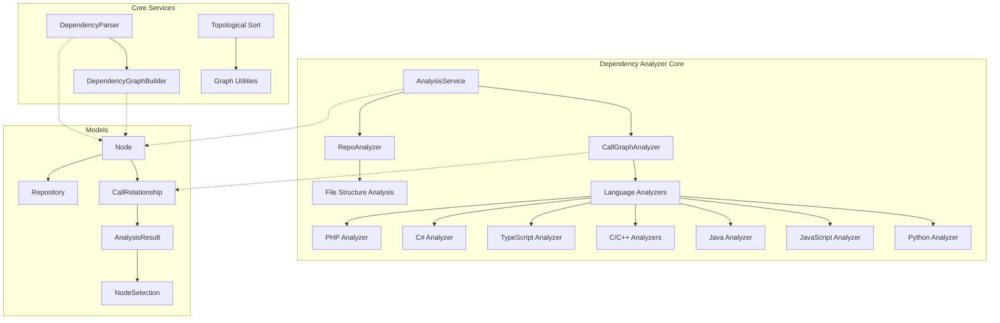
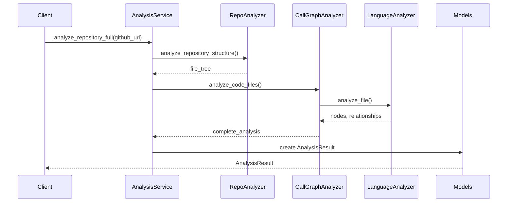
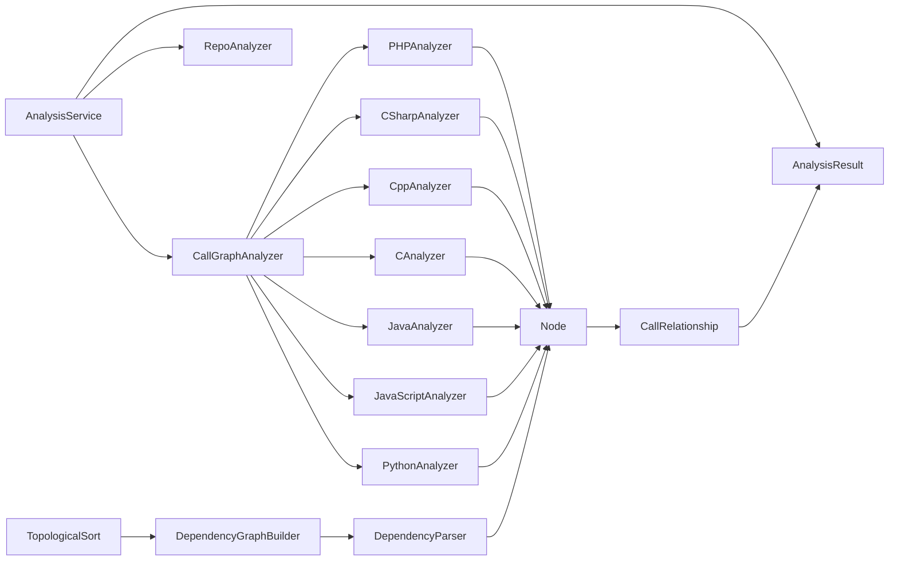
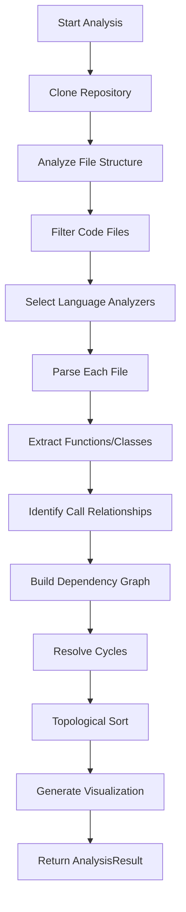

# Dependency Analyzer Module Documentation

## Overview

The dependency_analyzer module is a comprehensive system for analyzing code repositories and extracting dependency relationships between code components. It supports multiple programming languages and provides tools for building dependency graphs, performing topological sorting, and identifying call relationships within codebases.

## Architecture

The dependency_analyzer module follows a modular architecture with distinct components for different aspects of dependency analysis:



## Core Components

### AnalysisService
The central orchestrator for repository analysis that handles the complete workflow:

- Repository cloning and validation
- File structure analysis with filtering
- Multi-language AST parsing and call graph generation
- Result consolidation and cleanup

```python
service = AnalysisService()
result = service.analyze_repository_full(github_url)
```

### CallGraphAnalyzer
Coordinates language-specific analyzers to build comprehensive call graphs across different programming languages in a repository.

### RepoAnalyzer
Analyzes repository structures and generates detailed file tree representations with filtering capabilities.

### Language-Specific Analyzers
The module includes specialized analyzers for multiple programming languages:

- **Python Analyzer**: Uses AST parsing to extract functions, classes, and method calls
- **JavaScript/TypeScript Analyzers**: Uses tree-sitter for AST-based analysis
- **Java Analyzer**: Extracts classes, methods, and call relationships
- **C/C++ Analyzers**: Handles C and C++ function definitions and calls
- **C# Analyzer**: Analyzes C# code structures
- **PHP Analyzer**: Processes PHP code for dependencies

### Models
Data structures that represent the analyzed code components:

- **Node**: Represents a code component (function, class, method) with metadata
- **CallRelationship**: Represents a call relationship between two nodes
- **Repository**: Contains repository metadata
- **AnalysisResult**: Complete analysis result with functions, relationships, and visualization data
- **NodeSelection**: Defines selected nodes for partial export

### DependencyGraphBuilder
Handles dependency analysis and graph building, including topological sorting and leaf node identification.

### Topological Sort Utilities
Provides functions for dependency graph analysis:

- `topological_sort()`: Performs topological sorting on dependency graphs
- `resolve_cycles()`: Detects and resolves dependency cycles
- `dependency_first_dfs()`: Depth-first traversal prioritizing dependencies
- `build_graph_from_components()`: Builds dependency graphs from components
- `get_leaf_nodes()`: Identifies leaf nodes in the dependency graph

## Data Flow



## Component Relationships



## Process Flow



## Key Features

### Multi-Language Support
The module supports analysis of multiple programming languages:
- Python (AST-based)
- JavaScript/TypeScript (tree-sitter-based)
- Java (tree-sitter-based)
- C/C++ (tree-sitter-based)
- C# (tree-sitter-based)
- PHP (tree-sitter-based)
- Go, Rust, Ruby (pattern-based)

### Dependency Graph Construction
- Builds comprehensive dependency graphs between code components
- Handles cross-language dependencies
- Resolves function calls to actual function definitions
- Deduplicates relationships to reduce noise

### Topological Analysis
- Performs topological sorting to determine dependency order
- Detects and resolves dependency cycles
- Identifies leaf nodes for focused analysis

### Security and Safety
- Implements path validation to prevent directory traversal attacks
- Uses safe file reading utilities
- Validates repository structure before analysis

## Integration Points

The dependency_analyzer module integrates with other modules in the system:

- **[config.md]**: Uses configuration settings for analysis parameters
- **[utils.md]**: Leverages file management utilities
- **[documentation_generator.md]**: Provides data for documentation generation
- **[agent_orchestrator.md]**: Supplies dependency information for agent operations
- **[agent_tools.md]**: Provides dependency data for tools like CodeWikiDeps

## Usage Examples

### Basic Repository Analysis
```python
from codewiki.src.be.dependency_analyzer import AnalysisService

service = AnalysisService()
result = service.analyze_repository_full("https://github.com/user/repo")
```

### Local Repository Analysis
```python
result = service.analyze_local_repository("/path/to/local/repo")
```

### Building Dependency Graph
```python
from codewiki.src.be.dependency_analyzer import DependencyGraphBuilder
from codewiki.src.config import Config

config = Config()
builder = DependencyGraphBuilder(config)
components, leaf_nodes = builder.build_dependency_graph()
```

## Configuration

The module uses the system configuration from [config.md] and supports:

- Repository path configuration
- Dependency graph output directory
- File inclusion/exclusion patterns
- Language-specific analysis settings

## Error Handling

The module implements comprehensive error handling:

- Repository cloning failures
- File parsing errors
- Invalid path detection
- Memory and timeout protection
- Graceful degradation for unsupported languages

## Performance Considerations

- Efficient file filtering to avoid analyzing unnecessary files
- Parallel processing where possible
- Memory-efficient data structures
- Caching mechanisms for repeated analysis
- Selective analysis of high-connectivity files

## Security Considerations

- Path validation to prevent directory traversal
- Safe file reading with size limits
- Input validation for repository URLs
- Sandboxed analysis environment
- Cleanup of temporary files after analysis

## Extending the Module

To add support for new languages:

1. Create a new analyzer in the `analyzers` directory
2. Implement the language-specific parsing logic
3. Register the analyzer in the `CallGraphAnalyzer`
4. Update the `CODE_EXTENSIONS` mapping in patterns.py
5. Add appropriate function definition patterns

## Testing and Validation

The module includes validation at multiple levels:

- File structure validation
- Dependency resolution validation
- Cycle detection verification
- Output format validation
- Cross-language compatibility checks