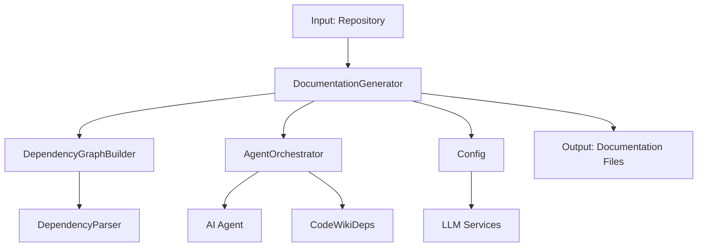
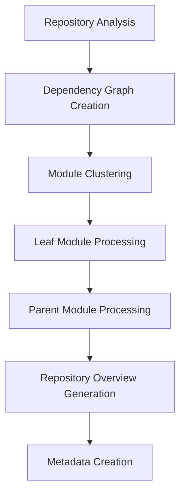
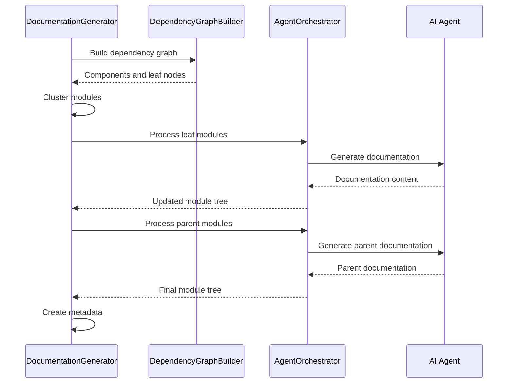
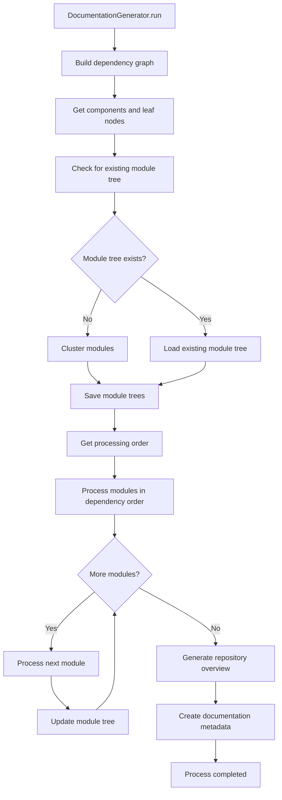

# Documentation Generator Module

## Overview

The Documentation Generator module is the core orchestrator responsible for generating comprehensive documentation for code repositories. It implements a dynamic programming approach to process modules in dependency order, starting with leaf modules and working up to parent modules and repository overview. This module coordinates with other system components to analyze dependencies, cluster related components, and generate human-readable documentation using AI agents.

## Architecture



## Core Components

### DocumentationGenerator Class

The main class that orchestrates the entire documentation generation process:

- **Purpose**: Coordinates the documentation generation workflow using a dynamic programming approach
- **Key Responsibilities**:
  - Builds dependency graphs using `DependencyGraphBuilder`
  - Clusters modules using `cluster_modules` function
  - Processes modules in dependency order (leaf modules first)
  - Generates parent module documentation based on child modules
  - Creates repository overview documentation
  - Manages metadata generation

## Key Features

### 1. Dynamic Programming Approach
The module implements a dynamic programming strategy where:
- Leaf modules (modules with no dependencies) are processed first
- Parent modules are processed after their children
- Repository overview is generated last
- This ensures all necessary information is available when generating higher-level documentation

### 2. Module Processing Order


### 3. Documentation Generation Pipeline



## Dependencies

### [dependency_analyzer](dependency_analyzer.md)
- **DependencyGraphBuilder**: Used to analyze repository dependencies and identify leaf nodes
- **DependencyParser**: Parses the repository to extract components and their relationships
- **cluster_modules**: Groups related components into logical modules

### [agent_orchestrator](agent_orchestrator.md)
- **AgentOrchestrator**: Manages AI agents that generate documentation for individual modules
- Creates appropriate agents based on module complexity
- Handles tool integration for code analysis

### [config](config.md)
- **Config**: Provides configuration parameters for the documentation generation process
- Contains repository path, output directories, and LLM settings

### [utils](utils.md)
- **file_manager**: Handles file operations for saving/loading documentation and metadata
- Ensures proper directory structure and file management

## Process Flow

### Main Execution Flow


### Module Processing Flow
1. **Leaf Module Processing**:
   - Uses AI agents with complex tooling for detailed analysis
   - Generates comprehensive documentation for individual components
   - Saves documentation to working directory

2. **Parent Module Processing**:
   - Aggregates documentation from child modules
   - Generates higher-level overviews based on child content
   - Creates architectural documentation

3. **Repository Overview Generation**:
   - Provides high-level repository structure and purpose
   - Summarizes key modules and their relationships
   - Serves as entry point for documentation navigation

## Data Flow

### Input Data
- Repository path and configuration
- Source code files to analyze
- LLM configuration and credentials

### Intermediate Data
- Dependency graph (JSON format)
- Module tree structure (JSON format)
- Component analysis results
- Partial documentation files

### Output Data
- Module-specific documentation files (.md format)
- Repository overview documentation
- Module tree metadata (JSON format)
- Documentation generation metadata

## Configuration

The module uses the [Config](config.md) class which provides:
- Repository path and output directory settings
- LLM model configuration (main, fallback, clustering models)
- Maximum depth and token limits
- API endpoints and authentication

## Error Handling

The module implements comprehensive error handling:
- Graceful failure recovery for individual module processing
- Logging of errors with traceback information
- Continuation of processing even if individual modules fail
- Validation of module existence before processing

## Integration Points

### With Dependency Analyzer
- Receives dependency graph and leaf node information
- Uses clustering algorithms to group related components

### With Agent Orchestrator
- Delegates module documentation generation to AI agents
- Coordinates tool access and context management

### With File Management System
- Manages documentation file creation and organization
- Handles metadata generation and storage

## Performance Considerations

- **Dynamic Programming**: Processes modules in optimal order to minimize redundant work
- **Caching**: Checks for existing documentation to avoid regeneration
- **Parallel Processing**: Supports concurrent processing of independent modules
- **Memory Management**: Efficiently handles large repositories through modular processing

## File Structure

Generated documentation follows this structure:
```
output/
├── docs/
│   ├── [repo-name]-docs/
│   │   ├── overview.md (repository overview)
│   │   ├── [module1].md (individual module docs)
│   │   ├── [module2].md
│   │   ├── module_tree.json (complete module structure)
│   │   ├── first_module_tree.json (initial clustering result)
│   │   └── metadata.json (generation information)
```

## Key Methods

### `run()`
Main entry point that orchestrates the entire documentation generation process

### `generate_module_documentation()`
Handles the core module processing using dynamic programming approach

### `generate_parent_module_docs()`
Creates parent module documentation based on child module content

### `get_processing_order()`
Implements topological sort to determine optimal processing order

### `create_documentation_metadata()`
Generates metadata about the documentation generation process

## Usage Context

This module serves as the central hub for documentation generation, integrating with various system components to provide a comprehensive solution for automatically generating documentation from source code repositories. It's designed to handle complex, multi-module repositories while maintaining context and dependency relationships throughout the generation process.