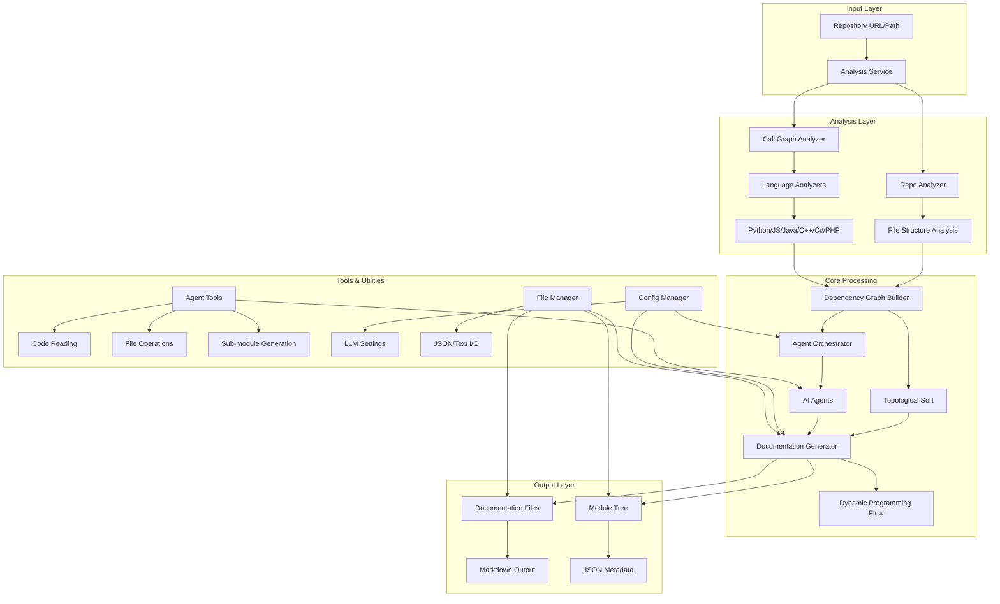
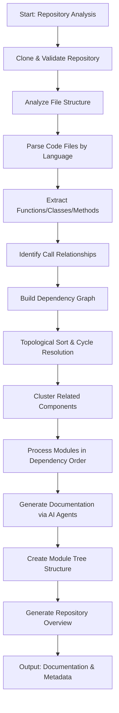

# CodeWiki Repository Overview

## Purpose

CodeWiki is an AI-powered code documentation generation system that automatically analyzes software repositories and creates comprehensive documentation. The system uses advanced dependency analysis, multi-language code parsing, and AI agents to generate human-readable documentation that explains code structure, relationships, and functionality. It supports multiple programming languages and provides tools for understanding complex codebases through automated analysis and documentation generation.

## Architecture

### End-to-End System Architecture

### Processing Pipeline

## Core Modules Documentation

### [dependency_analyzer](dependency_analyzer.md)
The dependency analyzer module provides comprehensive code repository analysis and dependency relationship extraction. It supports multiple programming languages through specialized analyzers and builds dependency graphs with topological sorting capabilities. Key components include AnalysisService, CallGraphAnalyzer, and language-specific parsers for Python, JavaScript, Java, C/C++, C#, and PHP.

### [documentation_generator](documentation_generator.md)
The documentation generator orchestrates the entire documentation creation process using a dynamic programming approach. It processes modules in dependency order (leaf modules first), coordinates with AI agents, and generates comprehensive documentation following a hierarchical structure. The module integrates with dependency analysis and agent orchestration systems.

### [agent_orchestrator](agent_orchestrator.md)
The agent orchestrator manages AI agents responsible for documentation generation. It dynamically creates agents based on module complexity, provides appropriate tools and context, and coordinates the documentation generation process. The orchestrator handles both simple leaf modules and complex multi-file modules with different agent configurations.

### [agent_tools](agent_tools.md)
The agent tools module provides essential utilities for AI agents to interact with the codebase. It includes tools for reading code components, file system operations, sub-module documentation generation, and intelligent code visualization. The tools ensure safe and controlled access to the repository while supporting comprehensive documentation tasks.

### [config](config.md)
The config module manages centralized application configuration for both backend and frontend components. It handles LLM service settings, directory paths, environment variables, and execution context management. The module supports both CLI and web application contexts with appropriate configuration loading mechanisms.

### [utils](utils.md)
The utils module provides essential utility functions and the FileManager class for file operations. It includes token counting, complexity checking, Mermaid diagram validation, and other supporting functions used throughout the system. The FileManager handles JSON and text file operations with standardized error handling and formatting.