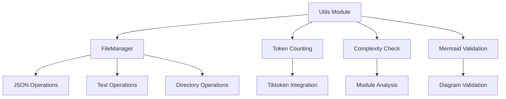

# Utils Module Documentation

## Introduction

The Utils module provides essential utility functions and classes that support various operations across the CodeWiki system. The primary component is the `FileManager` class, which handles file input/output operations for JSON and text files. Additionally, there are backend utility functions for token counting, complexity checking, and Mermaid diagram validation.

## Architecture Overview



## Core Components

### FileManager

The `FileManager` class is a utility class that provides static methods for common file operations. It serves as a centralized interface for handling file I/O operations throughout the application.

#### Class Definition
```python
class FileManager:
    """Handles file I/O operations."""
```

#### Methods

**`ensure_directory(path: str) -> None`**
- Creates a directory if it doesn't exist
- Uses `os.makedirs(path, exist_ok=True)` to create the directory and any necessary parent directories
- Example usage:
```python
FileManager.ensure_directory("/path/to/directory")
```

**`save_json(data: Any, filepath: str) -> None`**
- Saves data as JSON to the specified file
- Uses 4-space indentation for readable JSON output
- Example usage:
```python
data = {"key": "value", "number": 42}
FileManager.save_json(data, "output.json")
```

**`load_json(filepath: str) -> Optional[Dict[str, Any]]`**
- Loads JSON data from the specified file
- Returns `None` if the file doesn't exist
- Example usage:
```python
data = FileManager.load_json("input.json")
if data:
    print(data["key"])
```

**`save_text(content: str, filepath: str) -> None`**
- Saves text content to the specified file
- Example usage:
```python
FileManager.save_text("Hello, World!", "output.txt")
```

**`load_text(filepath: str) -> str`**
- Loads text content from the specified file
- Example usage:
```python
content = FileManager.load_text("input.txt")
print(content)
```

#### Instance
An instance of the FileManager class is created for convenience:
```python
file_manager = FileManager()
```

### Backend Utilities

The backend utils module provides additional utility functions for specific operations:

#### Token Counting
- **`count_tokens(text: str) -> int`**: Counts the number of tokens in a text using the tiktoken library with the GPT-4 encoding model
- Uses `tiktoken.encoding_for_model("gpt-4")` for tokenization

#### Complexity Checking
- **`is_complex_module(components: dict[str, any], core_component_ids: list[str]) -> bool`**: Determines if a module is complex based on the number of files it spans
- Returns `True` if the number of unique files is greater than 1

#### Mermaid Diagram Validation
- **`validate_mermaid_diagrams(md_file_path: str, relative_path: str) -> str`**: Validates all Mermaid diagrams in a markdown file
- **`extract_mermaid_blocks(content: str) -> List[Tuple[int, str]]`**: Extracts all Mermaid code blocks from markdown content
- **`validate_single_diagram(diagram_content: str, diagram_num: int, line_start: int) -> str`**: Validates a single Mermaid diagram

## Dependencies

The Utils module has the following dependencies:

- **Standard Library**: `os`, `json`, `typing`, `re`, `pathlib`, `logging`, `traceback`
- **External Libraries**: `tiktoken`, `mermaid-parser-py`, `mermaid`

## Integration with Other Modules

The Utils module is integrated throughout the CodeWiki system:

- [dependency_analyzer.md](dependency_analyzer.md) uses FileManager for saving analysis results
- [documentation_generator.md](documentation_generator.md) uses FileManager for saving generated documentation
- [agent_orchestrator.md](agent_orchestrator.md) uses utility functions for various operations
- [config.md](config.md) may use FileManager for configuration file operations

## Usage Examples

### Basic File Operations
```python
from codewiki.src.utils import FileManager

# Ensure directory exists
FileManager.ensure_directory("data/output")

# Save and load JSON
data = {"name": "example", "value": 123}
FileManager.save_json(data, "data/output/example.json")
loaded_data = FileManager.load_json("data/output/example.json")

# Save and load text
FileManager.save_text("Hello, World!", "data/output/hello.txt")
content = FileManager.load_text("data/output/hello.txt")
```

### Using the Pre-created Instance
```python
from codewiki.src.utils import file_manager

# Use the pre-created instance
file_manager.save_json({"key": "value"}, "output.json")
```

## Best Practices

1. **Use FileManager for all file operations**: Instead of directly using file I/O operations, use the FileManager class to maintain consistency and benefit from standardized error handling.

2. **Handle None returns**: When using `load_json()`, always check if the return value is None (indicating the file doesn't exist).

3. **Directory creation**: Use `ensure_directory()` before attempting to save files to ensure the target directory exists.

4. **JSON formatting**: The `save_json()` method uses 4-space indentation for readability, making it suitable for configuration files and debug output.

## Error Handling

The FileManager class provides basic error handling:

- `load_json()` returns `None` if the file doesn't exist
- Other methods may raise standard file I/O exceptions that should be handled by the calling code

## Performance Considerations

- The FileManager uses simple file operations that are appropriate for most use cases
- For large files, consider the memory implications of loading entire files into memory
- The token counting function uses efficient tokenization via the tiktoken library

## Testing

The Utils module includes a test section in the backend utils file that demonstrates validation of Mermaid diagrams:

```python
if __name__ == "__main__":
    import asyncio
    test_file = "output/docs/SWE_agent-docs/agent_hooks.md"
    result = asyncio.run(validate_mermaid_diagrams(test_file, "agent_hooks.md"))
    print(result)
```

## Future Enhancements

Potential areas for improvement in the Utils module:

1. **Enhanced error handling**: Add more comprehensive error handling and logging
2. **File validation**: Add methods to validate file formats before loading
3. **Async operations**: Consider adding async versions of file operations for better performance in I/O-heavy applications
4. **Compression support**: Add methods for handling compressed files
5. **File type validation**: Add methods to validate file types and content before processing